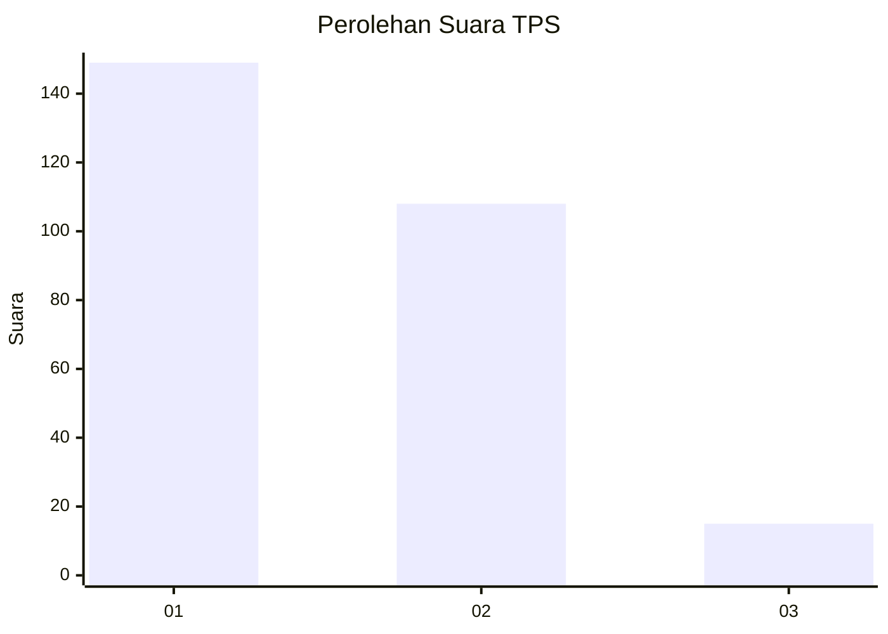
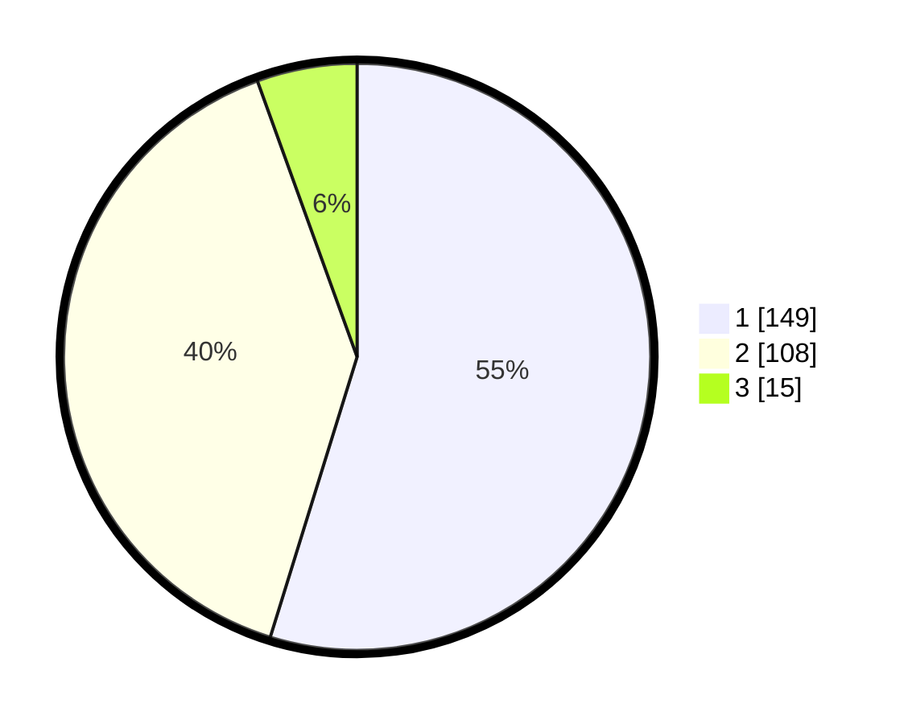

# Hasil

## Grafik

## Tabel

| No. | Nama Paslon    | Suara | Suara (raw) | Persentase |
|:--- |:-------------- | -----:| -----------:| ----------:|
| 1   | ANIES MUHAIMIN | 149   | [149][p-1]  | 54,78      |
| 2   | PRABOWO GIBRAN | 108   | [108][p-2]  | 39,71      |
| 3   | GANJAR MAHFUD  | 15    | [15][p-3]   | 5,51       |

[p-1]: https://github.com/gigit-pemilu/pemilu-2024/blob/main/pilpres/hitung-suara/sub/35-jawa-timur/sub/28-pamekasan/sub/06-palengaan/sub/2009-kacok/sub/003-tps/sub/paslon-1.txt
[p-2]: https://github.com/gigit-pemilu/pemilu-2024/blob/main/pilpres/hitung-suara/sub/35-jawa-timur/sub/28-pamekasan/sub/06-palengaan/sub/2009-kacok/sub/003-tps/sub/paslon-2.txt
[p-3]: https://github.com/gigit-pemilu/pemilu-2024/blob/main/pilpres/hitung-suara/sub/35-jawa-timur/sub/28-pamekasan/sub/06-palengaan/sub/2009-kacok/sub/003-tps/sub/paslon-3.txt

## Foto C Plano

https://sirekap-obj-formc.kpu.go.id/1f95/pemilu/ppwp/35/28/06/20/09/3528062009003-20240214-193347--2401ee94-04f2-4a16-93a2-0e854beba70b.jpg

https://sirekap-obj-formc.kpu.go.id/1f95/pemilu/ppwp/35/28/06/20/09/3528062009003-20240214-193356--8e7f3940-f9c0-4770-9021-5aa3486b035b.jpg

https://sirekap-obj-formc.kpu.go.id/1f95/pemilu/ppwp/35/28/06/20/09/3528062009003-20240214-193404--2ca9dcb9-a820-4c5f-badc-bff430b2b34a.jpg

## Metadata

| Key        | Value               |
| ---------- | ------------------- |
| Time Stamp | 2024-02-25 16:00:00 |

