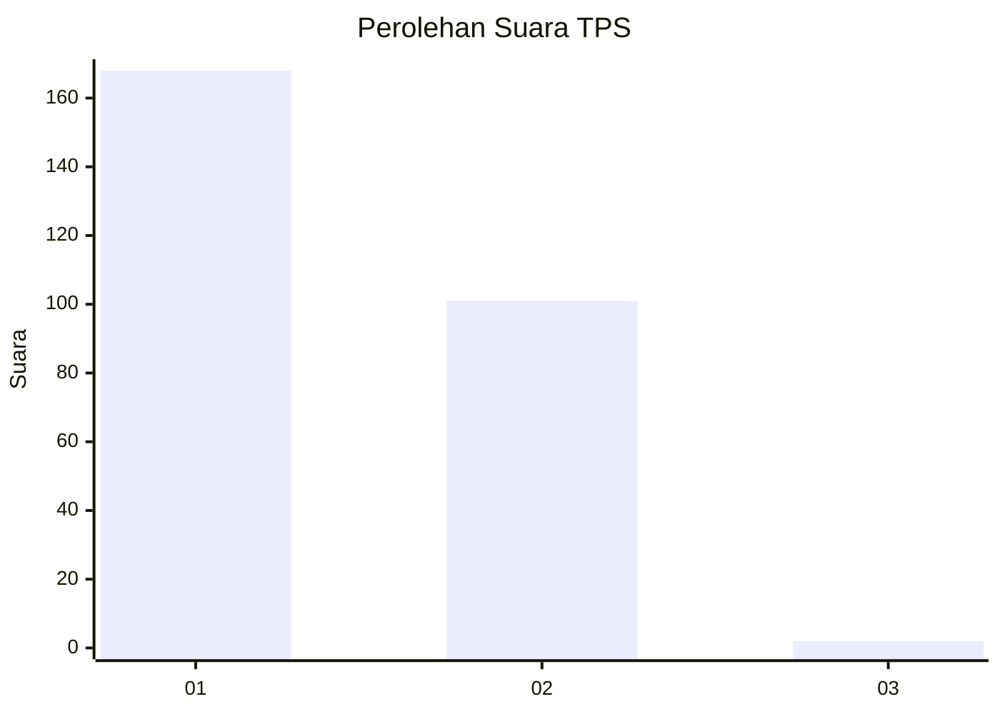
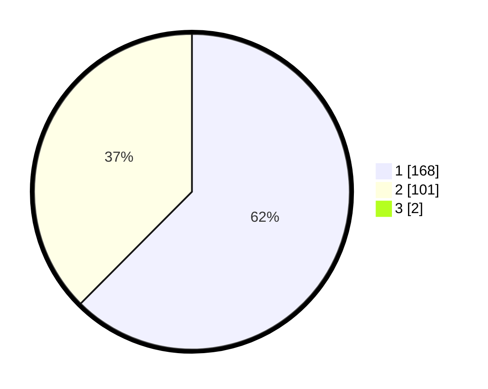

# Hasil

## Grafik

## Tabel

| No. | Nama Paslon    | Suara | Suara (raw) | Persentase |
|:--- |:-------------- | -----:| -----------:| ----------:|
| 1   | ANIES MUHAIMIN | 168   | [168][p-1]  | 61,99      |
| 2   | PRABOWO GIBRAN | 101   | [101][p-2]  | 37,27      |
| 3   | GANJAR MAHFUD  | 2     | [2][p-3]    | 0,74       |

[p-1]: https://github.com/gigit-pemilu/pemilu-2024-35-jawa-timur/blob/main/pilpres/hitung-suara/sub/35-jawa-timur/sub/28-pamekasan/sub/06-palengaan/sub/2009-kacok/sub/008-tps/sub/paslon-1.txt
[p-2]: https://github.com/gigit-pemilu/pemilu-2024-35-jawa-timur/blob/main/pilpres/hitung-suara/sub/35-jawa-timur/sub/28-pamekasan/sub/06-palengaan/sub/2009-kacok/sub/008-tps/sub/paslon-2.txt
[p-3]: https://github.com/gigit-pemilu/pemilu-2024-35-jawa-timur/blob/main/pilpres/hitung-suara/sub/35-jawa-timur/sub/28-pamekasan/sub/06-palengaan/sub/2009-kacok/sub/008-tps/sub/paslon-3.txt

## Foto C Plano

https://sirekap-obj-formc.kpu.go.id/45ab/pemilu/ppwp/35/28/06/20/09/3528062009008-20240214-194951--816e256a-b876-44a3-ab2a-56b55d513af5.jpg

https://sirekap-obj-formc.kpu.go.id/45ab/pemilu/ppwp/35/28/06/20/09/3528062009008-20240214-195136--39a558be-78e8-43fd-91b7-7c3651330bfb.jpg

https://sirekap-obj-formc.kpu.go.id/45ab/pemilu/ppwp/35/28/06/20/09/3528062009008-20240214-195228--6227d9f9-5e97-42be-ba26-b989b62699e9.jpg

## Metadata

| Key        | Value               |
| ---------- | ------------------- |
| Time Stamp | 2024-02-17 16:00:02 |

