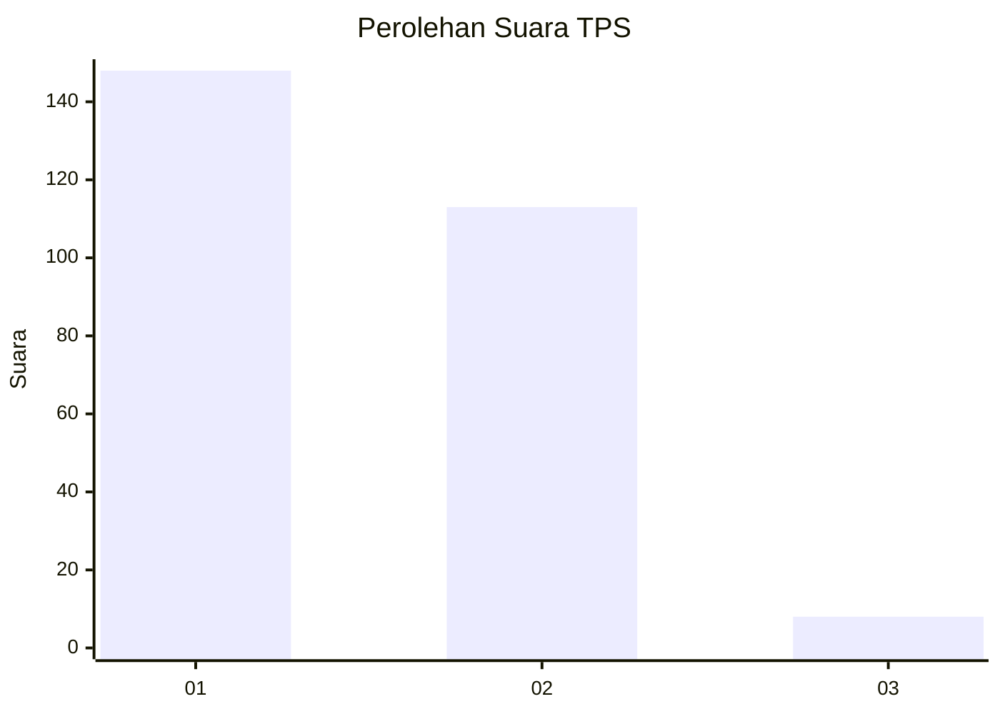
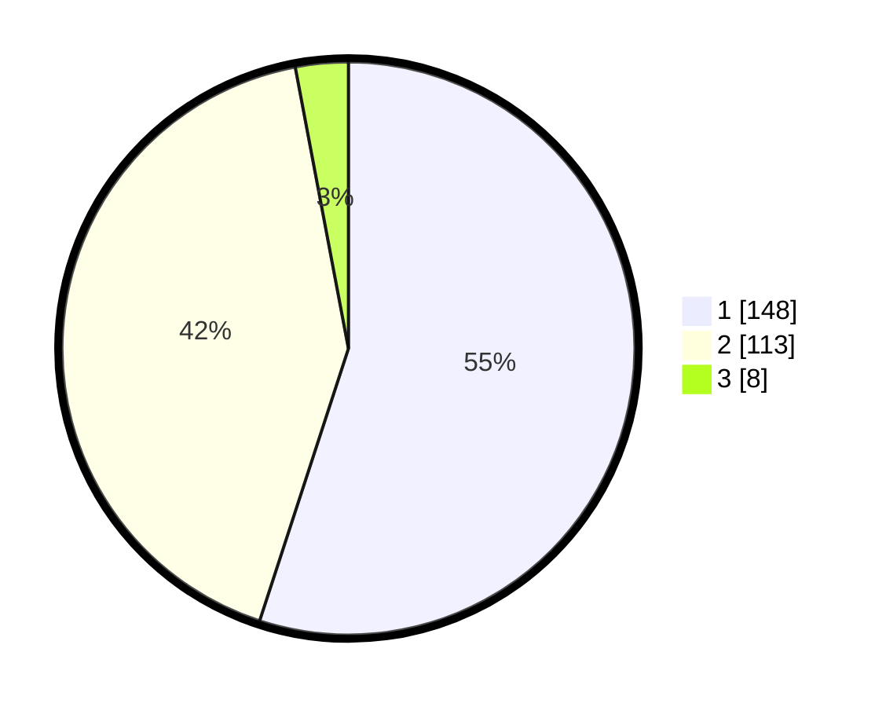

# Hasil

## Grafik

## Tabel

| No. | Nama Paslon    | Suara | Suara (raw) | Persentase |
|:--- |:-------------- | -----:| -----------:| ----------:|
| 1   | ANIES MUHAIMIN | 148   | [148][p-1]  | 55,02      |
| 2   | PRABOWO GIBRAN | 113   | [113][p-2]  | 42,01      |
| 3   | GANJAR MAHFUD  | 8     | [8][p-3]    | 2,97       |

[p-1]: https://github.com/gigit-pemilu/pemilu-2024-35-jawa-timur/blob/main/pilpres/hitung-suara/sub/35-jawa-timur/sub/28-pamekasan/sub/06-palengaan/sub/2011-palengaan-laok/sub/005-tps/sub/paslon-1.txt
[p-2]: https://github.com/gigit-pemilu/pemilu-2024-35-jawa-timur/blob/main/pilpres/hitung-suara/sub/35-jawa-timur/sub/28-pamekasan/sub/06-palengaan/sub/2011-palengaan-laok/sub/005-tps/sub/paslon-2.txt
[p-3]: https://github.com/gigit-pemilu/pemilu-2024-35-jawa-timur/blob/main/pilpres/hitung-suara/sub/35-jawa-timur/sub/28-pamekasan/sub/06-palengaan/sub/2011-palengaan-laok/sub/005-tps/sub/paslon-3.txt

## Foto C Plano

https://sirekap-obj-formc.kpu.go.id/e085/pemilu/ppwp/35/28/06/20/11/3528062011005-20240214-233840--23e124b8-d103-4924-bb4a-bfabf2eed0f5.jpg

https://sirekap-obj-formc.kpu.go.id/e085/pemilu/ppwp/35/28/06/20/11/3528062011005-20240214-233651--31597041-40dc-4f4f-bd38-e6cd8636c7a8.jpg

https://sirekap-obj-formc.kpu.go.id/e085/pemilu/ppwp/35/28/06/20/11/3528062011005-20240214-233736--49c801db-de34-4e7d-a8db-05708d97425c.jpg

## Metadata

| Key        | Value               |
| ---------- | ------------------- |
| Time Stamp | 2024-02-17 11:00:02 |

