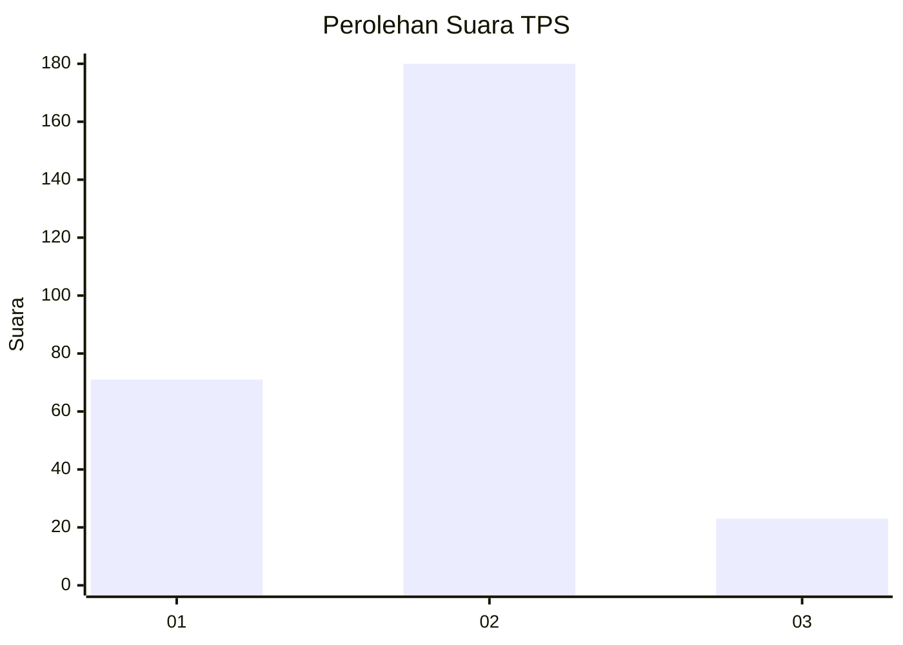
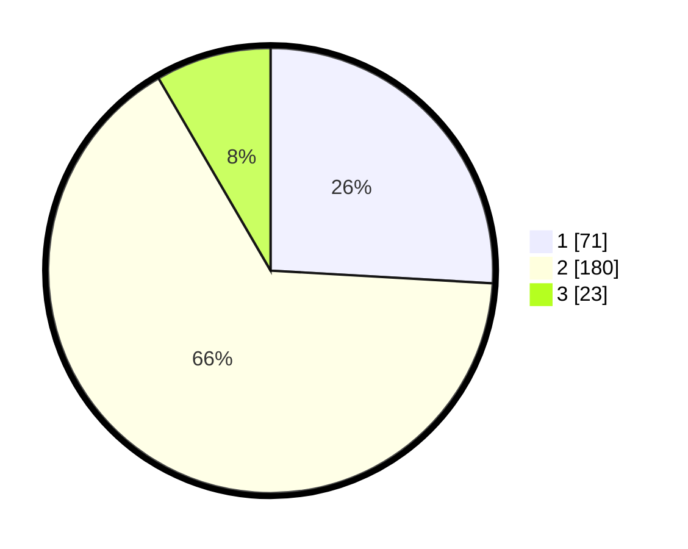

# Hasil

## Grafik

## Tabel

| No. | Nama Paslon    | Suara | Suara (raw) | Persentase |
|:--- |:-------------- | -----:| -----------:| ----------:|
| 1   | ANIES MUHAIMIN | 71    | [71][p-1]   | 25,91      |
| 2   | PRABOWO GIBRAN | 180   | [180][p-2]  | 65,69      |
| 3   | GANJAR MAHFUD  | 23    | [23][p-3]   | 8,39       |

[p-1]: https://github.com/gigit-pemilu/pemilu-2024/blob/main/pilpres/hitung-suara/sub/35-jawa-timur/sub/28-pamekasan/sub/06-palengaan/sub/2011-palengaan-laok/sub/006-tps/sub/paslon-1.txt
[p-2]: https://github.com/gigit-pemilu/pemilu-2024/blob/main/pilpres/hitung-suara/sub/35-jawa-timur/sub/28-pamekasan/sub/06-palengaan/sub/2011-palengaan-laok/sub/006-tps/sub/paslon-2.txt
[p-3]: https://github.com/gigit-pemilu/pemilu-2024/blob/main/pilpres/hitung-suara/sub/35-jawa-timur/sub/28-pamekasan/sub/06-palengaan/sub/2011-palengaan-laok/sub/006-tps/sub/paslon-3.txt

## Foto C Plano

https://sirekap-obj-formc.kpu.go.id/bc43/pemilu/ppwp/35/28/06/20/11/3528062011006-20240214-221229--263b20a1-8e79-4bee-83fb-f4b8454309d3.jpg

https://sirekap-obj-formc.kpu.go.id/bc43/pemilu/ppwp/35/28/06/20/11/3528062011006-20240214-221312--8119cf25-6937-4434-ad53-494b1d7a11f4.jpg

## Metadata

| Key        | Value               |
| ---------- | ------------------- |
| Time Stamp | 2024-02-25 16:00:00 |

