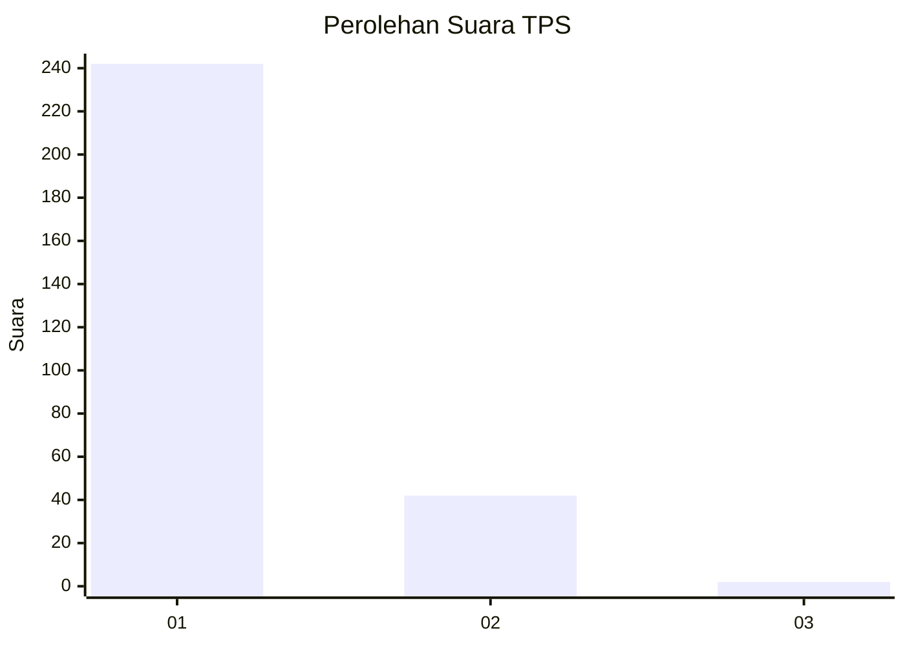
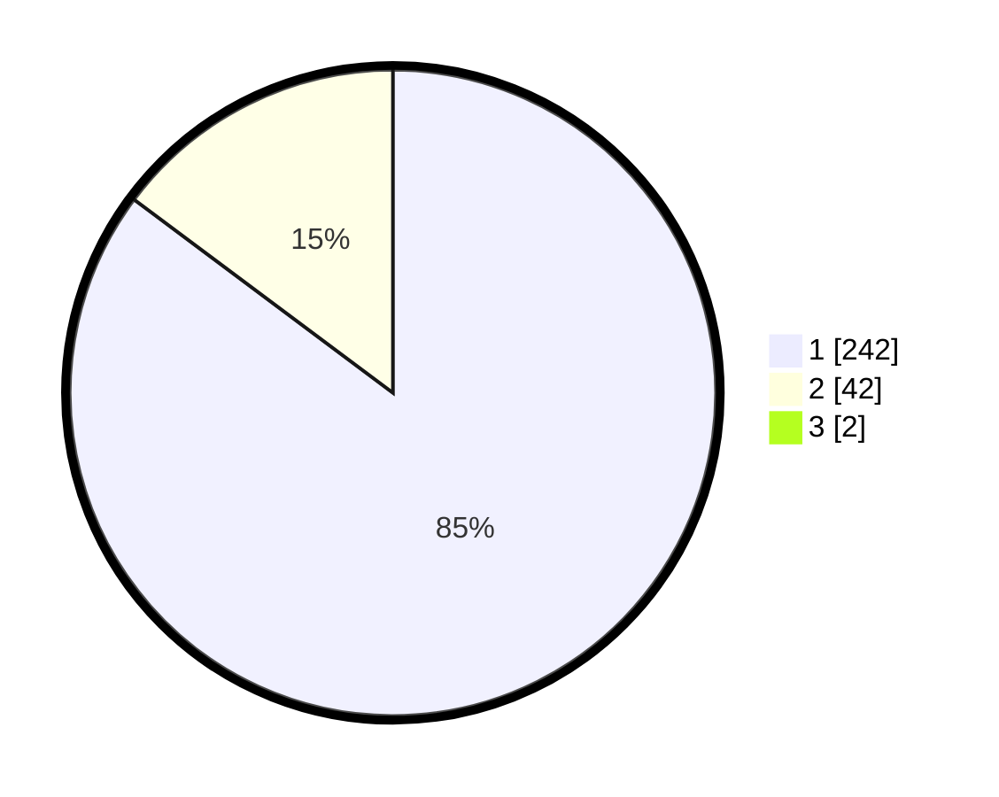

# Hasil

## Grafik

## Tabel

| No. | Nama Paslon    | Suara | Suara (raw) | Persentase |
|:--- |:-------------- | -----:| -----------:| ----------:|
| 1   | ANIES MUHAIMIN | 242   | [242][p-1]  | 84,62      |
| 2   | PRABOWO GIBRAN | 42    | [42][p-2]   | 14,69      |
| 3   | GANJAR MAHFUD  | 2     | [2][p-3]    | 0,70       |

[p-1]: https://github.com/gigit-pemilu/pemilu-2024-35-jawa-timur/blob/main/pilpres/hitung-suara/sub/35-jawa-timur/sub/28-pamekasan/sub/06-palengaan/sub/2011-palengaan-laok/sub/022-tps/sub/paslon-1.txt
[p-2]: https://github.com/gigit-pemilu/pemilu-2024-35-jawa-timur/blob/main/pilpres/hitung-suara/sub/35-jawa-timur/sub/28-pamekasan/sub/06-palengaan/sub/2011-palengaan-laok/sub/022-tps/sub/paslon-2.txt
[p-3]: https://github.com/gigit-pemilu/pemilu-2024-35-jawa-timur/blob/main/pilpres/hitung-suara/sub/35-jawa-timur/sub/28-pamekasan/sub/06-palengaan/sub/2011-palengaan-laok/sub/022-tps/sub/paslon-3.txt

## Foto C Plano

https://sirekap-obj-formc.kpu.go.id/1ac9/pemilu/ppwp/35/28/06/20/11/3528062011022-20240214-224404--73059b13-829c-4bc5-97a6-ba97396bbebc.jpg

https://sirekap-obj-formc.kpu.go.id/1ac9/pemilu/ppwp/35/28/06/20/11/3528062011022-20240214-224442--5e729976-fda7-4242-ae65-8afd47f43a48.jpg

https://sirekap-obj-formc.kpu.go.id/1ac9/pemilu/ppwp/35/28/06/20/11/3528062011022-20240214-224515--46f7de88-de23-4ecc-9841-7bfc5873124b.jpg

## Metadata

| Key        | Value               |
| ---------- | ------------------- |
| Time Stamp | 2024-02-17 11:00:02 |

