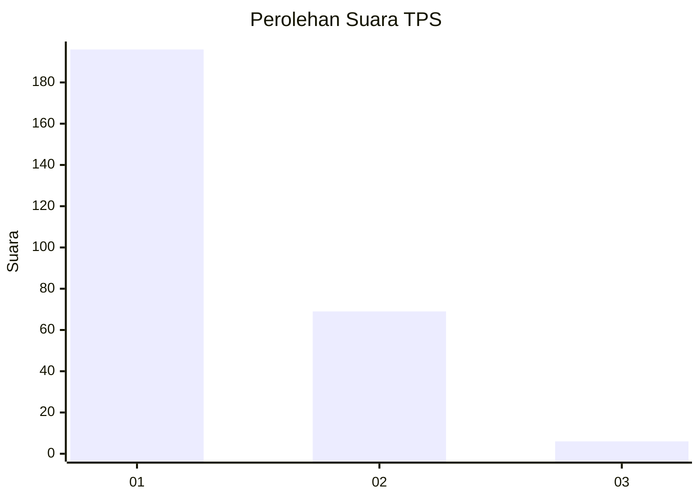
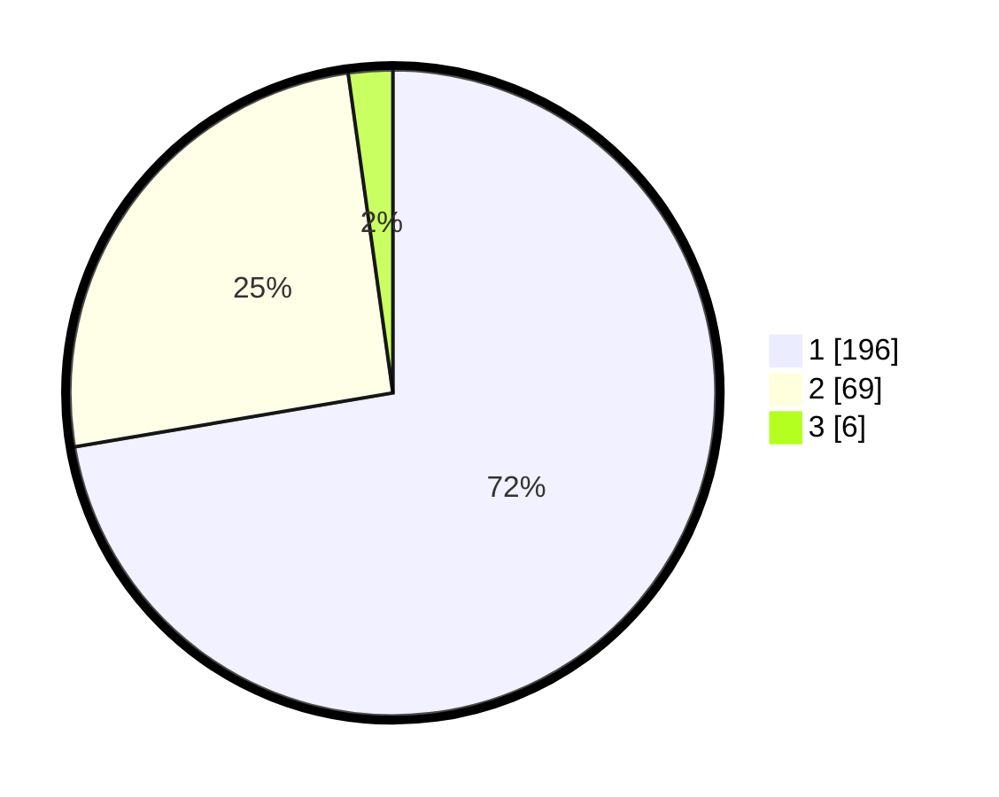

# Hasil

## Grafik

## Tabel

| No. | Nama Paslon    | Suara | Suara (raw) | Persentase |
|:--- |:-------------- | -----:| -----------:| ----------:|
| 1   | ANIES MUHAIMIN | 196   | [196][p-1]  | 72,32      |
| 2   | PRABOWO GIBRAN | 69    | [69][p-2]   | 25,46      |
| 3   | GANJAR MAHFUD  | 6     | [6][p-3]    | 2,21       |

[p-1]: https://github.com/gigit-pemilu/pemilu-2024/blob/main/pilpres/hitung-suara/sub/35-jawa-timur/sub/28-pamekasan/sub/06-palengaan/sub/2011-palengaan-laok/sub/027-tps/sub/paslon-1.txt
[p-2]: https://github.com/gigit-pemilu/pemilu-2024/blob/main/pilpres/hitung-suara/sub/35-jawa-timur/sub/28-pamekasan/sub/06-palengaan/sub/2011-palengaan-laok/sub/027-tps/sub/paslon-2.txt
[p-3]: https://github.com/gigit-pemilu/pemilu-2024/blob/main/pilpres/hitung-suara/sub/35-jawa-timur/sub/28-pamekasan/sub/06-palengaan/sub/2011-palengaan-laok/sub/027-tps/sub/paslon-3.txt

## Foto C Plano

https://sirekap-obj-formc.kpu.go.id/739d/pemilu/ppwp/35/28/06/20/11/3528062011027-20240214-194354--3decf5a7-1867-42be-926d-7ae7b6749676.jpg

https://sirekap-obj-formc.kpu.go.id/739d/pemilu/ppwp/35/28/06/20/11/3528062011027-20240214-194427--560e1ae3-065c-4134-abad-5fc8a3ba50f9.jpg

https://sirekap-obj-formc.kpu.go.id/739d/pemilu/ppwp/35/28/06/20/11/3528062011027-20240214-194502--c2bc53e6-cfb5-4218-a391-ded199518630.jpg

## Metadata

| Key        | Value               |
| ---------- | ------------------- |
| Time Stamp | 2024-02-17 16:00:02 |

