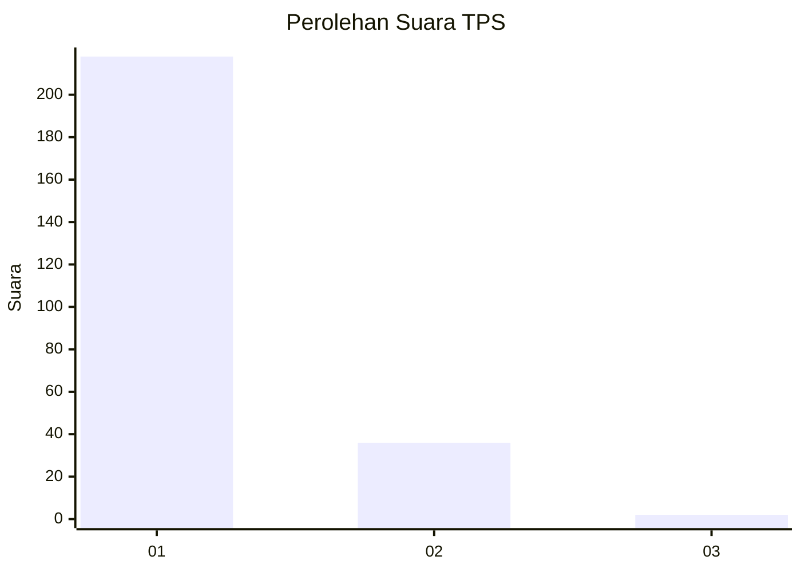
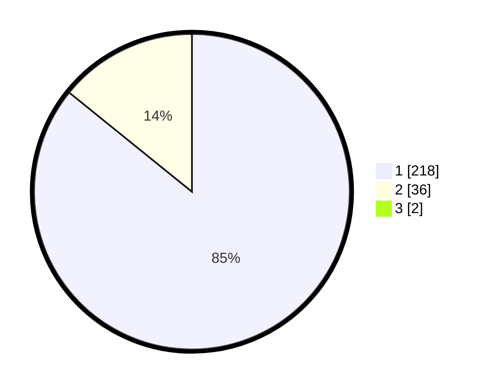

# Hasil

## Grafik

## Tabel

| No. | Nama Paslon    | Suara | Suara (raw) | Persentase |
|:--- |:-------------- | -----:| -----------:| ----------:|
| 1   | ANIES MUHAIMIN | 218   | [218][p-1]  | 85,16      |
| 2   | PRABOWO GIBRAN | 36    | [36][p-2]   | 14,06      |
| 3   | GANJAR MAHFUD  | 2     | [2][p-3]    | 0,78       |

[p-1]: https://github.com/gigit-pemilu/pemilu-2024-35-jawa-timur/blob/main/pilpres/hitung-suara/sub/35-jawa-timur/sub/28-pamekasan/sub/06-palengaan/sub/2011-palengaan-laok/sub/031-tps/sub/paslon-1.txt
[p-2]: https://github.com/gigit-pemilu/pemilu-2024-35-jawa-timur/blob/main/pilpres/hitung-suara/sub/35-jawa-timur/sub/28-pamekasan/sub/06-palengaan/sub/2011-palengaan-laok/sub/031-tps/sub/paslon-2.txt
[p-3]: https://github.com/gigit-pemilu/pemilu-2024-35-jawa-timur/blob/main/pilpres/hitung-suara/sub/35-jawa-timur/sub/28-pamekasan/sub/06-palengaan/sub/2011-palengaan-laok/sub/031-tps/sub/paslon-3.txt

## Foto C Plano

https://sirekap-obj-formc.kpu.go.id/c6b3/pemilu/ppwp/35/28/06/20/11/3528062011031-20240214-230644--b40566d9-34ff-45ea-9ff5-4d14f8adea62.jpg

https://sirekap-obj-formc.kpu.go.id/c6b3/pemilu/ppwp/35/28/06/20/11/3528062011031-20240214-230831--8b940ffc-71ed-4f8e-a0ef-1c3ae5aec2fe.jpg

https://sirekap-obj-formc.kpu.go.id/c6b3/pemilu/ppwp/35/28/06/20/11/3528062011031-20240214-231251--15f3d4f2-c438-4908-b749-ee17b674637d.jpg

## Metadata

| Key        | Value               |
| ---------- | ------------------- |
| Time Stamp | 2024-02-25 12:00:00 |

