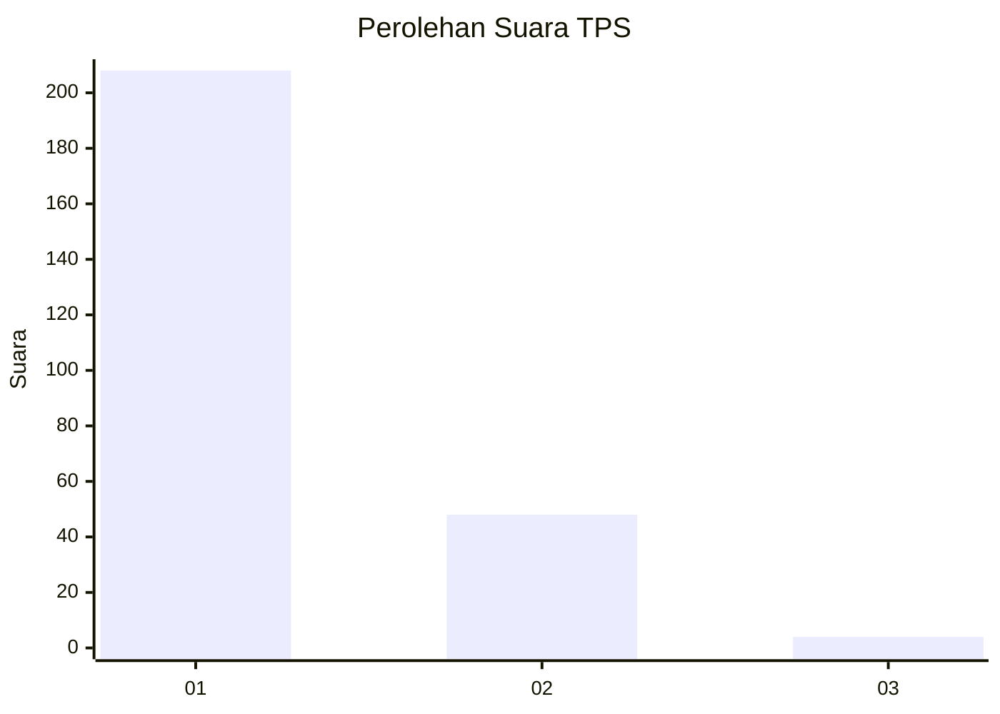
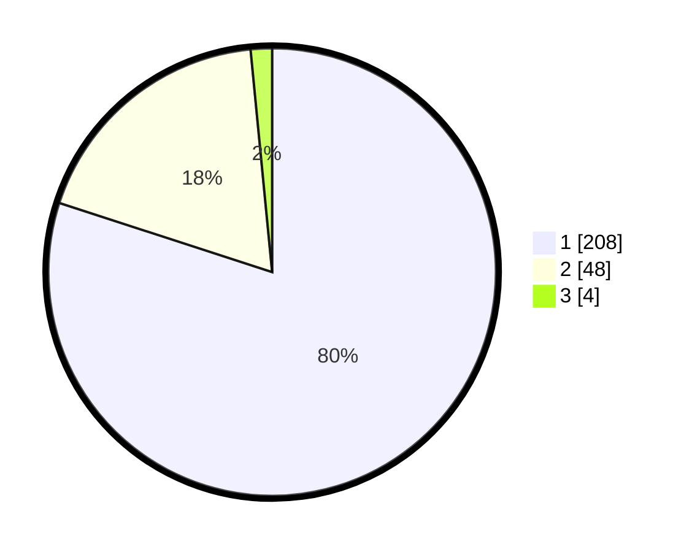

# Hasil

## Grafik

## Tabel

| No. | Nama Paslon    | Suara | Suara (raw) | Persentase |
|:--- |:-------------- | -----:| -----------:| ----------:|
| 1   | ANIES MUHAIMIN | 208   | [208][p-1]  | 80,00      |
| 2   | PRABOWO GIBRAN | 48    | [48][p-2]   | 18,46      |
| 3   | GANJAR MAHFUD  | 4     | [4][p-3]    | 1,54       |

[p-1]: https://github.com/gigit-pemilu/pemilu-2024-35-jawa-timur/blob/main/pilpres/hitung-suara/sub/35-jawa-timur/sub/28-pamekasan/sub/06-palengaan/sub/2011-palengaan-laok/sub/035-tps/sub/paslon-1.txt
[p-2]: https://github.com/gigit-pemilu/pemilu-2024-35-jawa-timur/blob/main/pilpres/hitung-suara/sub/35-jawa-timur/sub/28-pamekasan/sub/06-palengaan/sub/2011-palengaan-laok/sub/035-tps/sub/paslon-2.txt
[p-3]: https://github.com/gigit-pemilu/pemilu-2024-35-jawa-timur/blob/main/pilpres/hitung-suara/sub/35-jawa-timur/sub/28-pamekasan/sub/06-palengaan/sub/2011-palengaan-laok/sub/035-tps/sub/paslon-3.txt

## Foto C Plano

https://sirekap-obj-formc.kpu.go.id/815f/pemilu/ppwp/35/28/06/20/11/3528062011035-20240214-215522--278062fe-77a3-4375-87c6-f3b1ac1e54b0.jpg

https://sirekap-obj-formc.kpu.go.id/815f/pemilu/ppwp/35/28/06/20/11/3528062011035-20240214-215609--48492872-3e98-484c-8a77-e63514abc6cb.jpg

https://sirekap-obj-formc.kpu.go.id/815f/pemilu/ppwp/35/28/06/20/11/3528062011035-20240214-215821--ee2dfbba-5b2c-44c8-b9f4-80c03aedf4bd.jpg

## Metadata

| Key        | Value               |
| ---------- | ------------------- |
| Time Stamp | 2024-02-25 16:00:00 |

