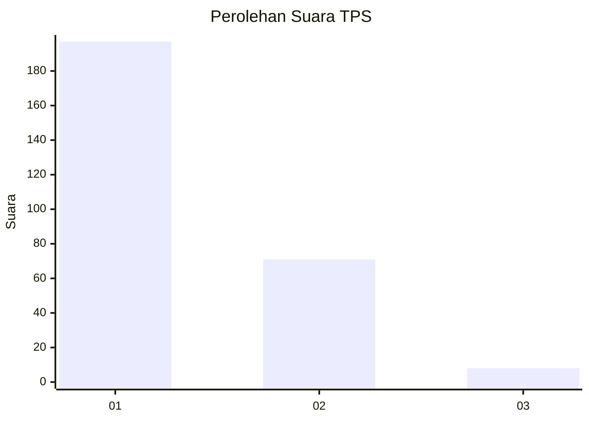
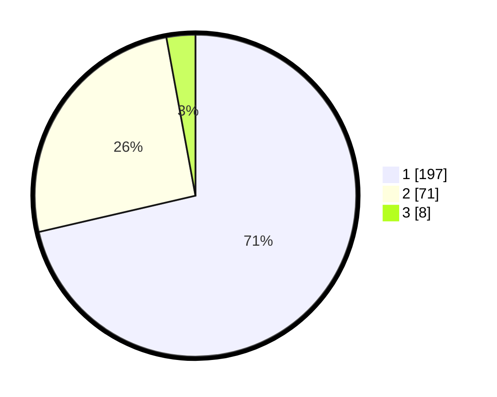

# Hasil

## Grafik

## Tabel

| No. | Nama Paslon    | Suara | Suara (raw) | Persentase |
|:--- |:-------------- | -----:| -----------:| ----------:|
| 1   | ANIES MUHAIMIN | 197   | [197][p-1]  | 71,38      |
| 2   | PRABOWO GIBRAN | 71    | [71][p-2]   | 25,72      |
| 3   | GANJAR MAHFUD  | 8     | [8][p-3]    | 2,90       |

[p-1]: https://github.com/gigit-pemilu/pemilu-2024-35-jawa-timur/blob/main/pilpres/hitung-suara/sub/35-jawa-timur/sub/28-pamekasan/sub/06-palengaan/sub/2011-palengaan-laok/sub/036-tps/sub/paslon-1.txt
[p-2]: https://github.com/gigit-pemilu/pemilu-2024-35-jawa-timur/blob/main/pilpres/hitung-suara/sub/35-jawa-timur/sub/28-pamekasan/sub/06-palengaan/sub/2011-palengaan-laok/sub/036-tps/sub/paslon-2.txt
[p-3]: https://github.com/gigit-pemilu/pemilu-2024-35-jawa-timur/blob/main/pilpres/hitung-suara/sub/35-jawa-timur/sub/28-pamekasan/sub/06-palengaan/sub/2011-palengaan-laok/sub/036-tps/sub/paslon-3.txt

## Foto C Plano

https://sirekap-obj-formc.kpu.go.id/a70c/pemilu/ppwp/35/28/06/20/11/3528062011036-20240214-222715--80834e0a-16e5-41d9-936d-4820c1ca0bc4.jpg

https://sirekap-obj-formc.kpu.go.id/a70c/pemilu/ppwp/35/28/06/20/11/3528062011036-20240214-222940--b7e8ef53-32b0-4eb2-8859-88b27fce2b65.jpg

https://sirekap-obj-formc.kpu.go.id/a70c/pemilu/ppwp/35/28/06/20/11/3528062011036-20240214-222903--8ea13f3e-c769-4b2b-9dea-c025323ef0c5.jpg

## Metadata

| Key        | Value               |
| ---------- | ------------------- |
| Time Stamp | 2024-02-17 16:00:02 |

