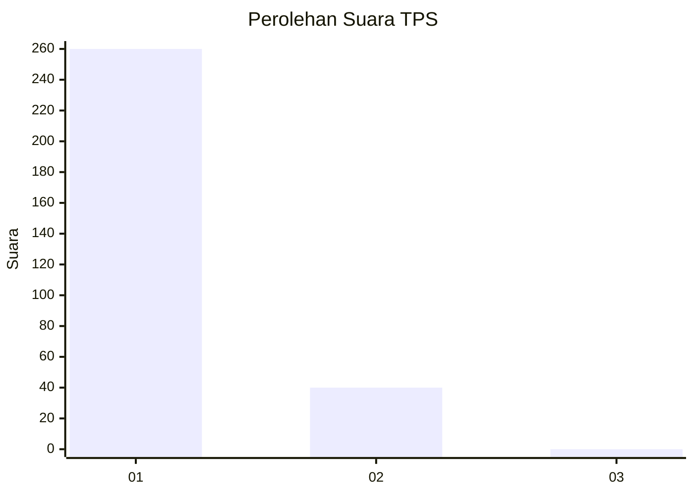
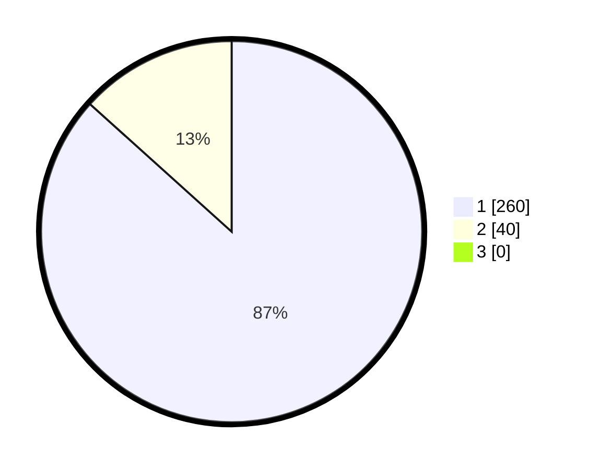

# Hasil

## Grafik

## Tabel

| No. | Nama Paslon    | Suara | Suara (raw) | Persentase |
|:--- |:-------------- | -----:| -----------:| ----------:|
| 1   | ANIES MUHAIMIN | 260   | [260][p-1]  | 86,67      |
| 2   | PRABOWO GIBRAN | 40    | [40][p-2]   | 13,33      |
| 3   | GANJAR MAHFUD  | 0     | [0][p-3]    | 0,00       |

[p-1]: https://github.com/gigit-pemilu/pemilu-2024-35-jawa-timur/blob/main/pilpres/hitung-suara/sub/35-jawa-timur/sub/28-pamekasan/sub/06-palengaan/sub/2012-palengaan-dajah/sub/003-tps/sub/paslon-1.txt
[p-2]: https://github.com/gigit-pemilu/pemilu-2024-35-jawa-timur/blob/main/pilpres/hitung-suara/sub/35-jawa-timur/sub/28-pamekasan/sub/06-palengaan/sub/2012-palengaan-dajah/sub/003-tps/sub/paslon-2.txt
[p-3]: https://github.com/gigit-pemilu/pemilu-2024-35-jawa-timur/blob/main/pilpres/hitung-suara/sub/35-jawa-timur/sub/28-pamekasan/sub/06-palengaan/sub/2012-palengaan-dajah/sub/003-tps/sub/paslon-3.txt

## Foto C Plano

https://sirekap-obj-formc.kpu.go.id/ea9d/pemilu/ppwp/35/28/06/20/12/3528062012003-20240215-075423--68d48e0b-e3cf-495b-808e-701948767118.jpg

https://sirekap-obj-formc.kpu.go.id/ea9d/pemilu/ppwp/35/28/06/20/12/3528062012003-20240215-075643--9ff9f3cc-a156-4c4f-a192-567c2c827f8f.jpg

https://sirekap-obj-formc.kpu.go.id/ea9d/pemilu/ppwp/35/28/06/20/12/3528062012003-20240215-075905--19710f7a-7f9b-4359-9ef6-27335d4ea573.jpg

## Metadata

| Key        | Value               |
| ---------- | ------------------- |
| Time Stamp | 2024-02-17 11:00:02 |

