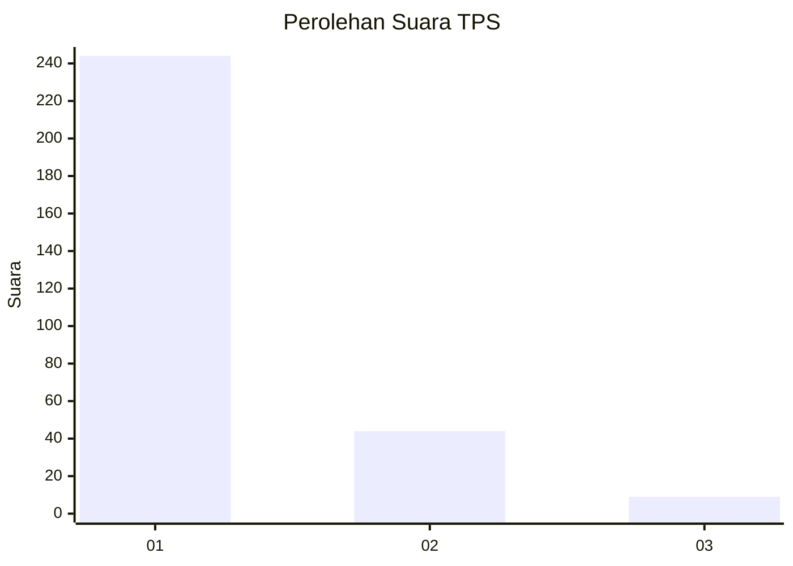
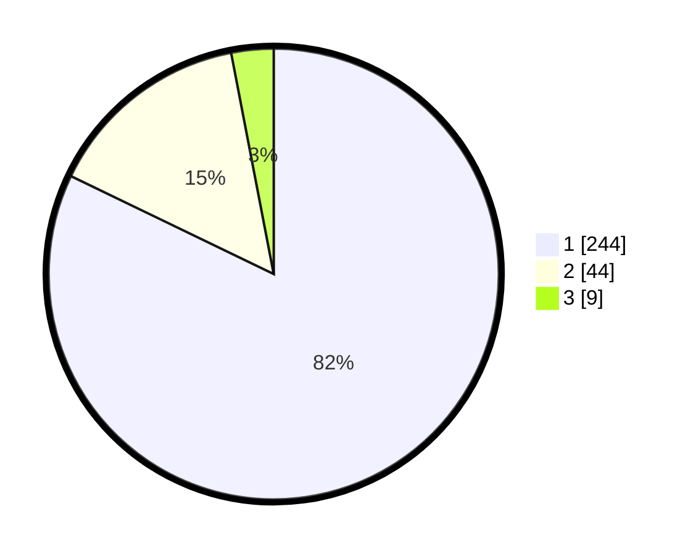

# Hasil

## Grafik

## Tabel

| No. | Nama Paslon    | Suara | Suara (raw) | Persentase |
|:--- |:-------------- | -----:| -----------:| ----------:|
| 1   | ANIES MUHAIMIN | 244   | [244][p-1]  | 82,15      |
| 2   | PRABOWO GIBRAN | 44    | [44][p-2]   | 14,81      |
| 3   | GANJAR MAHFUD  | 9     | [9][p-3]    | 3,03       |

[p-1]: https://github.com/gigit-pemilu/pemilu-2024/blob/main/pilpres/hitung-suara/sub/35-jawa-timur/sub/28-pamekasan/sub/06-palengaan/sub/2012-palengaan-dajah/sub/004-tps/sub/paslon-1.txt
[p-2]: https://github.com/gigit-pemilu/pemilu-2024/blob/main/pilpres/hitung-suara/sub/35-jawa-timur/sub/28-pamekasan/sub/06-palengaan/sub/2012-palengaan-dajah/sub/004-tps/sub/paslon-2.txt
[p-3]: https://github.com/gigit-pemilu/pemilu-2024/blob/main/pilpres/hitung-suara/sub/35-jawa-timur/sub/28-pamekasan/sub/06-palengaan/sub/2012-palengaan-dajah/sub/004-tps/sub/paslon-3.txt

## Foto C Plano

https://sirekap-obj-formc.kpu.go.id/4056/pemilu/ppwp/35/28/06/20/12/3528062012004-20240215-074550--0d0164b9-158c-455a-a7fe-e44ffe9eb7ad.jpg

https://sirekap-obj-formc.kpu.go.id/4056/pemilu/ppwp/35/28/06/20/12/3528062012004-20240215-074649--60b33b73-6d95-422c-b1f1-1b3257d36e1b.jpg

https://sirekap-obj-formc.kpu.go.id/4056/pemilu/ppwp/35/28/06/20/12/3528062012004-20240215-074748--c6552b16-004a-456c-a48b-9208516e0f43.jpg

## Metadata

| Key        | Value               |
| ---------- | ------------------- |
| Time Stamp | 2024-02-17 16:00:02 |

