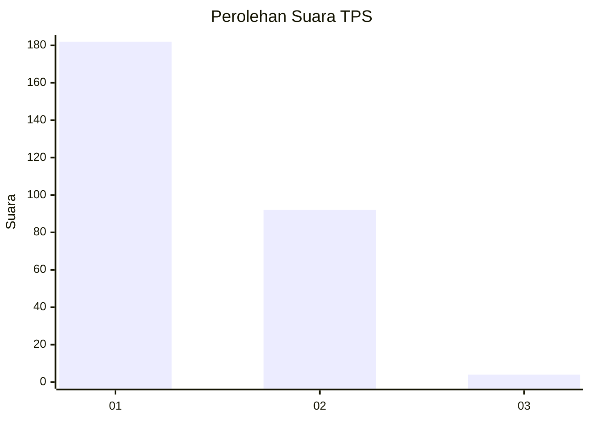
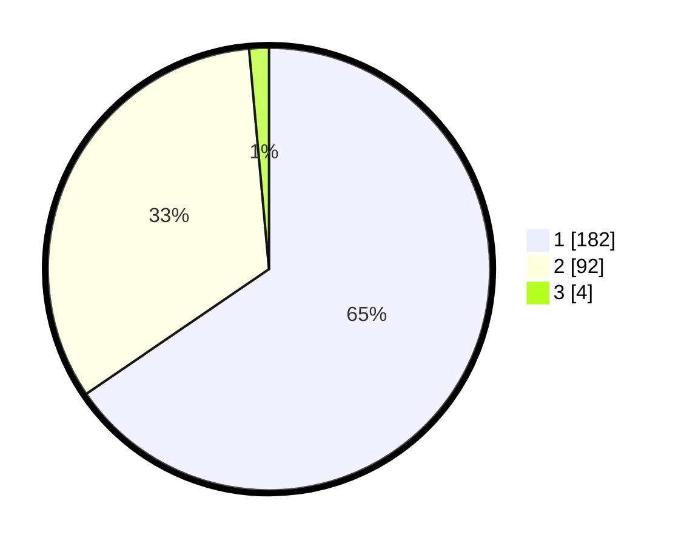

# Hasil

## Grafik

## Tabel

| No. | Nama Paslon    | Suara | Suara (raw) | Persentase |
|:--- |:-------------- | -----:| -----------:| ----------:|
| 1   | ANIES MUHAIMIN | 182   | [182][p-1]  | 65,47      |
| 2   | PRABOWO GIBRAN | 92    | [92][p-2]   | 33,09      |
| 3   | GANJAR MAHFUD  | 4     | [4][p-3]    | 1,44       |

[p-1]: https://github.com/gigit-pemilu/pemilu-2024-35-jawa-timur/blob/main/pilpres/hitung-suara/sub/35-jawa-timur/sub/28-pamekasan/sub/06-palengaan/sub/2012-palengaan-dajah/sub/009-tps/sub/paslon-1.txt
[p-2]: https://github.com/gigit-pemilu/pemilu-2024-35-jawa-timur/blob/main/pilpres/hitung-suara/sub/35-jawa-timur/sub/28-pamekasan/sub/06-palengaan/sub/2012-palengaan-dajah/sub/009-tps/sub/paslon-2.txt
[p-3]: https://github.com/gigit-pemilu/pemilu-2024-35-jawa-timur/blob/main/pilpres/hitung-suara/sub/35-jawa-timur/sub/28-pamekasan/sub/06-palengaan/sub/2012-palengaan-dajah/sub/009-tps/sub/paslon-3.txt

## Foto C Plano

https://sirekap-obj-formc.kpu.go.id/4448/pemilu/ppwp/35/28/06/20/12/3528062012009-20240214-221247--ebd3ff84-7284-46cb-8154-b839a469e19a.jpg

https://sirekap-obj-formc.kpu.go.id/4448/pemilu/ppwp/35/28/06/20/12/3528062012009-20240214-222112--299ba6d3-ed24-4f1d-9af8-ca62ecd3f9aa.jpg

https://sirekap-obj-formc.kpu.go.id/4448/pemilu/ppwp/35/28/06/20/12/3528062012009-20240214-222245--834a6a1f-e34d-4e0c-9e96-5e36ea64fd3f.jpg

## Metadata

| Key        | Value               |
| ---------- | ------------------- |
| Time Stamp | 2024-02-17 16:00:02 |

