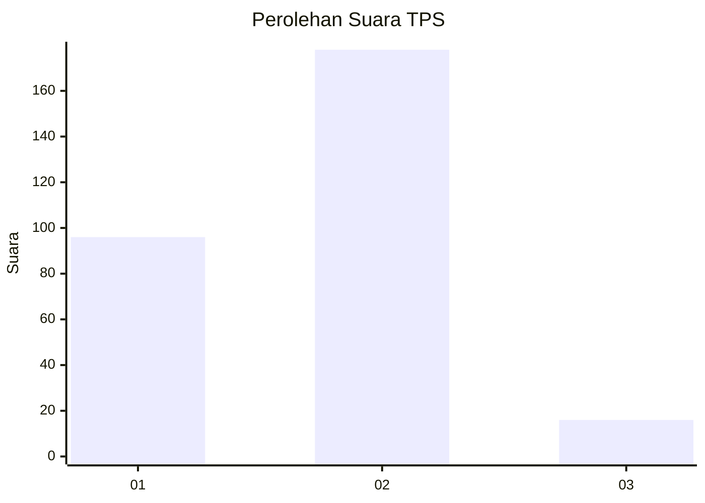
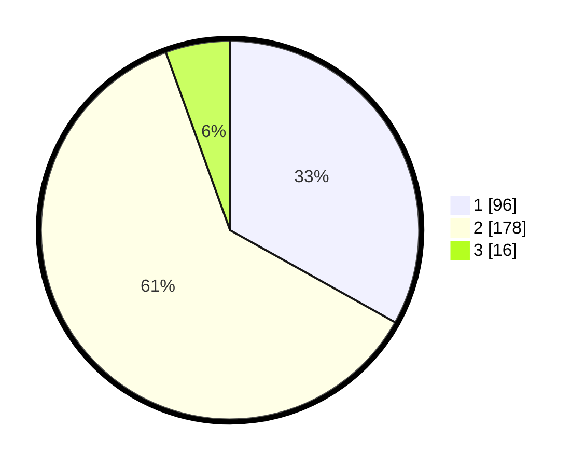

# Hasil

## Grafik

## Tabel

| No. | Nama Paslon    | Suara | Suara (raw) | Persentase |
|:--- |:-------------- | -----:| -----------:| ----------:|
| 1   | ANIES MUHAIMIN | 96    | [96][p-1]   | 33,10      |
| 2   | PRABOWO GIBRAN | 178   | [178][p-2]  | 61,38      |
| 3   | GANJAR MAHFUD  | 16    | [16][p-3]   | 5,52       |

[p-1]: https://github.com/gigit-pemilu/pemilu-2024-35-jawa-timur/blob/main/pilpres/hitung-suara/sub/35-jawa-timur/sub/28-pamekasan/sub/06-palengaan/sub/2012-palengaan-dajah/sub/017-tps/sub/paslon-1.txt
[p-2]: https://github.com/gigit-pemilu/pemilu-2024-35-jawa-timur/blob/main/pilpres/hitung-suara/sub/35-jawa-timur/sub/28-pamekasan/sub/06-palengaan/sub/2012-palengaan-dajah/sub/017-tps/sub/paslon-2.txt
[p-3]: https://github.com/gigit-pemilu/pemilu-2024-35-jawa-timur/blob/main/pilpres/hitung-suara/sub/35-jawa-timur/sub/28-pamekasan/sub/06-palengaan/sub/2012-palengaan-dajah/sub/017-tps/sub/paslon-3.txt

## Foto C Plano

https://sirekap-obj-formc.kpu.go.id/55bb/pemilu/ppwp/35/28/06/20/12/3528062012017-20240214-234218--1f3a685d-9dc7-47c1-8a2a-6345c9193d4c.jpg

https://sirekap-obj-formc.kpu.go.id/55bb/pemilu/ppwp/35/28/06/20/12/3528062012017-20240214-232546--691c8ad6-5a1e-459d-95ac-264e5ed4c4b7.jpg

https://sirekap-obj-formc.kpu.go.id/55bb/pemilu/ppwp/35/28/06/20/12/3528062012017-20240214-233813--3e34ce77-ae8d-4af8-ad55-5c4374fa8514.jpg

## Metadata

| Key        | Value               |
| ---------- | ------------------- |
| Time Stamp | 2024-02-24 22:31:28 |

