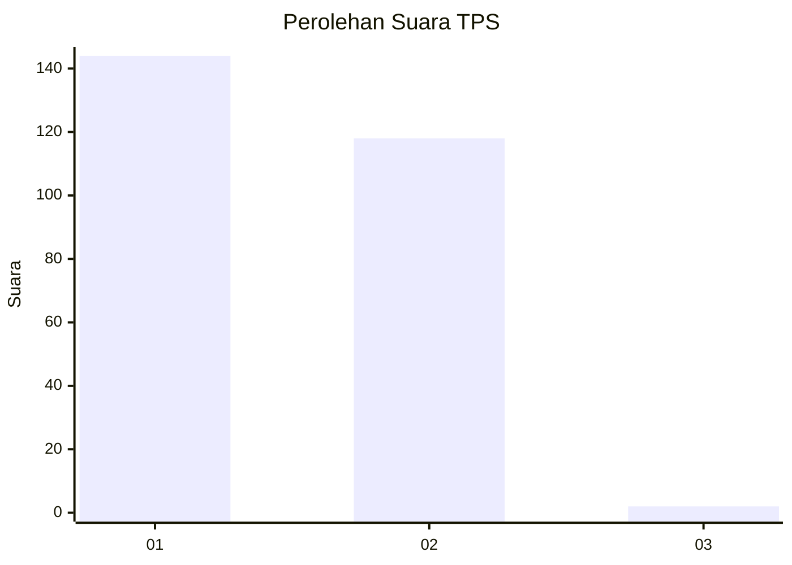
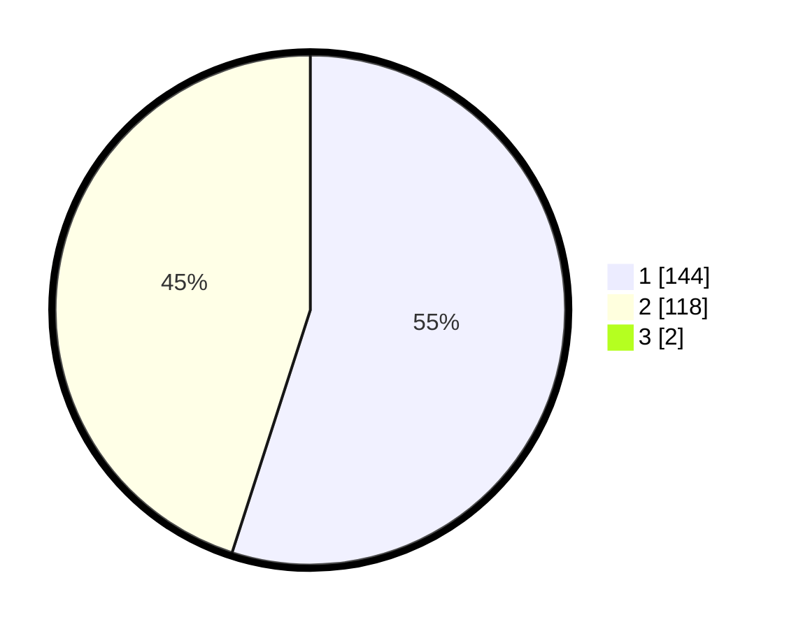

# Hasil

## Grafik

## Tabel

| No. | Nama Paslon    | Suara | Suara (raw) | Persentase |
|:--- |:-------------- | -----:| -----------:| ----------:|
| 1   | ANIES MUHAIMIN | 144   | [144][p-1]  | 54,55      |
| 2   | PRABOWO GIBRAN | 118   | [118][p-2]  | 44,70      |
| 3   | GANJAR MAHFUD  | 2     | [2][p-3]    | 0,76       |

[p-1]: https://github.com/gigit-pemilu/pemilu-2024/blob/main/pilpres/hitung-suara/sub/35-jawa-timur/sub/28-pamekasan/sub/06-palengaan/sub/2012-palengaan-dajah/sub/019-tps/sub/paslon-1.txt
[p-2]: https://github.com/gigit-pemilu/pemilu-2024/blob/main/pilpres/hitung-suara/sub/35-jawa-timur/sub/28-pamekasan/sub/06-palengaan/sub/2012-palengaan-dajah/sub/019-tps/sub/paslon-2.txt
[p-3]: https://github.com/gigit-pemilu/pemilu-2024/blob/main/pilpres/hitung-suara/sub/35-jawa-timur/sub/28-pamekasan/sub/06-palengaan/sub/2012-palengaan-dajah/sub/019-tps/sub/paslon-3.txt

## Foto C Plano

https://sirekap-obj-formc.kpu.go.id/515d/pemilu/ppwp/35/28/06/20/12/3528062012019-20240214-190539--285376e3-07ac-4c9c-8083-bfdf30f9c697.jpg

https://sirekap-obj-formc.kpu.go.id/515d/pemilu/ppwp/35/28/06/20/12/3528062012019-20240214-190434--a59ea25d-5cae-435f-a850-2958976c79e0.jpg

https://sirekap-obj-formc.kpu.go.id/515d/pemilu/ppwp/35/28/06/20/12/3528062012019-20240214-190740--92a52b75-065a-4d8f-9c5d-887a2d959bc7.jpg

## Metadata

| Key        | Value               |
| ---------- | ------------------- |
| Time Stamp | 2024-02-25 18:00:00 |

