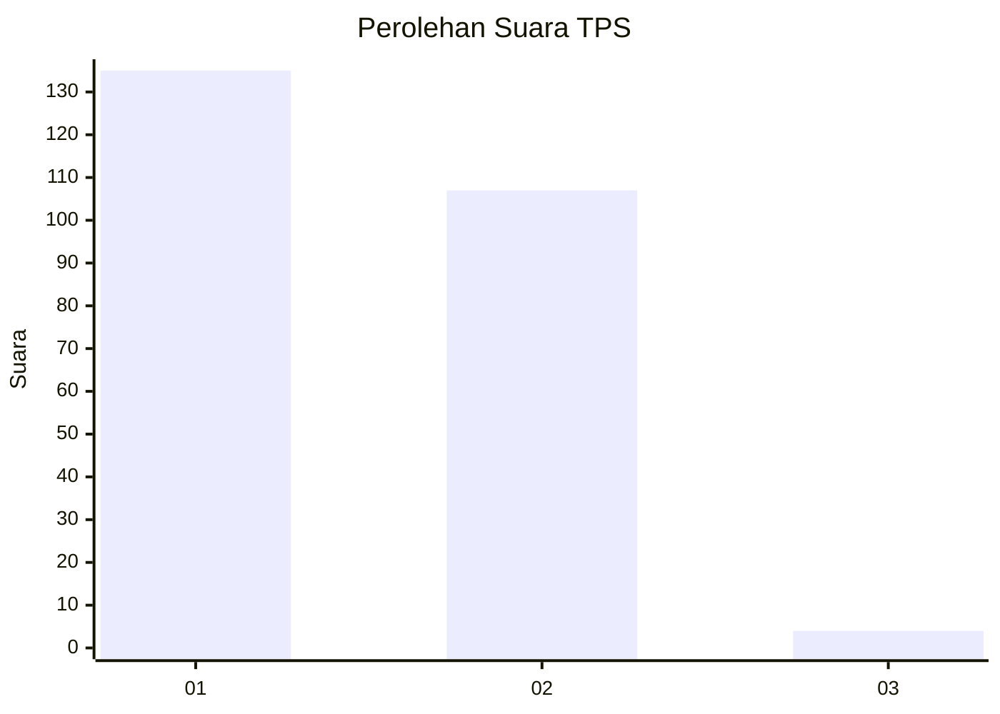
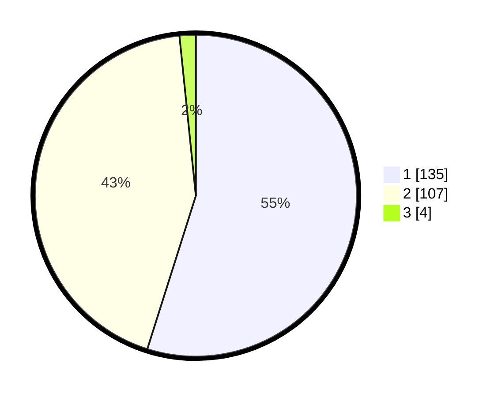

# Hasil

## Grafik

## Tabel

| No. | Nama Paslon    | Suara | Suara (raw) | Persentase |
|:--- |:-------------- | -----:| -----------:| ----------:|
| 1   | ANIES MUHAIMIN | 135   | [135][p-1]  | 54,88      |
| 2   | PRABOWO GIBRAN | 107   | [107][p-2]  | 43,50      |
| 3   | GANJAR MAHFUD  | 4     | [4][p-3]    | 1,63       |

[p-1]: https://github.com/gigit-pemilu/pemilu-2024/blob/main/pilpres/hitung-suara/sub/35-jawa-timur/sub/28-pamekasan/sub/06-palengaan/sub/2012-palengaan-dajah/sub/020-tps/sub/paslon-1.txt
[p-2]: https://github.com/gigit-pemilu/pemilu-2024/blob/main/pilpres/hitung-suara/sub/35-jawa-timur/sub/28-pamekasan/sub/06-palengaan/sub/2012-palengaan-dajah/sub/020-tps/sub/paslon-2.txt
[p-3]: https://github.com/gigit-pemilu/pemilu-2024/blob/main/pilpres/hitung-suara/sub/35-jawa-timur/sub/28-pamekasan/sub/06-palengaan/sub/2012-palengaan-dajah/sub/020-tps/sub/paslon-3.txt

## Foto C Plano

https://sirekap-obj-formc.kpu.go.id/3ca4/pemilu/ppwp/35/28/06/20/12/3528062012020-20240215-062233--93dbf40a-645a-4a78-9ddd-315e8c9007e4.jpg

https://sirekap-obj-formc.kpu.go.id/3ca4/pemilu/ppwp/35/28/06/20/12/3528062012020-20240215-062334--0bc3fcae-a260-47c1-a841-473bbf47ec71.jpg

https://sirekap-obj-formc.kpu.go.id/3ca4/pemilu/ppwp/35/28/06/20/12/3528062012020-20240215-062447--7f7f424d-d9c2-4516-9ea6-8b3aef8d9d2b.jpg

## Metadata

| Key        | Value               |
| ---------- | ------------------- |
| Time Stamp | 2024-02-17 16:00:02 |

