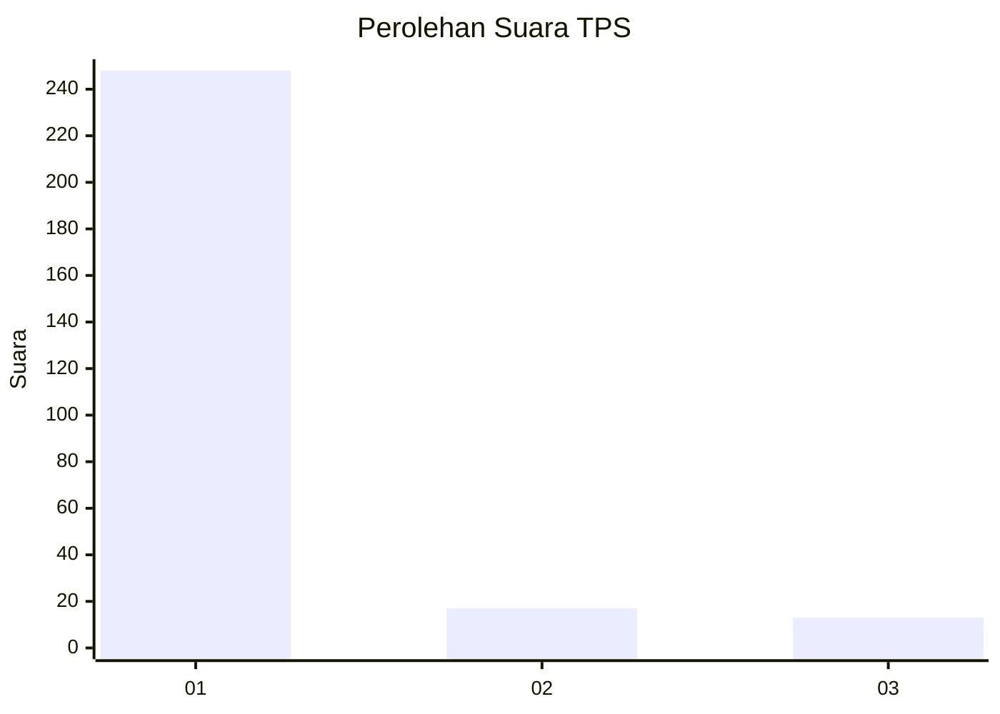
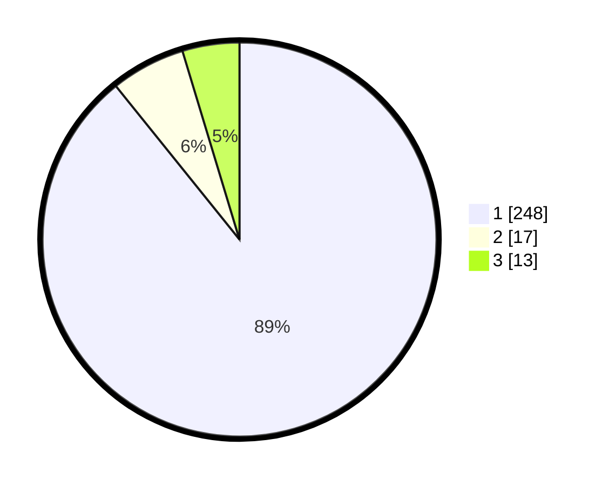

# Hasil

## Grafik

## Tabel

| No. | Nama Paslon    | Suara | Suara (raw) | Persentase |
|:--- |:-------------- | -----:| -----------:| ----------:|
| 1   | ANIES MUHAIMIN | 248   | [248][p-1]  | 89,21      |
| 2   | PRABOWO GIBRAN | 17    | [17][p-2]   | 6,12       |
| 3   | GANJAR MAHFUD  | 13    | [13][p-3]   | 4,68       |

[p-1]: https://github.com/gigit-pemilu/pemilu-2024/blob/main/pilpres/hitung-suara/sub/35-jawa-timur/sub/28-pamekasan/sub/07-pegantenan/sub/2001-plakpak/sub/002-tps/sub/paslon-1.txt
[p-2]: https://github.com/gigit-pemilu/pemilu-2024/blob/main/pilpres/hitung-suara/sub/35-jawa-timur/sub/28-pamekasan/sub/07-pegantenan/sub/2001-plakpak/sub/002-tps/sub/paslon-2.txt
[p-3]: https://github.com/gigit-pemilu/pemilu-2024/blob/main/pilpres/hitung-suara/sub/35-jawa-timur/sub/28-pamekasan/sub/07-pegantenan/sub/2001-plakpak/sub/002-tps/sub/paslon-3.txt

## Foto C Plano

https://sirekap-obj-formc.kpu.go.id/4b0c/pemilu/ppwp/35/28/07/20/01/3528072001002-20240214-205133--c6a3f860-1bbb-4d80-b081-2fb8a448701c.jpg

https://sirekap-obj-formc.kpu.go.id/4b0c/pemilu/ppwp/35/28/07/20/01/3528072001002-20240214-205243--208f03f4-c1a5-447f-b642-41272d2ffd11.jpg

https://sirekap-obj-formc.kpu.go.id/4b0c/pemilu/ppwp/35/28/07/20/01/3528072001002-20240214-205315--ac95a90b-d315-41ea-a5dc-0d8d46d9b0e8.jpg

## Metadata

| Key        | Value               |
| ---------- | ------------------- |
| Time Stamp | 2024-02-15 18:30:25 |

