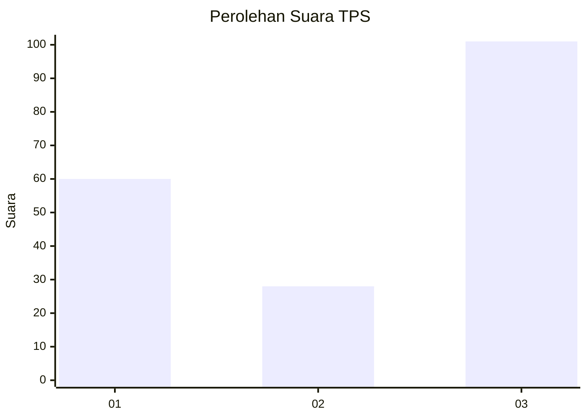
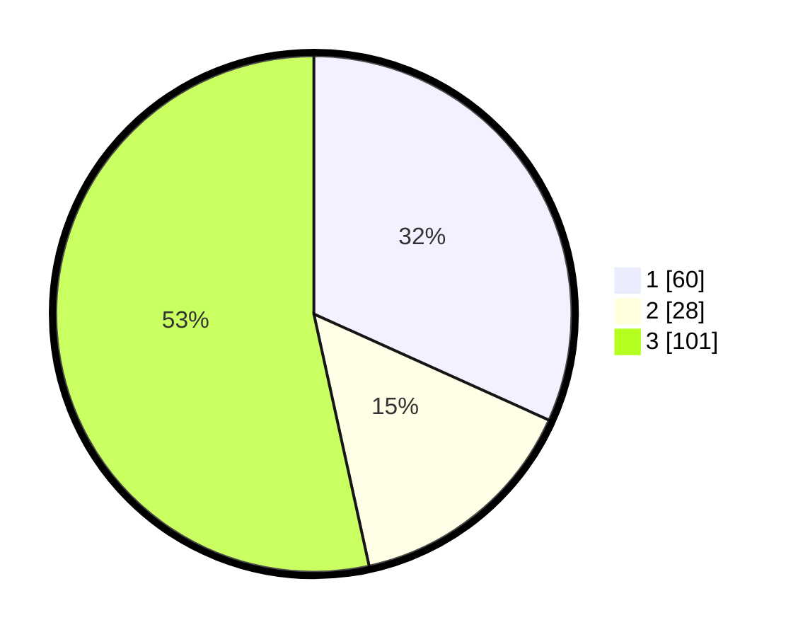

# Hasil

## Grafik

## Tabel

| No. | Nama Paslon    | Suara | Suara (raw) | Persentase |
|:--- |:-------------- | -----:| -----------:| ----------:|
| 1   | ANIES MUHAIMIN | 60    | [60][p-1]   | 31,75      |
| 2   | PRABOWO GIBRAN | 28    | [28][p-2]   | 14,81      |
| 3   | GANJAR MAHFUD  | 101   | [101][p-3]  | 53,44      |

[p-1]: https://github.com/gigit-pemilu/pemilu-2024-35-jawa-timur/blob/main/pilpres/hitung-suara/sub/35-jawa-timur/sub/28-pamekasan/sub/07-pegantenan/sub/2001-plakpak/sub/014-tps/sub/paslon-1.txt
[p-2]: https://github.com/gigit-pemilu/pemilu-2024-35-jawa-timur/blob/main/pilpres/hitung-suara/sub/35-jawa-timur/sub/28-pamekasan/sub/07-pegantenan/sub/2001-plakpak/sub/014-tps/sub/paslon-2.txt
[p-3]: https://github.com/gigit-pemilu/pemilu-2024-35-jawa-timur/blob/main/pilpres/hitung-suara/sub/35-jawa-timur/sub/28-pamekasan/sub/07-pegantenan/sub/2001-plakpak/sub/014-tps/sub/paslon-3.txt

## Foto C Plano

https://sirekap-obj-formc.kpu.go.id/b253/pemilu/ppwp/35/28/07/20/01/3528072001014-20240214-204301--8327dbc3-c604-49c6-97ac-8a01959e7e69.jpg

https://sirekap-obj-formc.kpu.go.id/b253/pemilu/ppwp/35/28/07/20/01/3528072001014-20240215-063307--73cfdc00-6824-4ff7-a843-6af0beb71ce3.jpg

https://sirekap-obj-formc.kpu.go.id/b253/pemilu/ppwp/35/28/07/20/01/3528072001014-20240215-063434--5178b007-031e-4242-b3b4-97844e76bcc2.jpg

## Metadata

| Key        | Value               |
| ---------- | ------------------- |
| Time Stamp | 2024-02-15 21:30:27 |

