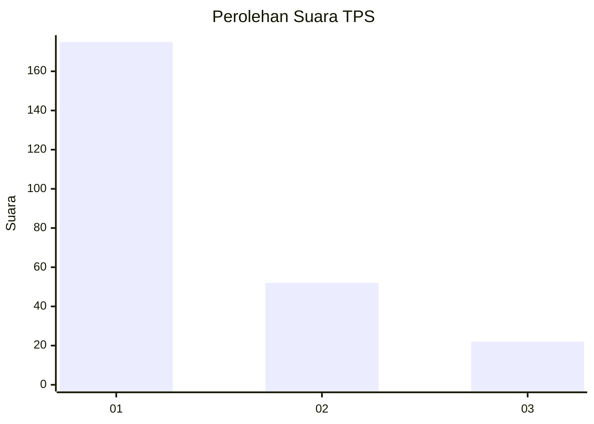
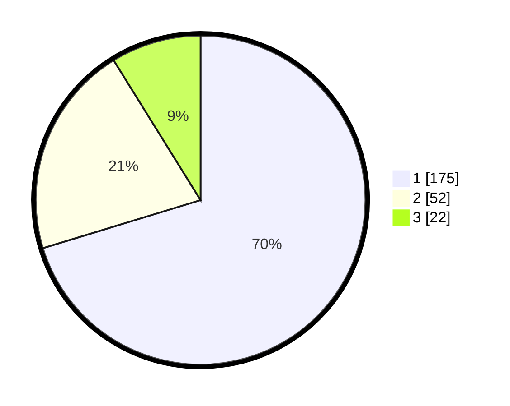

# Hasil

## Grafik

## Tabel

| No. | Nama Paslon    | Suara | Suara (raw) | Persentase |
|:--- |:-------------- | -----:| -----------:| ----------:|
| 1   | ANIES MUHAIMIN | 175   | [175][p-1]  | 70,28      |
| 2   | PRABOWO GIBRAN | 52    | [52][p-2]   | 20,88      |
| 3   | GANJAR MAHFUD  | 22    | [22][p-3]   | 8,84       |

[p-1]: https://github.com/gigit-pemilu/pemilu-2024/blob/main/pilpres/hitung-suara/sub/35-jawa-timur/sub/28-pamekasan/sub/07-pegantenan/sub/2001-plakpak/sub/020-tps/sub/paslon-1.txt
[p-2]: https://github.com/gigit-pemilu/pemilu-2024/blob/main/pilpres/hitung-suara/sub/35-jawa-timur/sub/28-pamekasan/sub/07-pegantenan/sub/2001-plakpak/sub/020-tps/sub/paslon-2.txt
[p-3]: https://github.com/gigit-pemilu/pemilu-2024/blob/main/pilpres/hitung-suara/sub/35-jawa-timur/sub/28-pamekasan/sub/07-pegantenan/sub/2001-plakpak/sub/020-tps/sub/paslon-3.txt

## Foto C Plano

https://sirekap-obj-formc.kpu.go.id/e657/pemilu/ppwp/35/28/07/20/01/3528072001020-20240214-214900--f02e21e5-ca61-485f-9c2e-6e27c214f300.jpg

https://sirekap-obj-formc.kpu.go.id/e657/pemilu/ppwp/35/28/07/20/01/3528072001020-20240214-195754--67335251-95cb-4c2e-ab08-cfff90d00c7e.jpg

https://sirekap-obj-formc.kpu.go.id/e657/pemilu/ppwp/35/28/07/20/01/3528072001020-20240214-203537--ab441214-e39c-4deb-9659-6afe7c762ae3.jpg

## Metadata

| Key        | Value               |
| ---------- | ------------------- |
| Time Stamp | 2024-02-15 18:30:25 |

