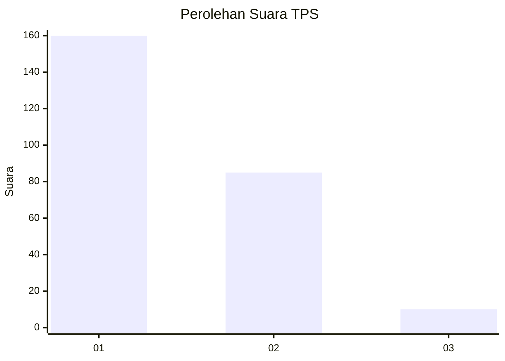
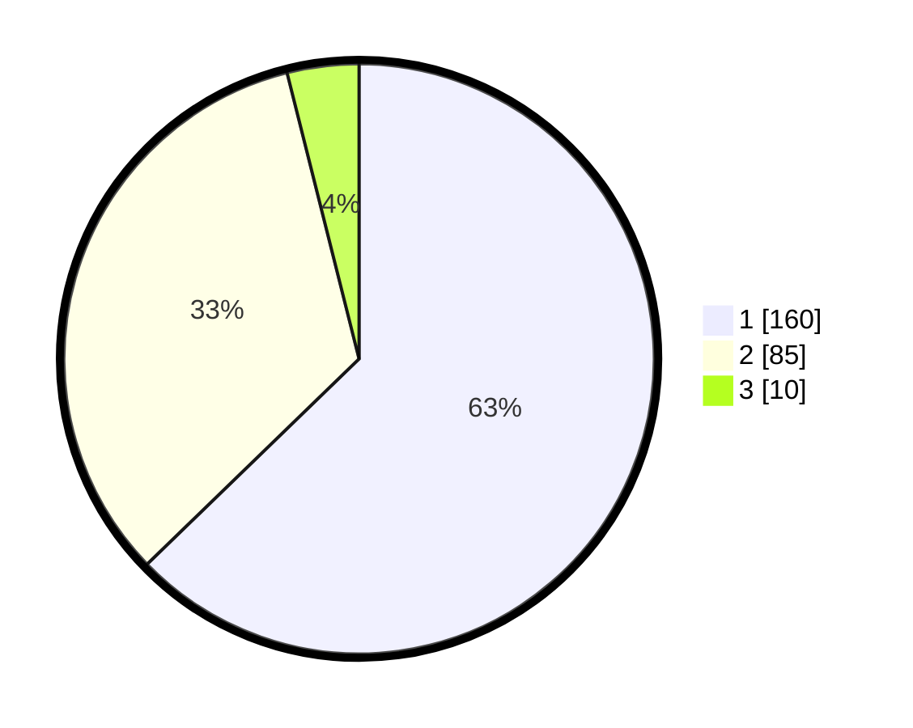

# Hasil

## Grafik

## Tabel

| No. | Nama Paslon    | Suara | Suara (raw) | Persentase |
|:--- |:-------------- | -----:| -----------:| ----------:|
| 1   | ANIES MUHAIMIN | 160   | [160][p-1]  | 62,75      |
| 2   | PRABOWO GIBRAN | 85    | [85][p-2]   | 33,33      |
| 3   | GANJAR MAHFUD  | 10    | [10][p-3]   | 3,92       |

[p-1]: https://github.com/gigit-pemilu/pemilu-2024/blob/main/pilpres/hitung-suara/sub/35-jawa-timur/sub/28-pamekasan/sub/07-pegantenan/sub/2001-plakpak/sub/036-tps/sub/paslon-1.txt
[p-2]: https://github.com/gigit-pemilu/pemilu-2024/blob/main/pilpres/hitung-suara/sub/35-jawa-timur/sub/28-pamekasan/sub/07-pegantenan/sub/2001-plakpak/sub/036-tps/sub/paslon-2.txt
[p-3]: https://github.com/gigit-pemilu/pemilu-2024/blob/main/pilpres/hitung-suara/sub/35-jawa-timur/sub/28-pamekasan/sub/07-pegantenan/sub/2001-plakpak/sub/036-tps/sub/paslon-3.txt

## Foto C Plano

https://sirekap-obj-formc.kpu.go.id/e3a8/pemilu/ppwp/35/28/07/20/01/3528072001036-20240214-214436--5f9dd8a7-a846-48b4-9bcb-291643a00917.jpg

https://sirekap-obj-formc.kpu.go.id/e3a8/pemilu/ppwp/35/28/07/20/01/3528072001036-20240214-214624--d51231d8-848f-48f5-9d86-22eb510e0bd3.jpg

https://sirekap-obj-formc.kpu.go.id/e3a8/pemilu/ppwp/35/28/07/20/01/3528072001036-20240214-214809--92693b98-edc0-4788-b519-7f345ac98647.jpg

## Metadata

| Key        | Value               |
| ---------- | ------------------- |
| Time Stamp | 2024-02-15 18:30:25 |

