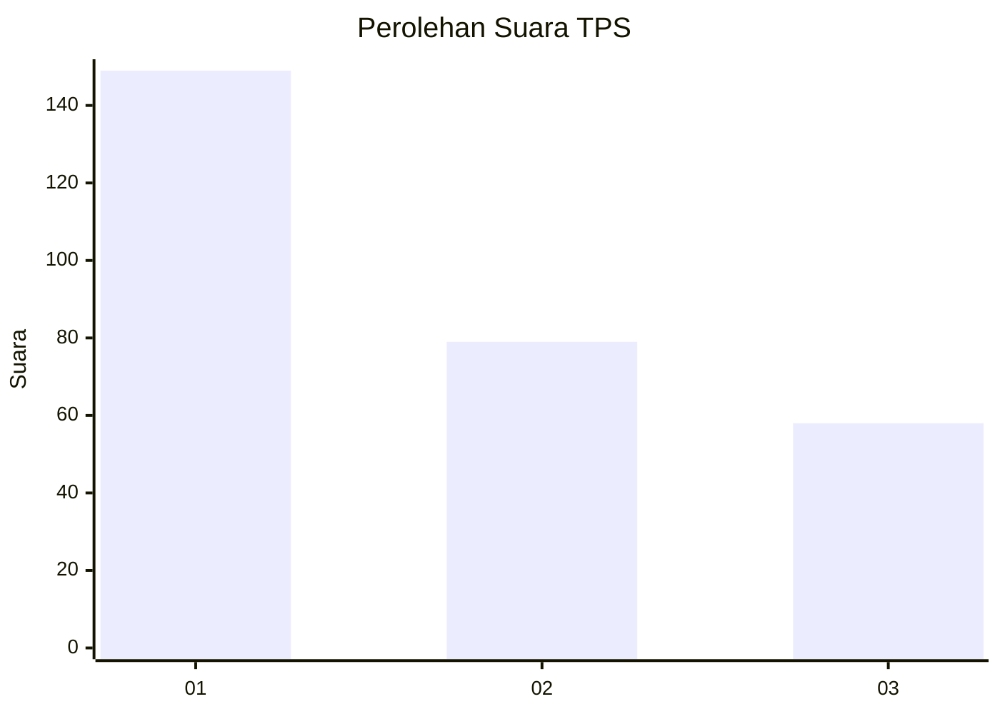
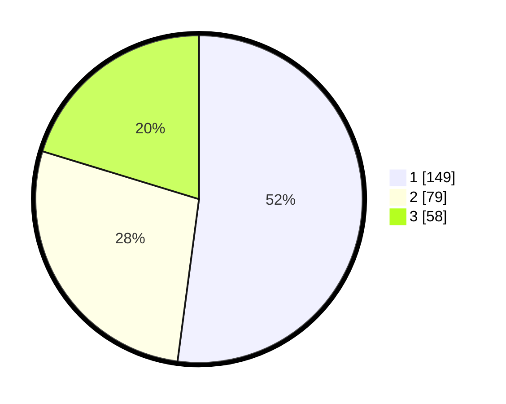

# Hasil

## Grafik

## Tabel

| No. | Nama Paslon    | Suara | Suara (raw) | Persentase |
|:--- |:-------------- | -----:| -----------:| ----------:|
| 1   | ANIES MUHAIMIN | 149   | [149][p-1]  | 52,10      |
| 2   | PRABOWO GIBRAN | 79    | [79][p-2]   | 27,62      |
| 3   | GANJAR MAHFUD  | 58    | [58][p-3]   | 20,28      |

[p-1]: https://github.com/gigit-pemilu/pemilu-2024-35-jawa-timur/blob/main/pilpres/hitung-suara/sub/35-jawa-timur/sub/28-pamekasan/sub/07-pegantenan/sub/2001-plakpak/sub/037-tps/sub/paslon-1.txt
[p-2]: https://github.com/gigit-pemilu/pemilu-2024-35-jawa-timur/blob/main/pilpres/hitung-suara/sub/35-jawa-timur/sub/28-pamekasan/sub/07-pegantenan/sub/2001-plakpak/sub/037-tps/sub/paslon-2.txt
[p-3]: https://github.com/gigit-pemilu/pemilu-2024-35-jawa-timur/blob/main/pilpres/hitung-suara/sub/35-jawa-timur/sub/28-pamekasan/sub/07-pegantenan/sub/2001-plakpak/sub/037-tps/sub/paslon-3.txt

## Foto C Plano

https://sirekap-obj-formc.kpu.go.id/23c0/pemilu/ppwp/35/28/07/20/01/3528072001037-20240214-221917--d08a0c9d-358d-459b-b46c-d05d59820669.jpg

https://sirekap-obj-formc.kpu.go.id/23c0/pemilu/ppwp/35/28/07/20/01/3528072001037-20240214-222321--f6c5ef30-8bf4-4012-9005-c34d497e38b4.jpg

https://sirekap-obj-formc.kpu.go.id/23c0/pemilu/ppwp/35/28/07/20/01/3528072001037-20240214-222145--4cd447fd-d901-4354-bfc1-01d281ad269c.jpg

## Metadata

| Key        | Value               |
| ---------- | ------------------- |
| Time Stamp | 2024-02-15 18:30:25 |

