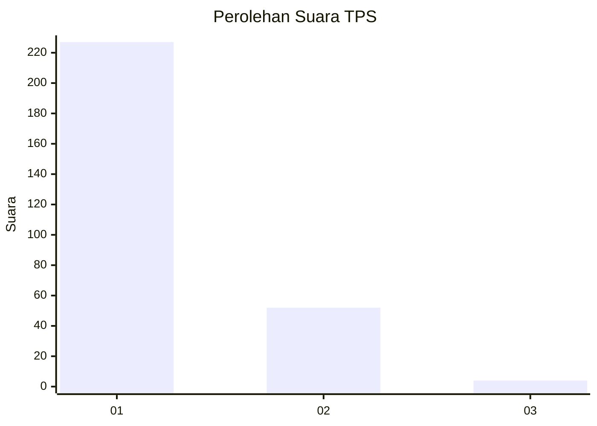
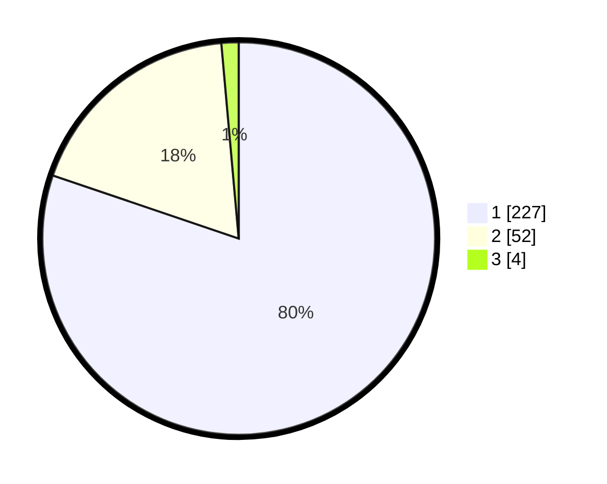

# Hasil

## Grafik

## Tabel

| No. | Nama Paslon    | Suara | Suara (raw) | Persentase |
|:--- |:-------------- | -----:| -----------:| ----------:|
| 1   | ANIES MUHAIMIN | 227   | [227][p-1]  | 80,21      |
| 2   | PRABOWO GIBRAN | 52    | [52][p-2]   | 18,37      |
| 3   | GANJAR MAHFUD  | 4     | [4][p-3]    | 1,41       |

[p-1]: https://github.com/gigit-pemilu/pemilu-2024/blob/main/pilpres/hitung-suara/sub/35-jawa-timur/sub/28-pamekasan/sub/07-pegantenan/sub/2002-palesanggar/sub/003-tps/sub/paslon-1.txt
[p-2]: https://github.com/gigit-pemilu/pemilu-2024/blob/main/pilpres/hitung-suara/sub/35-jawa-timur/sub/28-pamekasan/sub/07-pegantenan/sub/2002-palesanggar/sub/003-tps/sub/paslon-2.txt
[p-3]: https://github.com/gigit-pemilu/pemilu-2024/blob/main/pilpres/hitung-suara/sub/35-jawa-timur/sub/28-pamekasan/sub/07-pegantenan/sub/2002-palesanggar/sub/003-tps/sub/paslon-3.txt

## Foto C Plano

https://sirekap-obj-formc.kpu.go.id/7f14/pemilu/ppwp/35/28/07/20/02/3528072002003-20240215-231746--3d13a2a4-db83-428a-a801-30e874cde273.jpg

https://sirekap-obj-formc.kpu.go.id/7f14/pemilu/ppwp/35/28/07/20/02/3528072002003-20240215-231804--106e4c74-d6c2-43b6-a82b-ad18f8247675.jpg

https://sirekap-obj-formc.kpu.go.id/7f14/pemilu/ppwp/35/28/07/20/02/3528072002003-20240215-231817--c08d7e91-6165-4b4c-bc87-e6758ecea7e9.jpg

## Metadata

| Key        | Value               |
| ---------- | ------------------- |
| Time Stamp | 2024-02-19 06:16:00 |

