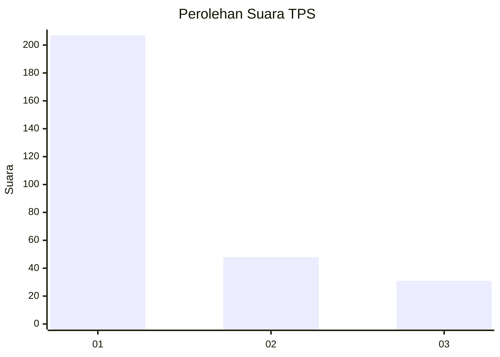
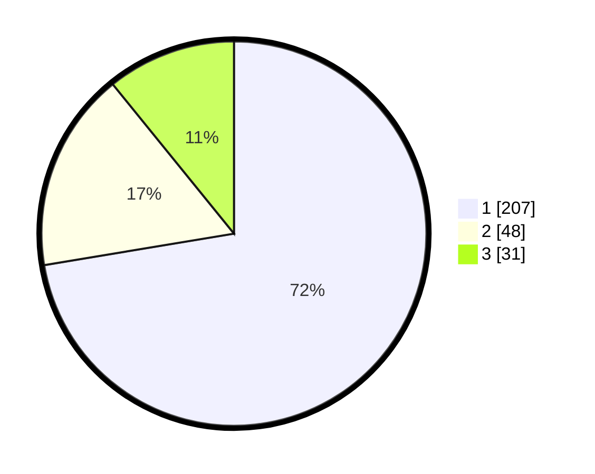

# Hasil

## Grafik

## Tabel

| No. | Nama Paslon    | Suara | Suara (raw) | Persentase |
|:--- |:-------------- | -----:| -----------:| ----------:|
| 1   | ANIES MUHAIMIN | 207   | [207][p-1]  | 72,38      |
| 2   | PRABOWO GIBRAN | 48    | [48][p-2]   | 16,78      |
| 3   | GANJAR MAHFUD  | 31    | [31][p-3]   | 10,84      |

[p-1]: https://github.com/gigit-pemilu/pemilu-2024/blob/main/pilpres/hitung-suara/sub/35-jawa-timur/sub/28-pamekasan/sub/07-pegantenan/sub/2002-palesanggar/sub/004-tps/sub/paslon-1.txt
[p-2]: https://github.com/gigit-pemilu/pemilu-2024/blob/main/pilpres/hitung-suara/sub/35-jawa-timur/sub/28-pamekasan/sub/07-pegantenan/sub/2002-palesanggar/sub/004-tps/sub/paslon-2.txt
[p-3]: https://github.com/gigit-pemilu/pemilu-2024/blob/main/pilpres/hitung-suara/sub/35-jawa-timur/sub/28-pamekasan/sub/07-pegantenan/sub/2002-palesanggar/sub/004-tps/sub/paslon-3.txt

## Foto C Plano

https://sirekap-obj-formc.kpu.go.id/4985/pemilu/ppwp/35/28/07/20/02/3528072002004-20240214-141143--a713db90-556d-4a1e-9003-8e7c3e55f699.jpg

https://sirekap-obj-formc.kpu.go.id/4985/pemilu/ppwp/35/28/07/20/02/3528072002004-20240214-141246--1af87927-61eb-4f57-8ede-682f4f43a783.jpg

https://sirekap-obj-formc.kpu.go.id/4985/pemilu/ppwp/35/28/07/20/02/3528072002004-20240214-141352--f254d019-253d-41f9-901d-acb30ca9c46b.jpg

## Metadata

| Key        | Value               |
| ---------- | ------------------- |
| Time Stamp | 2024-02-15 18:30:25 |

