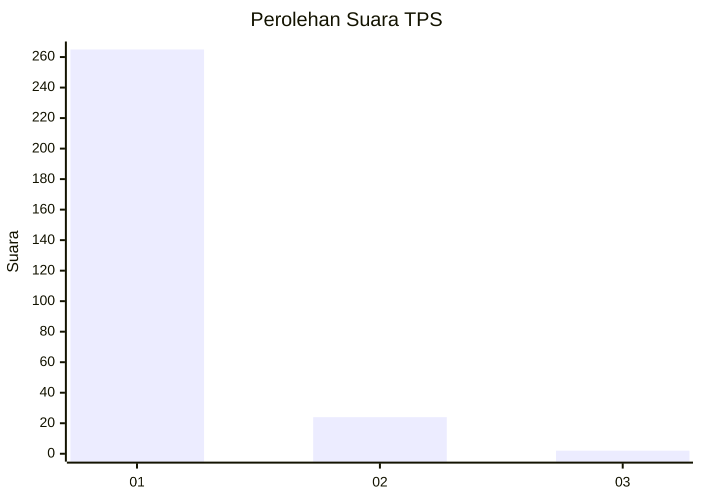
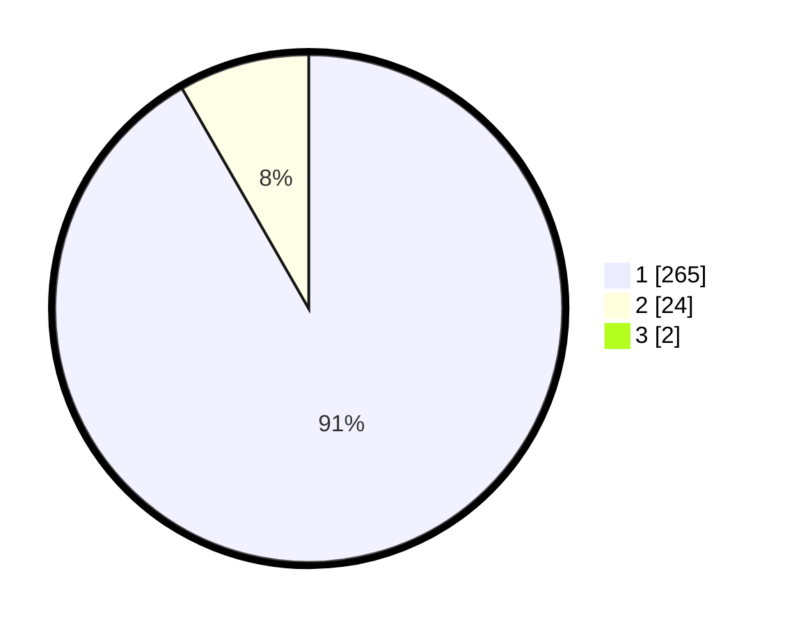

# Hasil

## Grafik

## Tabel

| No. | Nama Paslon    | Suara | Suara (raw) | Persentase |
|:--- |:-------------- | -----:| -----------:| ----------:|
| 1   | ANIES MUHAIMIN | 265   | [265][p-1]  | 91,07      |
| 2   | PRABOWO GIBRAN | 24    | [24][p-2]   | 8,25       |
| 3   | GANJAR MAHFUD  | 2     | [2][p-3]    | 0,69       |

[p-1]: https://github.com/gigit-pemilu/pemilu-2024-35-jawa-timur/blob/main/pilpres/hitung-suara/sub/35-jawa-timur/sub/28-pamekasan/sub/07-pegantenan/sub/2002-palesanggar/sub/010-tps/sub/paslon-1.txt
[p-2]: https://github.com/gigit-pemilu/pemilu-2024-35-jawa-timur/blob/main/pilpres/hitung-suara/sub/35-jawa-timur/sub/28-pamekasan/sub/07-pegantenan/sub/2002-palesanggar/sub/010-tps/sub/paslon-2.txt
[p-3]: https://github.com/gigit-pemilu/pemilu-2024-35-jawa-timur/blob/main/pilpres/hitung-suara/sub/35-jawa-timur/sub/28-pamekasan/sub/07-pegantenan/sub/2002-palesanggar/sub/010-tps/sub/paslon-3.txt

## Foto C Plano

https://sirekap-obj-formc.kpu.go.id/665a/pemilu/ppwp/35/28/07/20/02/3528072002010-20240214-141437--931c3713-0a7e-485f-8769-9594bd3e368f.jpg

https://sirekap-obj-formc.kpu.go.id/665a/pemilu/ppwp/35/28/07/20/02/3528072002010-20240214-141540--714a58de-0f12-4df0-b0f0-feead3fc51f6.jpg

https://sirekap-obj-formc.kpu.go.id/665a/pemilu/ppwp/35/28/07/20/02/3528072002010-20240214-141645--34d39392-d63b-461c-baee-d61e47e12168.jpg

## Metadata

| Key        | Value               |
| ---------- | ------------------- |
| Time Stamp | 2024-02-15 18:30:25 |

