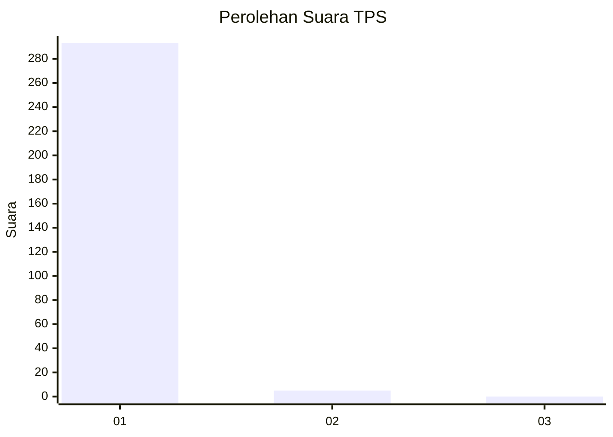
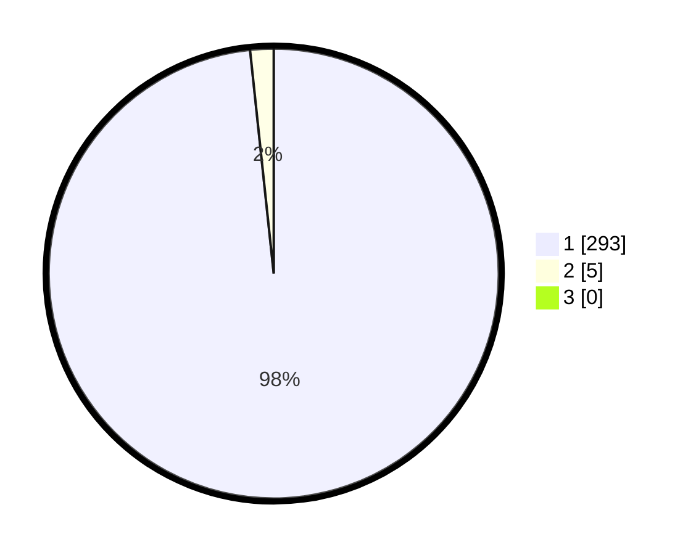

# Hasil

## Grafik

## Tabel

| No. | Nama Paslon    | Suara | Suara (raw) | Persentase |
|:--- |:-------------- | -----:| -----------:| ----------:|
| 1   | ANIES MUHAIMIN | 293   | [293][p-1]  | 98,32      |
| 2   | PRABOWO GIBRAN | 5     | [5][p-2]    | 1,68       |
| 3   | GANJAR MAHFUD  | 0     | [0][p-3]    | 0,00       |

[p-1]: https://github.com/gigit-pemilu/pemilu-2024/blob/main/pilpres/hitung-suara/sub/35-jawa-timur/sub/28-pamekasan/sub/07-pegantenan/sub/2002-palesanggar/sub/011-tps/sub/paslon-1.txt
[p-2]: https://github.com/gigit-pemilu/pemilu-2024/blob/main/pilpres/hitung-suara/sub/35-jawa-timur/sub/28-pamekasan/sub/07-pegantenan/sub/2002-palesanggar/sub/011-tps/sub/paslon-2.txt
[p-3]: https://github.com/gigit-pemilu/pemilu-2024/blob/main/pilpres/hitung-suara/sub/35-jawa-timur/sub/28-pamekasan/sub/07-pegantenan/sub/2002-palesanggar/sub/011-tps/sub/paslon-3.txt

## Foto C Plano

https://sirekap-obj-formc.kpu.go.id/a131/pemilu/ppwp/35/28/07/20/02/3528072002011-20240214-233146--b376b805-a710-4828-b07c-755466f74a52.jpg

https://sirekap-obj-formc.kpu.go.id/a131/pemilu/ppwp/35/28/07/20/02/3528072002011-20240214-233156--218714e2-08c5-4e42-b846-0e7813f1a0e3.jpg

https://sirekap-obj-formc.kpu.go.id/a131/pemilu/ppwp/35/28/07/20/02/3528072002011-20240214-233204--e7c6d236-5e43-434f-82a8-bffbb50572f1.jpg

## Metadata

| Key        | Value               |
| ---------- | ------------------- |
| Time Stamp | 2024-02-24 22:31:28 |

