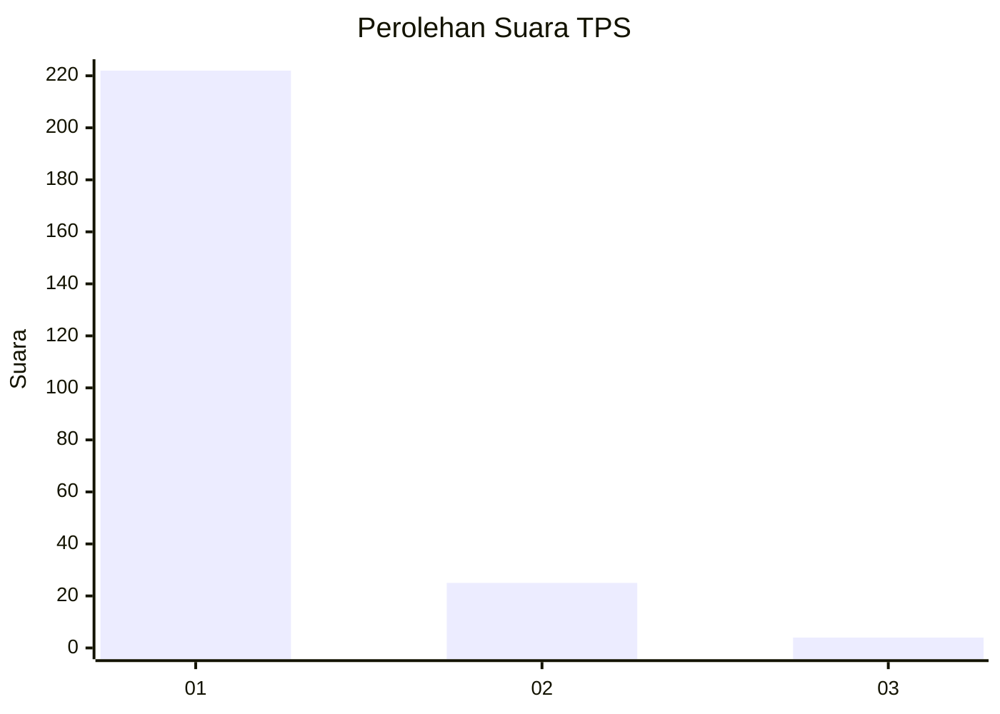
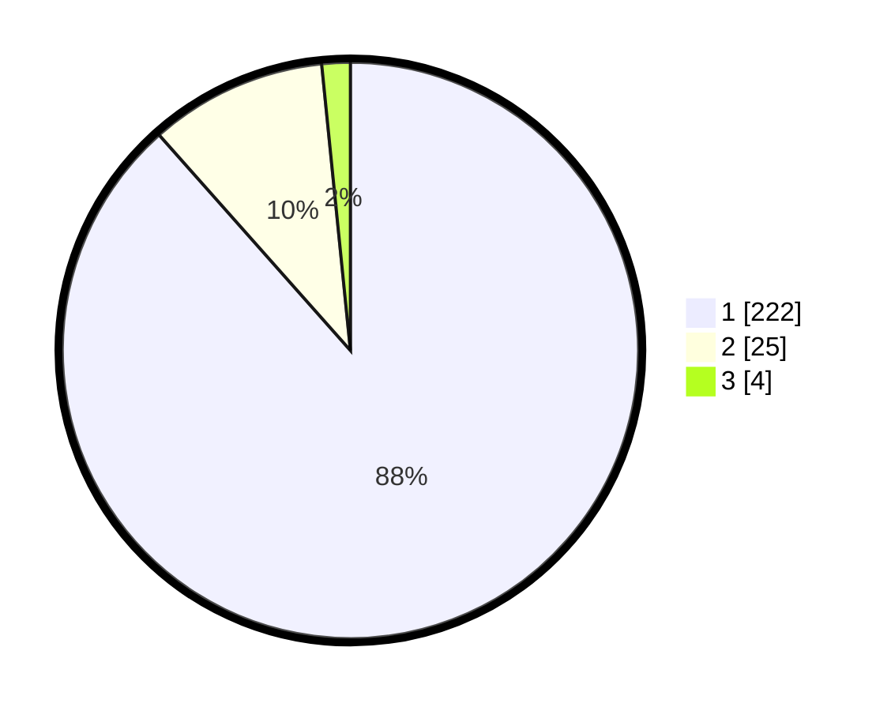

# Hasil

## Grafik

## Tabel

| No. | Nama Paslon    | Suara | Suara (raw) | Persentase |
|:--- |:-------------- | -----:| -----------:| ----------:|
| 1   | ANIES MUHAIMIN | 222   | [222][p-1]  | 88,45      |
| 2   | PRABOWO GIBRAN | 25    | [25][p-2]   | 9,96       |
| 3   | GANJAR MAHFUD  | 4     | [4][p-3]    | 1,59       |

[p-1]: https://github.com/gigit-pemilu/pemilu-2024/blob/main/pilpres/hitung-suara/sub/35-jawa-timur/sub/28-pamekasan/sub/07-pegantenan/sub/2002-palesanggar/sub/017-tps/sub/paslon-1.txt
[p-2]: https://github.com/gigit-pemilu/pemilu-2024/blob/main/pilpres/hitung-suara/sub/35-jawa-timur/sub/28-pamekasan/sub/07-pegantenan/sub/2002-palesanggar/sub/017-tps/sub/paslon-2.txt
[p-3]: https://github.com/gigit-pemilu/pemilu-2024/blob/main/pilpres/hitung-suara/sub/35-jawa-timur/sub/28-pamekasan/sub/07-pegantenan/sub/2002-palesanggar/sub/017-tps/sub/paslon-3.txt

## Foto C Plano

https://sirekap-obj-formc.kpu.go.id/7b7b/pemilu/ppwp/35/28/07/20/02/3528072002017-20240215-104601--90d459fb-de97-4c0a-9c3a-799c4ee3b1c8.jpg

https://sirekap-obj-formc.kpu.go.id/7b7b/pemilu/ppwp/35/28/07/20/02/3528072002017-20240215-104715--fa9bdc62-af60-41f0-8616-e6d365cdb68f.jpg

https://sirekap-obj-formc.kpu.go.id/7b7b/pemilu/ppwp/35/28/07/20/02/3528072002017-20240215-104658--fe590f3c-e42f-4bda-8f7d-b1b11914125e.jpg

## Metadata

| Key        | Value               |
| ---------- | ------------------- |
| Time Stamp | 2024-02-15 19:30:26 |

