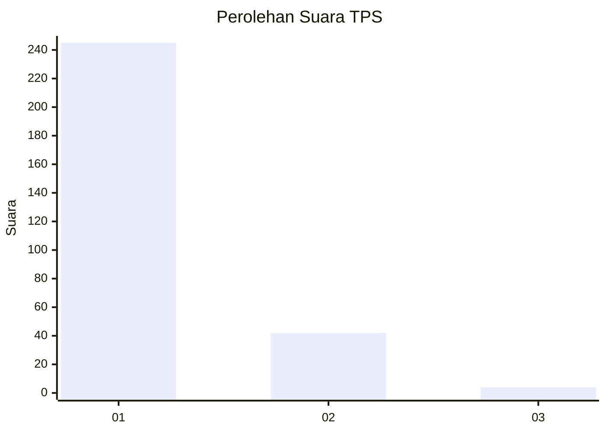
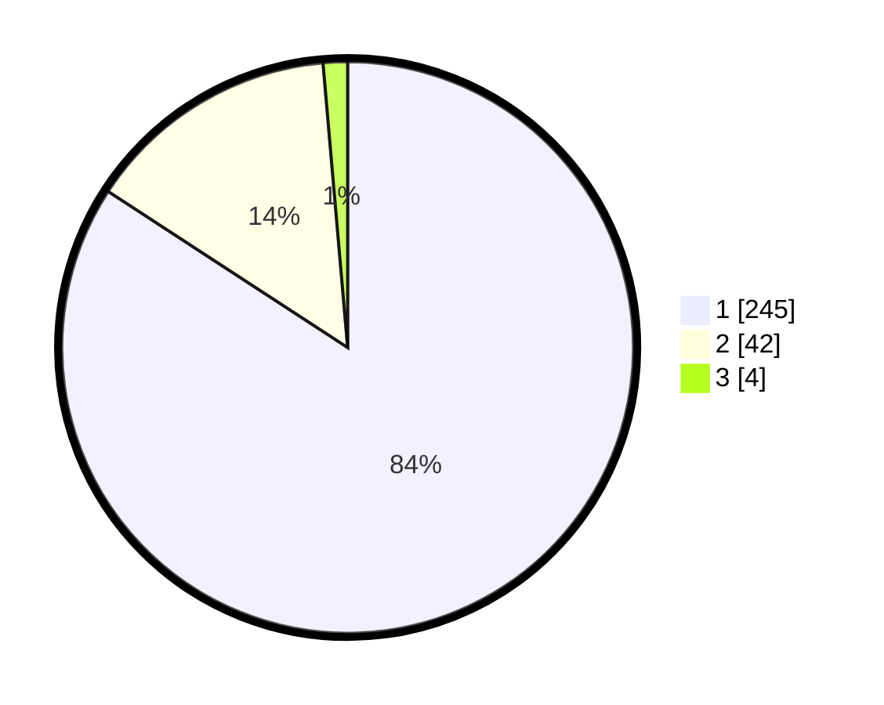

# Hasil

## Grafik

## Tabel

| No. | Nama Paslon    | Suara | Suara (raw) | Persentase |
|:--- |:-------------- | -----:| -----------:| ----------:|
| 1   | ANIES MUHAIMIN | 245   | [245][p-1]  | 84,19      |
| 2   | PRABOWO GIBRAN | 42    | [42][p-2]   | 14,43      |
| 3   | GANJAR MAHFUD  | 4     | [4][p-3]    | 1,37       |

[p-1]: https://github.com/gigit-pemilu/pemilu-2024/blob/main/pilpres/hitung-suara/sub/35-jawa-timur/sub/28-pamekasan/sub/07-pegantenan/sub/2002-palesanggar/sub/019-tps/sub/paslon-1.txt
[p-2]: https://github.com/gigit-pemilu/pemilu-2024/blob/main/pilpres/hitung-suara/sub/35-jawa-timur/sub/28-pamekasan/sub/07-pegantenan/sub/2002-palesanggar/sub/019-tps/sub/paslon-2.txt
[p-3]: https://github.com/gigit-pemilu/pemilu-2024/blob/main/pilpres/hitung-suara/sub/35-jawa-timur/sub/28-pamekasan/sub/07-pegantenan/sub/2002-palesanggar/sub/019-tps/sub/paslon-3.txt

## Foto C Plano

https://sirekap-obj-formc.kpu.go.id/093d/pemilu/ppwp/35/28/07/20/02/3528072002019-20240215-082004--a6cbfd06-6206-4fa2-9e37-b780a5b6d30c.jpg

https://sirekap-obj-formc.kpu.go.id/093d/pemilu/ppwp/35/28/07/20/02/3528072002019-20240215-082007--d3f27df2-1955-46ce-8d4f-a5cd2a9bfa58.jpg

https://sirekap-obj-formc.kpu.go.id/093d/pemilu/ppwp/35/28/07/20/02/3528072002019-20240215-082015--ce212d10-195e-4daf-965e-056081f553b8.jpg

## Metadata

| Key        | Value               |
| ---------- | ------------------- |
| Time Stamp | 2024-02-15 21:30:27 |

