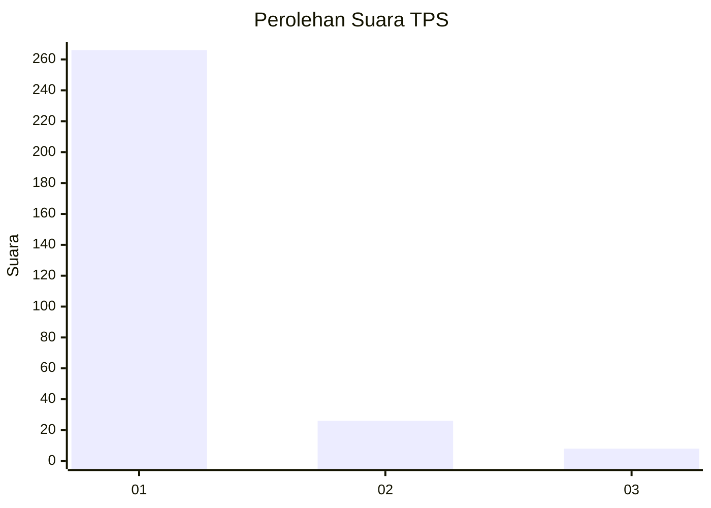
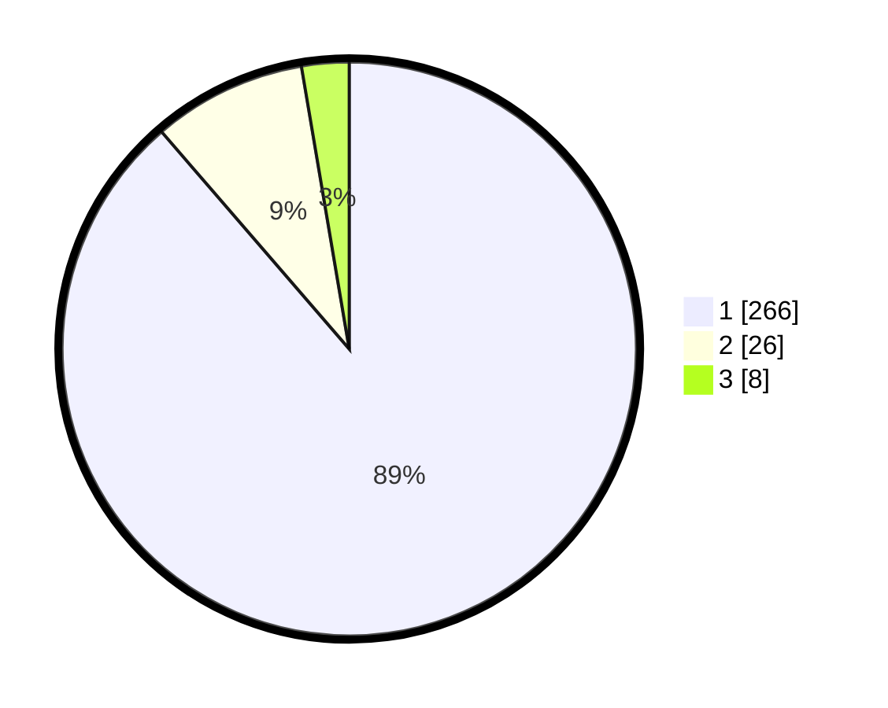

# Hasil

## Grafik

## Tabel

| No. | Nama Paslon    | Suara | Suara (raw) | Persentase |
|:--- |:-------------- | -----:| -----------:| ----------:|
| 1   | ANIES MUHAIMIN | 266   | [266][p-1]  | 88,67      |
| 2   | PRABOWO GIBRAN | 26    | [26][p-2]   | 8,67       |
| 3   | GANJAR MAHFUD  | 8     | [8][p-3]    | 2,67       |

[p-1]: https://github.com/gigit-pemilu/pemilu-2024/blob/main/pilpres/hitung-suara/sub/35-jawa-timur/sub/28-pamekasan/sub/07-pegantenan/sub/2005-bulangan-barat/sub/003-tps/sub/paslon-1.txt
[p-2]: https://github.com/gigit-pemilu/pemilu-2024/blob/main/pilpres/hitung-suara/sub/35-jawa-timur/sub/28-pamekasan/sub/07-pegantenan/sub/2005-bulangan-barat/sub/003-tps/sub/paslon-2.txt
[p-3]: https://github.com/gigit-pemilu/pemilu-2024/blob/main/pilpres/hitung-suara/sub/35-jawa-timur/sub/28-pamekasan/sub/07-pegantenan/sub/2005-bulangan-barat/sub/003-tps/sub/paslon-3.txt

## Foto C Plano

https://sirekap-obj-formc.kpu.go.id/e36c/pemilu/ppwp/35/28/07/20/05/3528072005003-20240215-021300--01d7e474-d174-4114-9f28-a868f6390c7e.jpg

https://sirekap-obj-formc.kpu.go.id/e36c/pemilu/ppwp/35/28/07/20/05/3528072005003-20240215-024911--629c223d-538c-45f0-bc78-df0a1a2a58ec.jpg

https://sirekap-obj-formc.kpu.go.id/e36c/pemilu/ppwp/35/28/07/20/05/3528072005003-20240214-230246--57350005-ca7f-465c-8af2-80511e92d08d.jpg

## Metadata

| Key        | Value               |
| ---------- | ------------------- |
| Time Stamp | 2024-02-24 22:31:28 |

