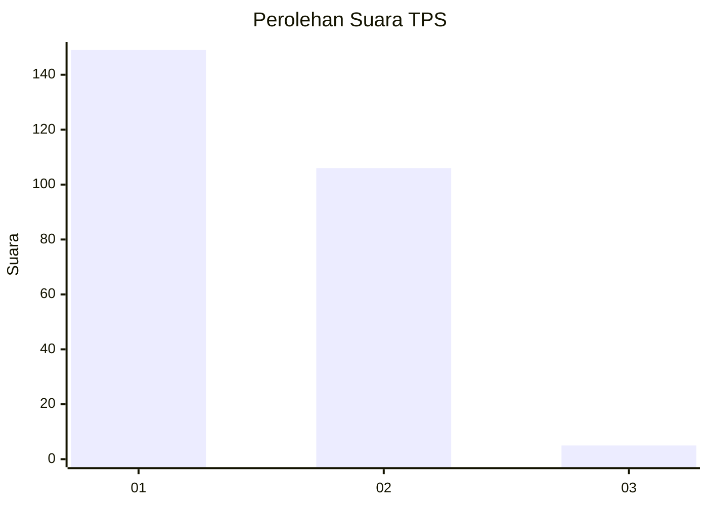
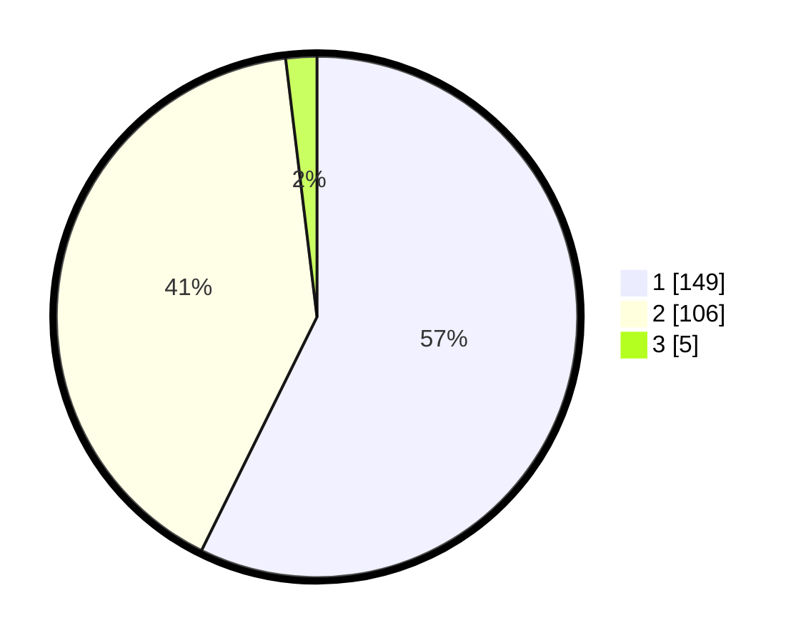

# Hasil

## Grafik

## Tabel

| No. | Nama Paslon    | Suara | Suara (raw) | Persentase |
|:--- |:-------------- | -----:| -----------:| ----------:|
| 1   | ANIES MUHAIMIN | 149   | [149][p-1]  | 57,31      |
| 2   | PRABOWO GIBRAN | 106   | [106][p-2]  | 40,77      |
| 3   | GANJAR MAHFUD  | 5     | [5][p-3]    | 1,92       |

[p-1]: https://github.com/gigit-pemilu/pemilu-2024-35-jawa-timur/blob/main/pilpres/hitung-suara/sub/35-jawa-timur/sub/28-pamekasan/sub/07-pegantenan/sub/2005-bulangan-barat/sub/008-tps/sub/paslon-1.txt
[p-2]: https://github.com/gigit-pemilu/pemilu-2024-35-jawa-timur/blob/main/pilpres/hitung-suara/sub/35-jawa-timur/sub/28-pamekasan/sub/07-pegantenan/sub/2005-bulangan-barat/sub/008-tps/sub/paslon-2.txt
[p-3]: https://github.com/gigit-pemilu/pemilu-2024-35-jawa-timur/blob/main/pilpres/hitung-suara/sub/35-jawa-timur/sub/28-pamekasan/sub/07-pegantenan/sub/2005-bulangan-barat/sub/008-tps/sub/paslon-3.txt

## Foto C Plano

https://sirekap-obj-formc.kpu.go.id/b88e/pemilu/ppwp/35/28/07/20/05/3528072005008-20240214-220215--f004f8d0-83e3-4eca-ad2b-1ca4865130d6.jpg

https://sirekap-obj-formc.kpu.go.id/b88e/pemilu/ppwp/35/28/07/20/05/3528072005008-20240214-220436--8096a9a2-bb17-4058-8279-fe9500571fe9.jpg

https://sirekap-obj-formc.kpu.go.id/b88e/pemilu/ppwp/35/28/07/20/05/3528072005008-20240214-221635--9886b349-ac4c-45b0-bc0e-01c9a78e4f21.jpg

## Metadata

| Key        | Value               |
| ---------- | ------------------- |
| Time Stamp | 2024-02-15 18:30:25 |

