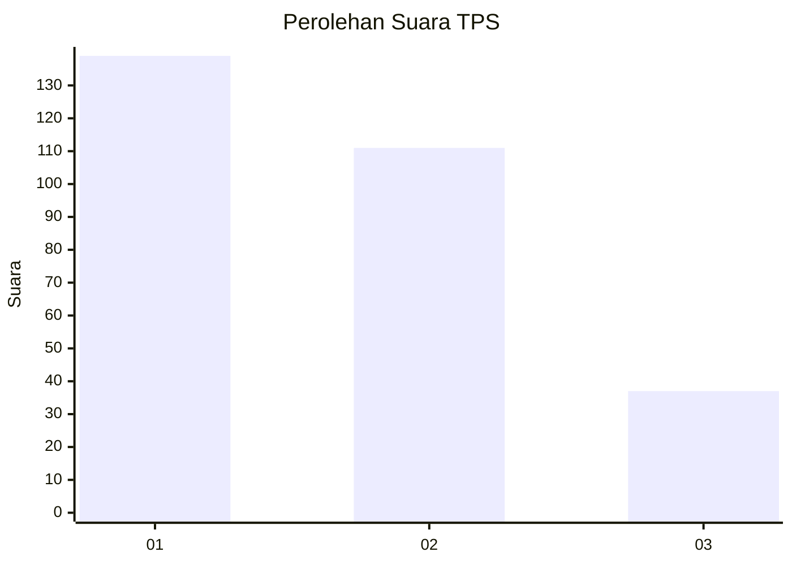
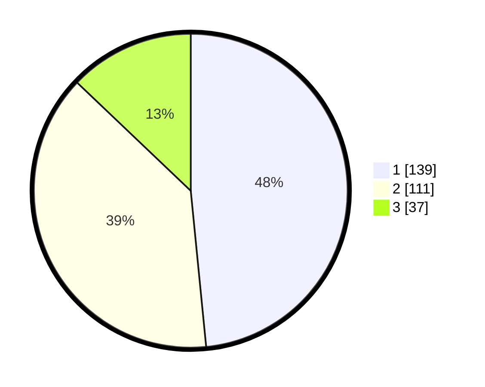

# Hasil

## Grafik

## Tabel

| No. | Nama Paslon    | Suara | Suara (raw) | Persentase |
|:--- |:-------------- | -----:| -----------:| ----------:|
| 1   | ANIES MUHAIMIN | 139   | [139][p-1]  | 48,43      |
| 2   | PRABOWO GIBRAN | 111   | [111][p-2]  | 38,68      |
| 3   | GANJAR MAHFUD  | 37    | [37][p-3]   | 12,89      |

[p-1]: https://github.com/gigit-pemilu/pemilu-2024/blob/main/pilpres/hitung-suara/sub/35-jawa-timur/sub/28-pamekasan/sub/07-pegantenan/sub/2006-bulangan-haji/sub/011-tps/sub/paslon-1.txt
[p-2]: https://github.com/gigit-pemilu/pemilu-2024/blob/main/pilpres/hitung-suara/sub/35-jawa-timur/sub/28-pamekasan/sub/07-pegantenan/sub/2006-bulangan-haji/sub/011-tps/sub/paslon-2.txt
[p-3]: https://github.com/gigit-pemilu/pemilu-2024/blob/main/pilpres/hitung-suara/sub/35-jawa-timur/sub/28-pamekasan/sub/07-pegantenan/sub/2006-bulangan-haji/sub/011-tps/sub/paslon-3.txt

## Foto C Plano

https://sirekap-obj-formc.kpu.go.id/d4b3/pemilu/ppwp/35/28/07/20/06/3528072006011-20240215-072646--7913eb63-1fd9-4fd1-a323-f4d9f34e180d.jpg

https://sirekap-obj-formc.kpu.go.id/d4b3/pemilu/ppwp/35/28/07/20/06/3528072006011-20240215-072710--35111c15-bf24-4e11-9314-cf541de8ba57.jpg

https://sirekap-obj-formc.kpu.go.id/d4b3/pemilu/ppwp/35/28/07/20/06/3528072006011-20240215-072725--499d655c-4f76-483b-8a22-d0ad108f084a.jpg

## Metadata

| Key        | Value               |
| ---------- | ------------------- |
| Time Stamp | 2024-02-24 22:31:28 |

