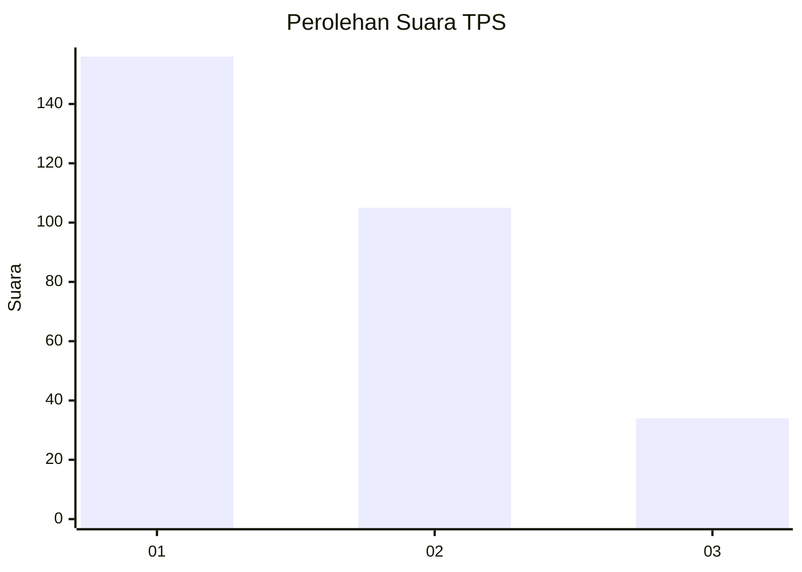
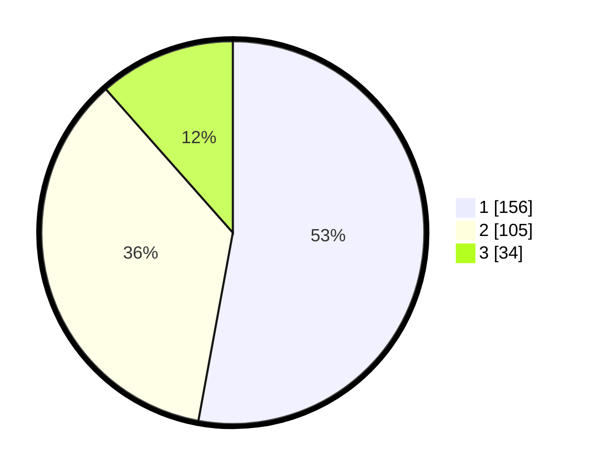

# Hasil

## Grafik

## Tabel

| No. | Nama Paslon    | Suara | Suara (raw) | Persentase |
|:--- |:-------------- | -----:| -----------:| ----------:|
| 1   | ANIES MUHAIMIN | 156   | [156][p-1]  | 52,88      |
| 2   | PRABOWO GIBRAN | 105   | [105][p-2]  | 35,59      |
| 3   | GANJAR MAHFUD  | 34    | [34][p-3]   | 11,53      |

[p-1]: https://github.com/gigit-pemilu/pemilu-2024/blob/main/pilpres/hitung-suara/sub/35-jawa-timur/sub/28-pamekasan/sub/07-pegantenan/sub/2009-tebul-timur/sub/005-tps/sub/paslon-1.txt
[p-2]: https://github.com/gigit-pemilu/pemilu-2024/blob/main/pilpres/hitung-suara/sub/35-jawa-timur/sub/28-pamekasan/sub/07-pegantenan/sub/2009-tebul-timur/sub/005-tps/sub/paslon-2.txt
[p-3]: https://github.com/gigit-pemilu/pemilu-2024/blob/main/pilpres/hitung-suara/sub/35-jawa-timur/sub/28-pamekasan/sub/07-pegantenan/sub/2009-tebul-timur/sub/005-tps/sub/paslon-3.txt

## Foto C Plano

https://sirekap-obj-formc.kpu.go.id/cb65/pemilu/ppwp/35/28/07/20/09/3528072009005-20240215-061714--873a3712-97dd-44cc-9f95-12972d93c4fb.jpg

https://sirekap-obj-formc.kpu.go.id/cb65/pemilu/ppwp/35/28/07/20/09/3528072009005-20240215-061720--3ae74f78-b100-41b8-90b0-fdd162e6bcce.jpg

https://sirekap-obj-formc.kpu.go.id/cb65/pemilu/ppwp/35/28/07/20/09/3528072009005-20240215-061725--5d0eee33-85b9-4d23-baa9-e70c5c8e785b.jpg

## Metadata

| Key        | Value               |
| ---------- | ------------------- |
| Time Stamp | 2024-02-24 22:31:28 |

