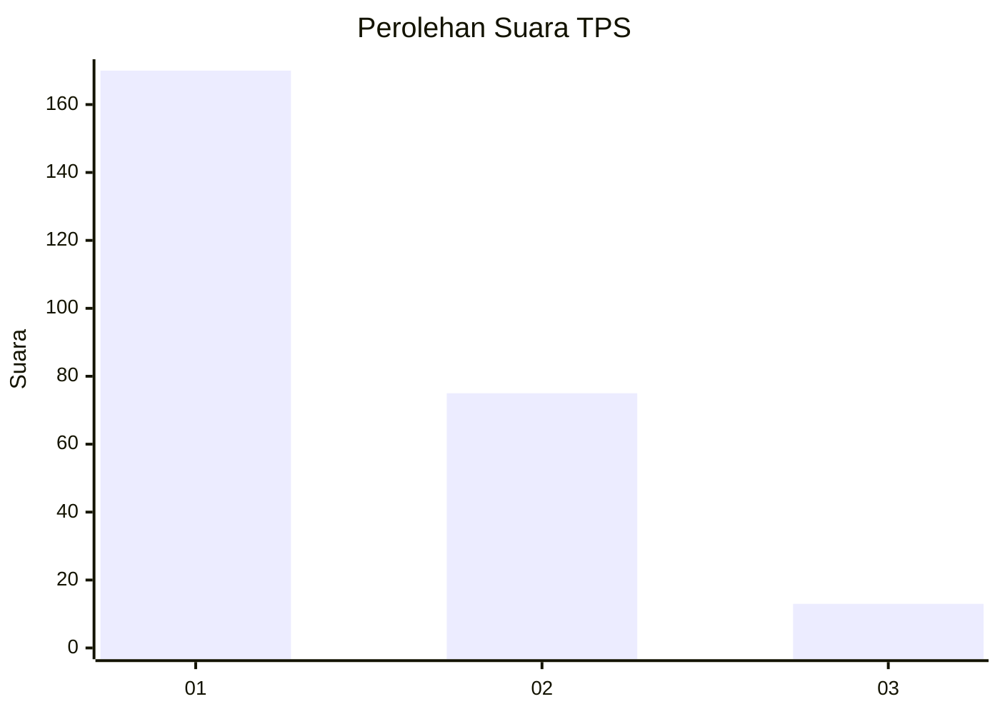
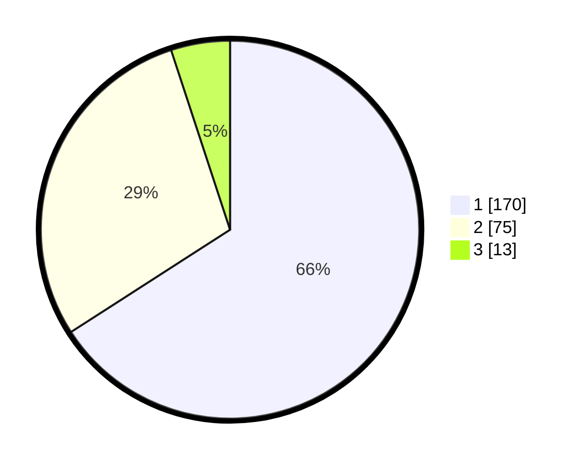

# Hasil

## Grafik

## Tabel

| No. | Nama Paslon    | Suara | Suara (raw) | Persentase |
|:--- |:-------------- | -----:| -----------:| ----------:|
| 1   | ANIES MUHAIMIN | 170   | [170][p-1]  | 65,89      |
| 2   | PRABOWO GIBRAN | 75    | [75][p-2]   | 29,07      |
| 3   | GANJAR MAHFUD  | 13    | [13][p-3]   | 5,04       |

[p-1]: https://github.com/gigit-pemilu/pemilu-2024-35-jawa-timur/blob/main/pilpres/hitung-suara/sub/35-jawa-timur/sub/28-pamekasan/sub/07-pegantenan/sub/2009-tebul-timur/sub/009-tps/sub/paslon-1.txt
[p-2]: https://github.com/gigit-pemilu/pemilu-2024-35-jawa-timur/blob/main/pilpres/hitung-suara/sub/35-jawa-timur/sub/28-pamekasan/sub/07-pegantenan/sub/2009-tebul-timur/sub/009-tps/sub/paslon-2.txt
[p-3]: https://github.com/gigit-pemilu/pemilu-2024-35-jawa-timur/blob/main/pilpres/hitung-suara/sub/35-jawa-timur/sub/28-pamekasan/sub/07-pegantenan/sub/2009-tebul-timur/sub/009-tps/sub/paslon-3.txt

## Foto C Plano

https://sirekap-obj-formc.kpu.go.id/7ab1/pemilu/ppwp/35/28/07/20/09/3528072009009-20240214-191536--87f5d2a0-b842-4d8c-b56d-56dca7643d87.jpg

https://sirekap-obj-formc.kpu.go.id/7ab1/pemilu/ppwp/35/28/07/20/09/3528072009009-20240214-191356--29c658b9-85c2-46ed-94c5-744b8d7329ef.jpg

https://sirekap-obj-formc.kpu.go.id/7ab1/pemilu/ppwp/35/28/07/20/09/3528072009009-20240214-200851--c35a8cc7-e10c-41bd-928b-9acf629eb944.jpg

## Metadata

| Key        | Value               |
| ---------- | ------------------- |
| Time Stamp | 2024-02-15 21:30:27 |

