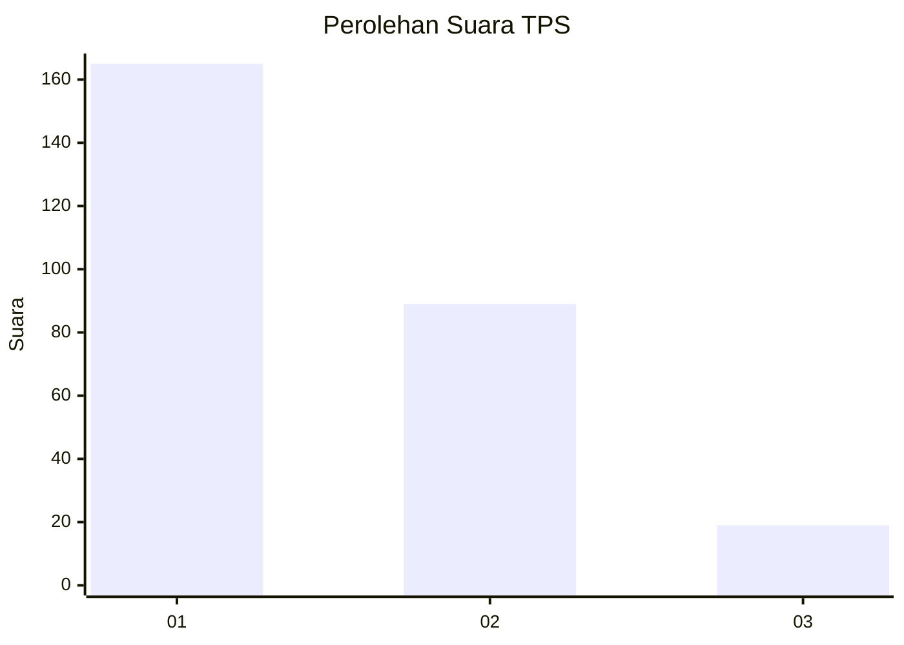
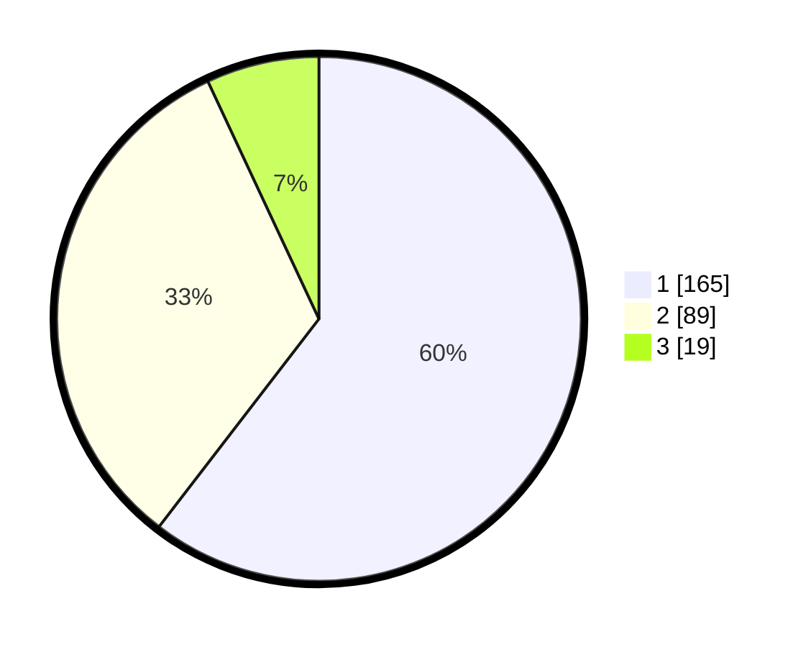

# Hasil

## Grafik

## Tabel

| No. | Nama Paslon    | Suara | Suara (raw) | Persentase |
|:--- |:-------------- | -----:| -----------:| ----------:|
| 1   | ANIES MUHAIMIN | 165   | [165][p-1]  | 60,44      |
| 2   | PRABOWO GIBRAN | 89    | [89][p-2]   | 32,60      |
| 3   | GANJAR MAHFUD  | 19    | [19][p-3]   | 6,96       |

[p-1]: https://github.com/gigit-pemilu/pemilu-2024/blob/main/pilpres/hitung-suara/sub/35-jawa-timur/sub/28-pamekasan/sub/07-pegantenan/sub/2010-tebul-barat/sub/004-tps/sub/paslon-1.txt
[p-2]: https://github.com/gigit-pemilu/pemilu-2024/blob/main/pilpres/hitung-suara/sub/35-jawa-timur/sub/28-pamekasan/sub/07-pegantenan/sub/2010-tebul-barat/sub/004-tps/sub/paslon-2.txt
[p-3]: https://github.com/gigit-pemilu/pemilu-2024/blob/main/pilpres/hitung-suara/sub/35-jawa-timur/sub/28-pamekasan/sub/07-pegantenan/sub/2010-tebul-barat/sub/004-tps/sub/paslon-3.txt

## Foto C Plano

https://sirekap-obj-formc.kpu.go.id/0f5b/pemilu/ppwp/35/28/07/20/10/3528072010004-20240214-221700--7a0a3142-e642-41f0-8116-4c7a1aff95cf.jpg

https://sirekap-obj-formc.kpu.go.id/0f5b/pemilu/ppwp/35/28/07/20/10/3528072010004-20240214-223619--728ee0ed-e82a-46f8-ab6e-9796962b2ce6.jpg

https://sirekap-obj-formc.kpu.go.id/0f5b/pemilu/ppwp/35/28/07/20/10/3528072010004-20240214-223701--a739ed3f-e8fc-4cc1-b7a6-3a36b20b4553.jpg

## Metadata

| Key        | Value               |
| ---------- | ------------------- |
| Time Stamp | 2024-02-25 15:00:00 |

