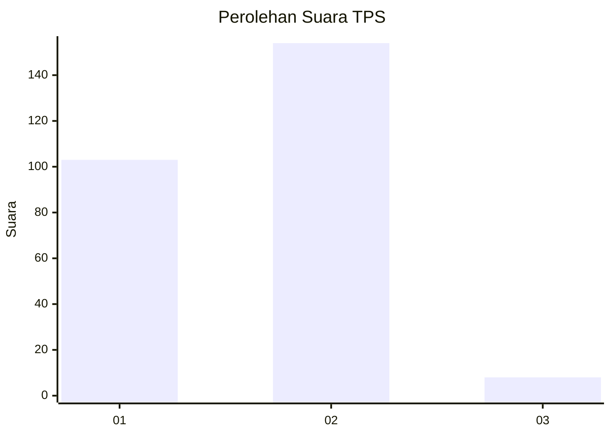
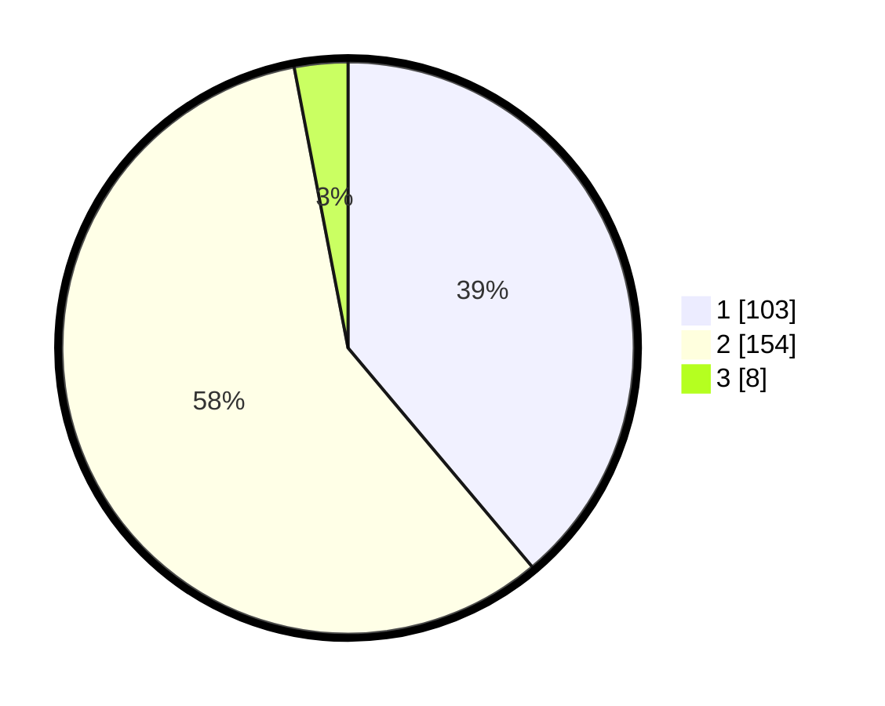

# Hasil

## Grafik

## Tabel

| No. | Nama Paslon    | Suara | Suara (raw) | Persentase |
|:--- |:-------------- | -----:| -----------:| ----------:|
| 1   | ANIES MUHAIMIN | 103   | [103][p-1]  | 38,87      |
| 2   | PRABOWO GIBRAN | 154   | [154][p-2]  | 58,11      |
| 3   | GANJAR MAHFUD  | 8     | [8][p-3]    | 3,02       |

[p-1]: https://github.com/gigit-pemilu/pemilu-2024-35-jawa-timur/blob/main/pilpres/hitung-suara/sub/35-jawa-timur/sub/28-pamekasan/sub/07-pegantenan/sub/2010-tebul-barat/sub/005-tps/sub/paslon-1.txt
[p-2]: https://github.com/gigit-pemilu/pemilu-2024-35-jawa-timur/blob/main/pilpres/hitung-suara/sub/35-jawa-timur/sub/28-pamekasan/sub/07-pegantenan/sub/2010-tebul-barat/sub/005-tps/sub/paslon-2.txt
[p-3]: https://github.com/gigit-pemilu/pemilu-2024-35-jawa-timur/blob/main/pilpres/hitung-suara/sub/35-jawa-timur/sub/28-pamekasan/sub/07-pegantenan/sub/2010-tebul-barat/sub/005-tps/sub/paslon-3.txt

## Foto C Plano

https://sirekap-obj-formc.kpu.go.id/af33/pemilu/ppwp/35/28/07/20/10/3528072010005-20240214-214929--12644c39-ccf7-412d-aec9-c3f932d9016e.jpg

https://sirekap-obj-formc.kpu.go.id/af33/pemilu/ppwp/35/28/07/20/10/3528072010005-20240214-215142--76a6372d-2969-4eec-a555-a98d18d3cc13.jpg

https://sirekap-obj-formc.kpu.go.id/af33/pemilu/ppwp/35/28/07/20/10/3528072010005-20240214-215333--3b333693-18cc-4b3b-9846-56fcb8b18c17.jpg

## Metadata

| Key        | Value               |
| ---------- | ------------------- |
| Time Stamp | 2024-02-15 21:30:27 |

