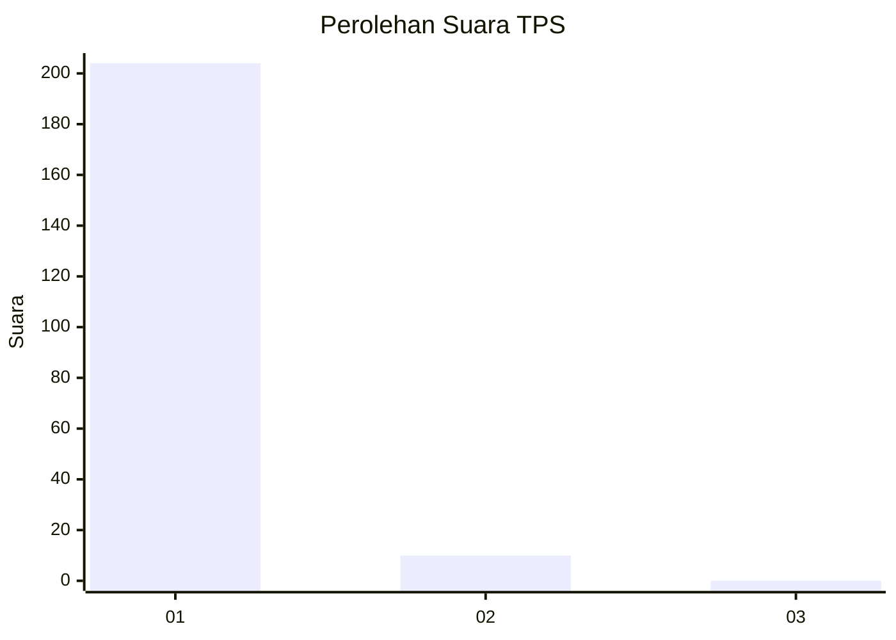
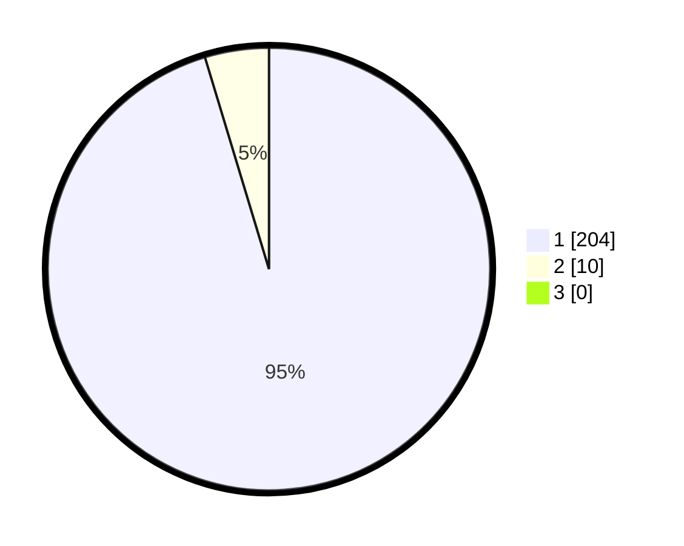

# Hasil

## Grafik

## Tabel

| No. | Nama Paslon    | Suara | Suara (raw) | Persentase |
|:--- |:-------------- | -----:| -----------:| ----------:|
| 1   | ANIES MUHAIMIN | 204   | [204][p-1]  | 95,33      |
| 2   | PRABOWO GIBRAN | 10    | [10][p-2]   | 4,67       |
| 3   | GANJAR MAHFUD  | 0     | [0][p-3]    | 0,00       |

[p-1]: https://github.com/gigit-pemilu/pemilu-2024/blob/main/pilpres/hitung-suara/sub/35-jawa-timur/sub/28-pamekasan/sub/07-pegantenan/sub/2011-ambender/sub/002-tps/sub/paslon-1.txt
[p-2]: https://github.com/gigit-pemilu/pemilu-2024/blob/main/pilpres/hitung-suara/sub/35-jawa-timur/sub/28-pamekasan/sub/07-pegantenan/sub/2011-ambender/sub/002-tps/sub/paslon-2.txt
[p-3]: https://github.com/gigit-pemilu/pemilu-2024/blob/main/pilpres/hitung-suara/sub/35-jawa-timur/sub/28-pamekasan/sub/07-pegantenan/sub/2011-ambender/sub/002-tps/sub/paslon-3.txt

## Foto C Plano

https://sirekap-obj-formc.kpu.go.id/7fab/pemilu/ppwp/35/28/07/20/11/3528072011002-20240214-202032--b8ae8567-5cbd-41f4-b8d7-f6e4fa273729.jpg

https://sirekap-obj-formc.kpu.go.id/7fab/pemilu/ppwp/35/28/07/20/11/3528072011002-20240214-202226--e428ae90-b1ff-450e-9b1f-d30379c8c2f1.jpg

https://sirekap-obj-formc.kpu.go.id/7fab/pemilu/ppwp/35/28/07/20/11/3528072011002-20240214-202517--6ace83b1-e067-4477-b06f-796a1c3dc3c5.jpg

## Metadata

| Key        | Value               |
| ---------- | ------------------- |
| Time Stamp | 2024-02-15 21:30:27 |

