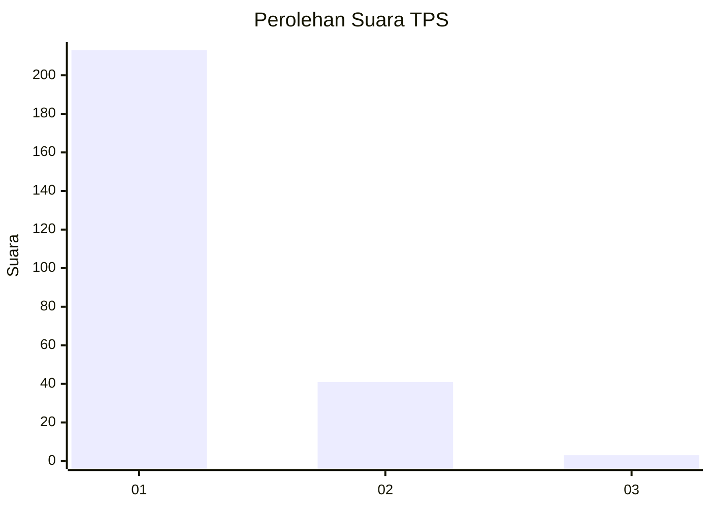
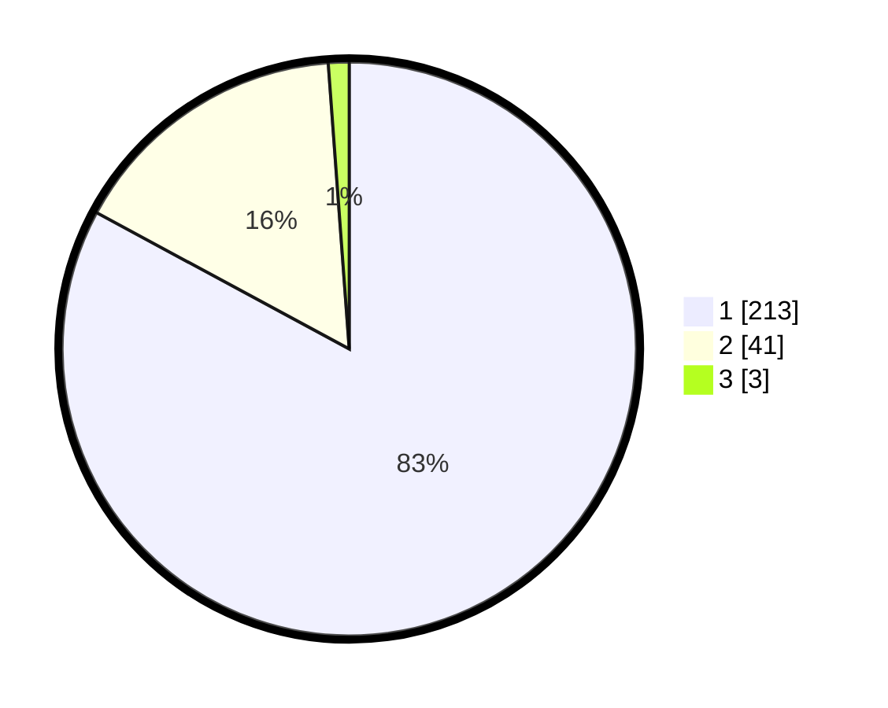

# Hasil

## Grafik

## Tabel

| No. | Nama Paslon    | Suara | Suara (raw) | Persentase |
|:--- |:-------------- | -----:| -----------:| ----------:|
| 1   | ANIES MUHAIMIN | 213   | [213][p-1]  | 82,88      |
| 2   | PRABOWO GIBRAN | 41    | [41][p-2]   | 15,95      |
| 3   | GANJAR MAHFUD  | 3     | [3][p-3]    | 1,17       |

[p-1]: https://github.com/gigit-pemilu/pemilu-2024-35-jawa-timur/blob/main/pilpres/hitung-suara/sub/35-jawa-timur/sub/28-pamekasan/sub/07-pegantenan/sub/2011-ambender/sub/003-tps/sub/paslon-1.txt
[p-2]: https://github.com/gigit-pemilu/pemilu-2024-35-jawa-timur/blob/main/pilpres/hitung-suara/sub/35-jawa-timur/sub/28-pamekasan/sub/07-pegantenan/sub/2011-ambender/sub/003-tps/sub/paslon-2.txt
[p-3]: https://github.com/gigit-pemilu/pemilu-2024-35-jawa-timur/blob/main/pilpres/hitung-suara/sub/35-jawa-timur/sub/28-pamekasan/sub/07-pegantenan/sub/2011-ambender/sub/003-tps/sub/paslon-3.txt

## Foto C Plano

https://sirekap-obj-formc.kpu.go.id/1369/pemilu/ppwp/35/28/07/20/11/3528072011003-20240214-211353--70fb012e-9953-49fb-9aa7-76254be994f7.jpg

https://sirekap-obj-formc.kpu.go.id/1369/pemilu/ppwp/35/28/07/20/11/3528072011003-20240214-213025--aaf5a1fe-0c4e-4343-bbed-c164dff7d781.jpg

https://sirekap-obj-formc.kpu.go.id/1369/pemilu/ppwp/35/28/07/20/11/3528072011003-20240214-213400--5d80c65b-5ac9-4e27-8426-fd64c47463e7.jpg

## Metadata

| Key        | Value               |
| ---------- | ------------------- |
| Time Stamp | 2024-02-15 21:30:27 |

