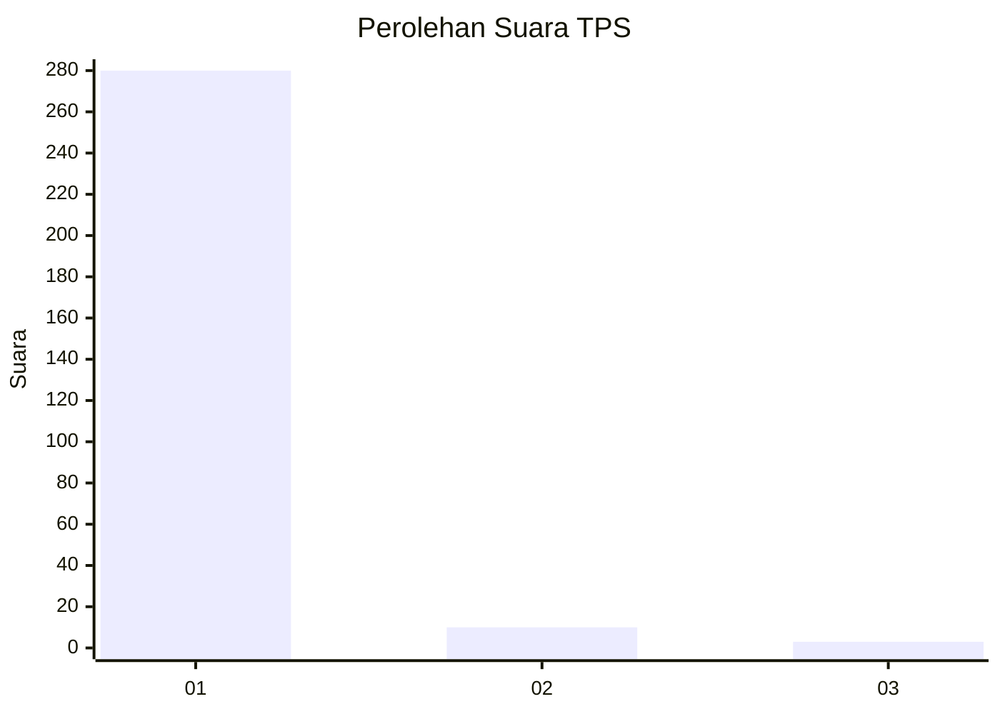
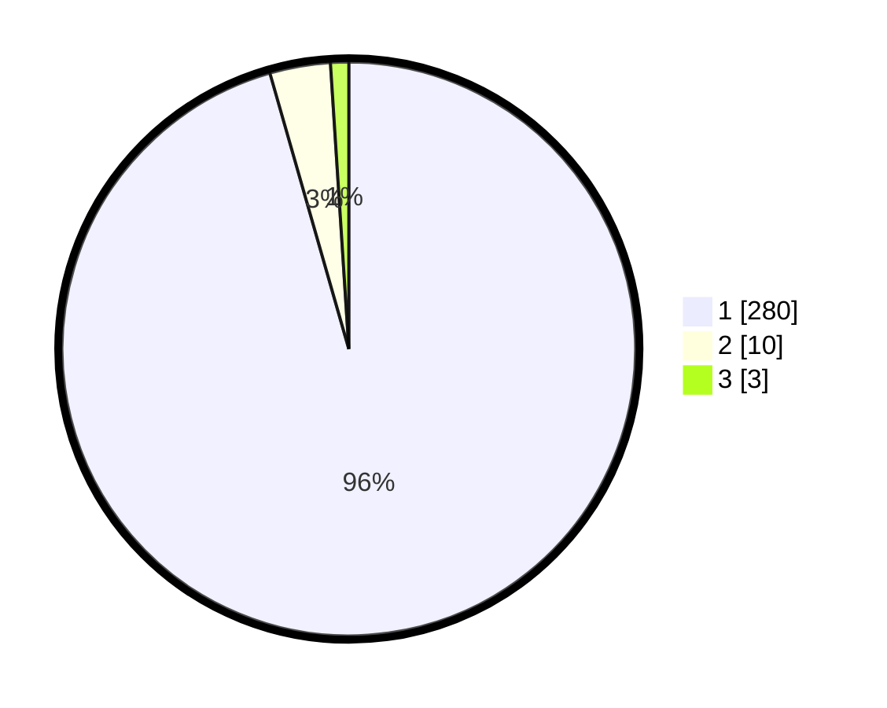

# Hasil

## Grafik

## Tabel

| No. | Nama Paslon    | Suara | Suara (raw) | Persentase |
|:--- |:-------------- | -----:| -----------:| ----------:|
| 1   | ANIES MUHAIMIN | 280   | [280][p-1]  | 95,56      |
| 2   | PRABOWO GIBRAN | 10    | [10][p-2]   | 3,41       |
| 3   | GANJAR MAHFUD  | 3     | [3][p-3]    | 1,02       |

[p-1]: https://github.com/gigit-pemilu/pemilu-2024-35-jawa-timur/blob/main/pilpres/hitung-suara/sub/35-jawa-timur/sub/28-pamekasan/sub/07-pegantenan/sub/2011-ambender/sub/007-tps/sub/paslon-1.txt
[p-2]: https://github.com/gigit-pemilu/pemilu-2024-35-jawa-timur/blob/main/pilpres/hitung-suara/sub/35-jawa-timur/sub/28-pamekasan/sub/07-pegantenan/sub/2011-ambender/sub/007-tps/sub/paslon-2.txt
[p-3]: https://github.com/gigit-pemilu/pemilu-2024-35-jawa-timur/blob/main/pilpres/hitung-suara/sub/35-jawa-timur/sub/28-pamekasan/sub/07-pegantenan/sub/2011-ambender/sub/007-tps/sub/paslon-3.txt

## Foto C Plano

https://sirekap-obj-formc.kpu.go.id/2fb2/pemilu/ppwp/35/28/07/20/11/3528072011007-20240214-191032--bde9cd27-9816-4fa1-8065-e407f0fb3d2e.jpg

https://sirekap-obj-formc.kpu.go.id/2fb2/pemilu/ppwp/35/28/07/20/11/3528072011007-20240214-193341--29b82140-5c99-44e0-8a74-e0117e5630ca.jpg

## Metadata

| Key        | Value               |
| ---------- | ------------------- |
| Time Stamp | 2024-02-21 15:00:00 |

