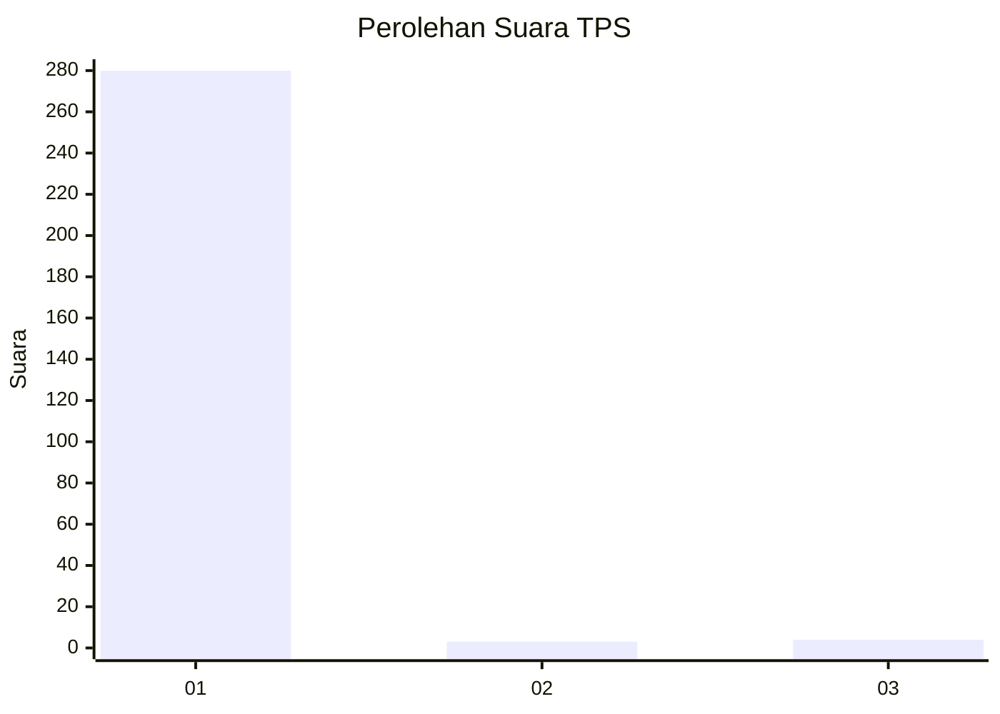
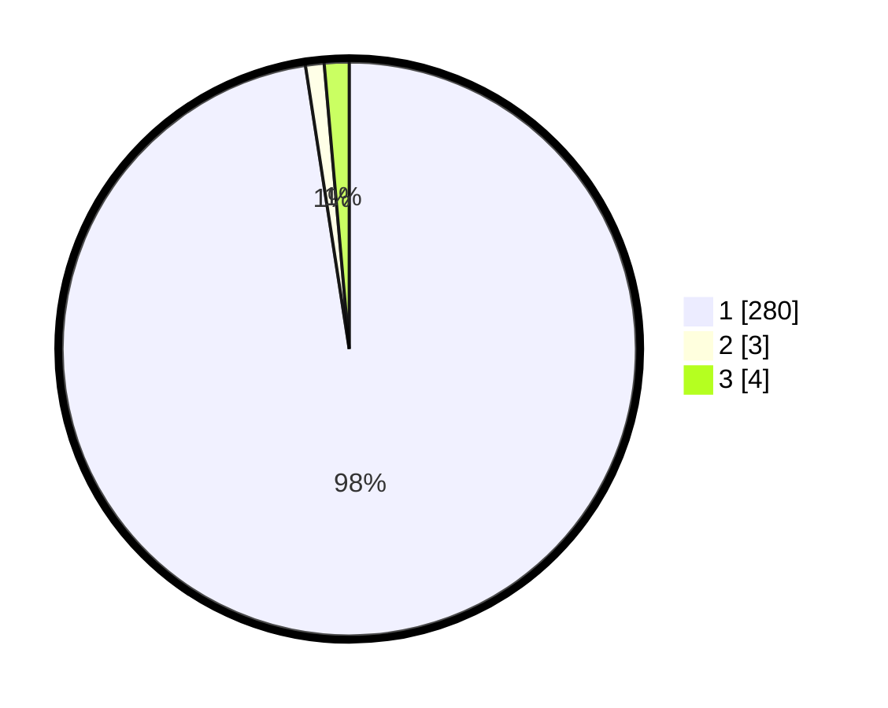

# Hasil

## Grafik

## Tabel

| No. | Nama Paslon    | Suara | Suara (raw) | Persentase |
|:--- |:-------------- | -----:| -----------:| ----------:|
| 1   | ANIES MUHAIMIN | 280   | [280][p-1]  | 97,56      |
| 2   | PRABOWO GIBRAN | 3     | [3][p-2]    | 1,05       |
| 3   | GANJAR MAHFUD  | 4     | [4][p-3]    | 1,39       |

[p-1]: https://github.com/gigit-pemilu/pemilu-2024-35-jawa-timur/blob/main/pilpres/hitung-suara/sub/35-jawa-timur/sub/28-pamekasan/sub/07-pegantenan/sub/2012-pasanggar/sub/006-tps/sub/paslon-1.txt
[p-2]: https://github.com/gigit-pemilu/pemilu-2024-35-jawa-timur/blob/main/pilpres/hitung-suara/sub/35-jawa-timur/sub/28-pamekasan/sub/07-pegantenan/sub/2012-pasanggar/sub/006-tps/sub/paslon-2.txt
[p-3]: https://github.com/gigit-pemilu/pemilu-2024-35-jawa-timur/blob/main/pilpres/hitung-suara/sub/35-jawa-timur/sub/28-pamekasan/sub/07-pegantenan/sub/2012-pasanggar/sub/006-tps/sub/paslon-3.txt

## Foto C Plano

https://sirekap-obj-formc.kpu.go.id/517d/pemilu/ppwp/35/28/07/20/12/3528072012006-20240214-220707--8afd4dd3-5b1b-4ae1-93eb-ea20ff2167e2.jpg

https://sirekap-obj-formc.kpu.go.id/517d/pemilu/ppwp/35/28/07/20/12/3528072012006-20240214-220923--e9d50643-8a54-4579-b918-153eda666544.jpg

https://sirekap-obj-formc.kpu.go.id/517d/pemilu/ppwp/35/28/07/20/12/3528072012006-20240214-221133--7c3ffd3f-51e3-4a41-9227-9fbabf932f02.jpg

## Metadata

| Key        | Value               |
| ---------- | ------------------- |
| Time Stamp | 2024-02-15 21:30:27 |

