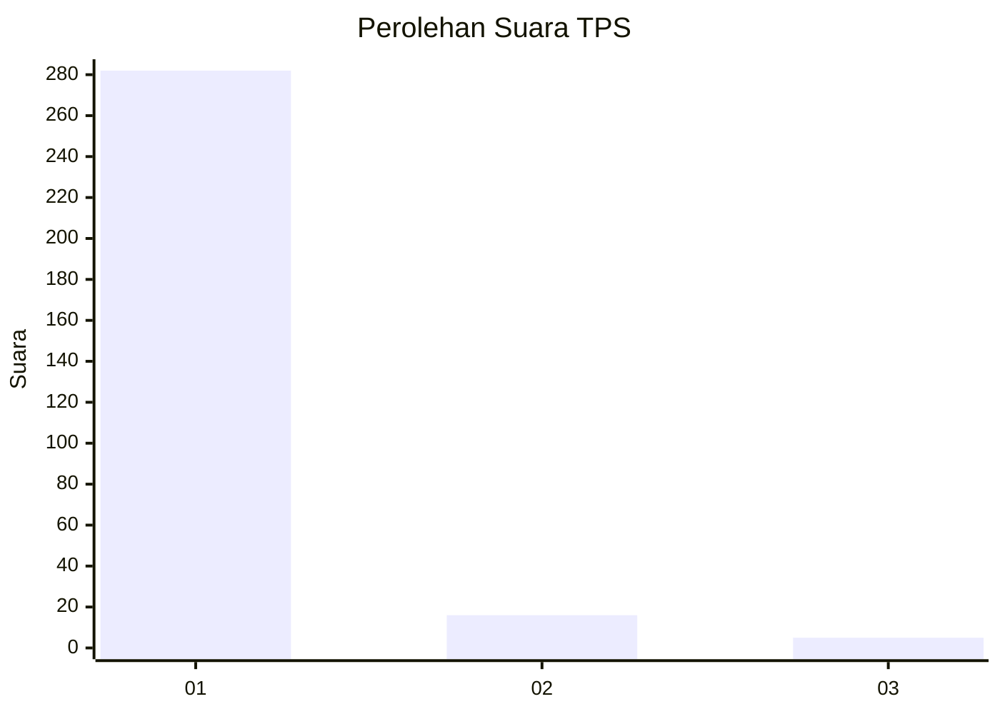
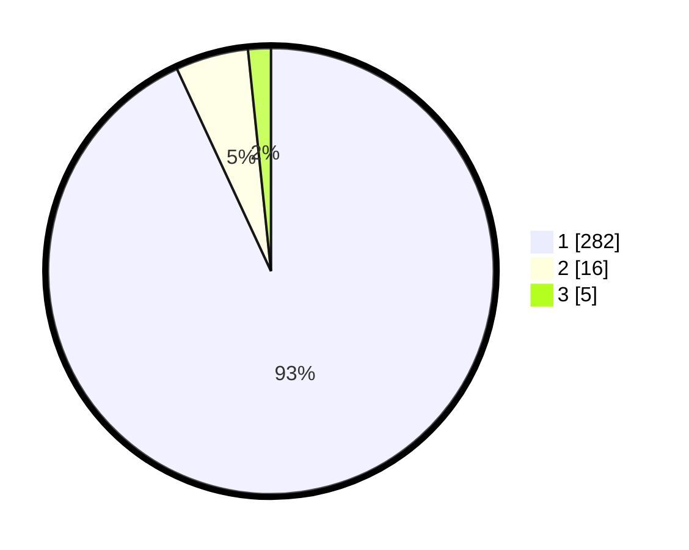

# Hasil

## Grafik

## Tabel

| No. | Nama Paslon    | Suara | Suara (raw) | Persentase |
|:--- |:-------------- | -----:| -----------:| ----------:|
| 1   | ANIES MUHAIMIN | 282   | [282][p-1]  | 93,07      |
| 2   | PRABOWO GIBRAN | 16    | [16][p-2]   | 5,28       |
| 3   | GANJAR MAHFUD  | 5     | [5][p-3]    | 1,65       |

[p-1]: https://github.com/gigit-pemilu/pemilu-2024-35-jawa-timur/blob/main/pilpres/hitung-suara/sub/35-jawa-timur/sub/28-pamekasan/sub/07-pegantenan/sub/2012-pasanggar/sub/007-tps/sub/paslon-1.txt
[p-2]: https://github.com/gigit-pemilu/pemilu-2024-35-jawa-timur/blob/main/pilpres/hitung-suara/sub/35-jawa-timur/sub/28-pamekasan/sub/07-pegantenan/sub/2012-pasanggar/sub/007-tps/sub/paslon-2.txt
[p-3]: https://github.com/gigit-pemilu/pemilu-2024-35-jawa-timur/blob/main/pilpres/hitung-suara/sub/35-jawa-timur/sub/28-pamekasan/sub/07-pegantenan/sub/2012-pasanggar/sub/007-tps/sub/paslon-3.txt

## Foto C Plano

https://sirekap-obj-formc.kpu.go.id/3a9d/pemilu/ppwp/35/28/07/20/12/3528072012007-20240215-064002--fa6234e9-278e-43bf-9e68-be46e088d7b4.jpg

https://sirekap-obj-formc.kpu.go.id/3a9d/pemilu/ppwp/35/28/07/20/12/3528072012007-20240215-092436--1767f002-c570-4d5d-a054-0cc9655482a6.jpg

https://sirekap-obj-formc.kpu.go.id/3a9d/pemilu/ppwp/35/28/07/20/12/3528072012007-20240215-064232--acc8c606-6b8b-46e6-8896-89e98c94aa07.jpg

## Metadata

| Key        | Value               |
| ---------- | ------------------- |
| Time Stamp | 2024-02-15 21:30:27 |

