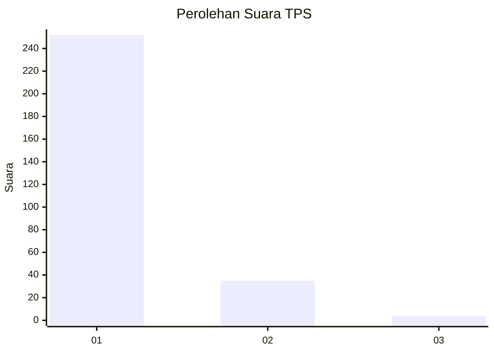
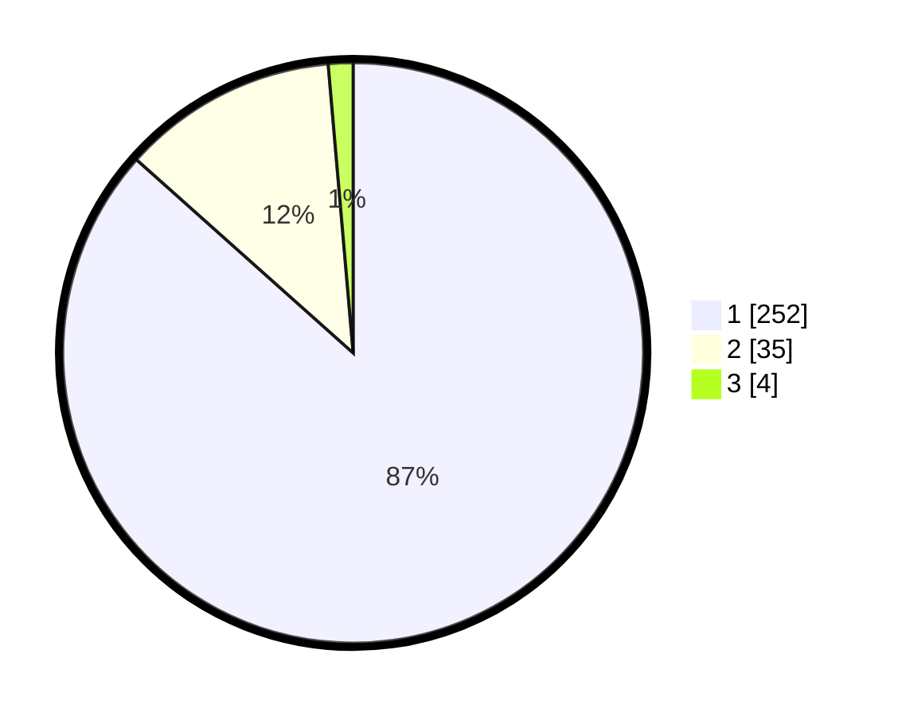

# Hasil

## Grafik

## Tabel

| No. | Nama Paslon    | Suara | Suara (raw) | Persentase |
|:--- |:-------------- | -----:| -----------:| ----------:|
| 1   | ANIES MUHAIMIN | 252   | [252][p-1]  | 86,60      |
| 2   | PRABOWO GIBRAN | 35    | [35][p-2]   | 12,03      |
| 3   | GANJAR MAHFUD  | 4     | [4][p-3]    | 1,37       |

[p-1]: https://github.com/gigit-pemilu/pemilu-2024-35-jawa-timur/blob/main/pilpres/hitung-suara/sub/35-jawa-timur/sub/28-pamekasan/sub/07-pegantenan/sub/2012-pasanggar/sub/009-tps/sub/paslon-1.txt
[p-2]: https://github.com/gigit-pemilu/pemilu-2024-35-jawa-timur/blob/main/pilpres/hitung-suara/sub/35-jawa-timur/sub/28-pamekasan/sub/07-pegantenan/sub/2012-pasanggar/sub/009-tps/sub/paslon-2.txt
[p-3]: https://github.com/gigit-pemilu/pemilu-2024-35-jawa-timur/blob/main/pilpres/hitung-suara/sub/35-jawa-timur/sub/28-pamekasan/sub/07-pegantenan/sub/2012-pasanggar/sub/009-tps/sub/paslon-3.txt

## Foto C Plano

https://sirekap-obj-formc.kpu.go.id/7b0f/pemilu/ppwp/35/28/07/20/12/3528072012009-20240214-214735--ba02a582-8a40-41dc-9d66-98f25e26f9c2.jpg

https://sirekap-obj-formc.kpu.go.id/7b0f/pemilu/ppwp/35/28/07/20/12/3528072012009-20240214-214547--c0f85a72-2939-40b5-a3e8-9e47ff5f73c4.jpg

https://sirekap-obj-formc.kpu.go.id/7b0f/pemilu/ppwp/35/28/07/20/12/3528072012009-20240214-214924--8610c7ca-93c6-4607-aff6-cb54d1418f9a.jpg

## Metadata

| Key        | Value               |
| ---------- | ------------------- |
| Time Stamp | 2024-02-25 16:00:00 |

