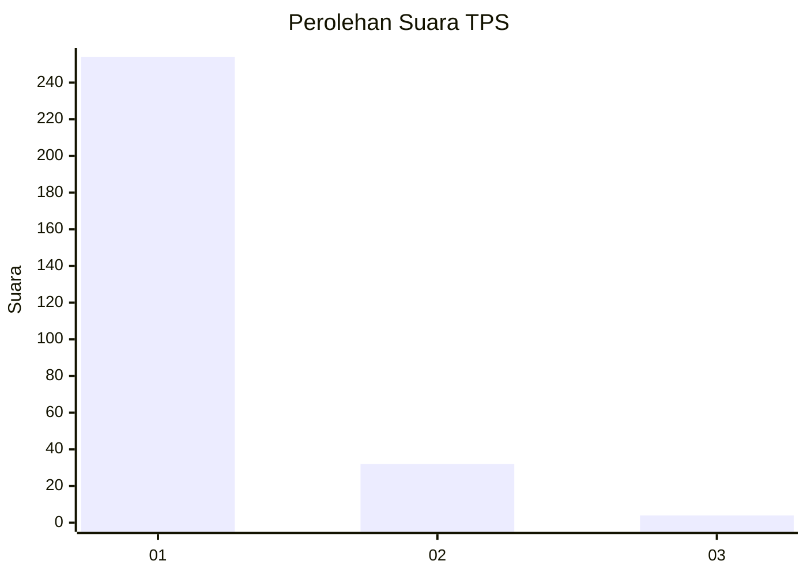
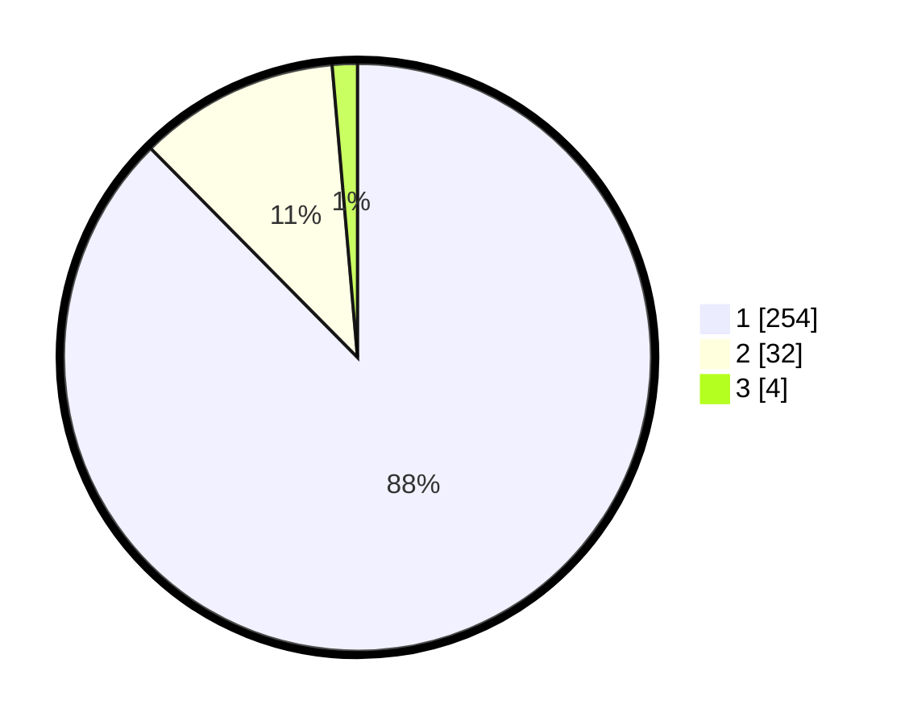

# Hasil

## Grafik

## Tabel

| No. | Nama Paslon    | Suara | Suara (raw) | Persentase |
|:--- |:-------------- | -----:| -----------:| ----------:|
| 1   | ANIES MUHAIMIN | 254   | [254][p-1]  | 87,59      |
| 2   | PRABOWO GIBRAN | 32    | [32][p-2]   | 11,03      |
| 3   | GANJAR MAHFUD  | 4     | [4][p-3]    | 1,38       |

[p-1]: https://github.com/gigit-pemilu/pemilu-2024/blob/main/pilpres/hitung-suara/sub/35-jawa-timur/sub/28-pamekasan/sub/07-pegantenan/sub/2012-pasanggar/sub/012-tps/sub/paslon-1.txt
[p-2]: https://github.com/gigit-pemilu/pemilu-2024/blob/main/pilpres/hitung-suara/sub/35-jawa-timur/sub/28-pamekasan/sub/07-pegantenan/sub/2012-pasanggar/sub/012-tps/sub/paslon-2.txt
[p-3]: https://github.com/gigit-pemilu/pemilu-2024/blob/main/pilpres/hitung-suara/sub/35-jawa-timur/sub/28-pamekasan/sub/07-pegantenan/sub/2012-pasanggar/sub/012-tps/sub/paslon-3.txt

## Foto C Plano

https://sirekap-obj-formc.kpu.go.id/ff15/pemilu/ppwp/35/28/07/20/12/3528072012012-20240215-070436--e645e878-1484-4d54-87ee-c448db710c1d.jpg

https://sirekap-obj-formc.kpu.go.id/ff15/pemilu/ppwp/35/28/07/20/12/3528072012012-20240215-070442--3e92666f-f2ed-4702-94bd-90f5e3222470.jpg

https://sirekap-obj-formc.kpu.go.id/ff15/pemilu/ppwp/35/28/07/20/12/3528072012012-20240215-070448--5c78b7e8-1936-43c3-a553-9c9f5db3f1fb.jpg

## Metadata

| Key        | Value               |
| ---------- | ------------------- |
| Time Stamp | 2024-02-15 21:30:27 |

