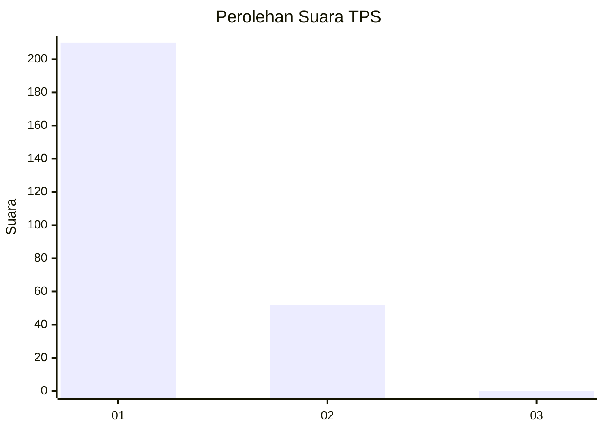
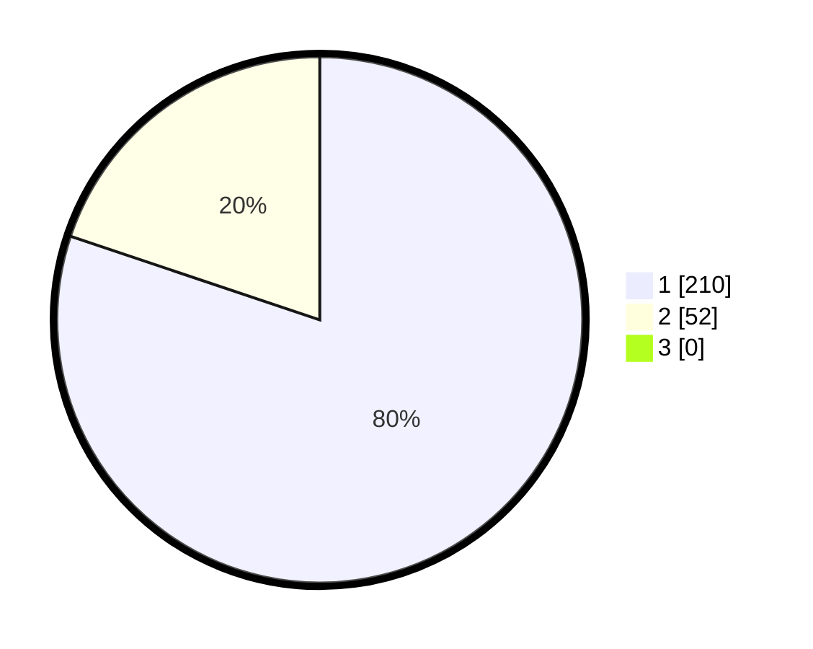

# Hasil

## Grafik

## Tabel

| No. | Nama Paslon    | Suara | Suara (raw) | Persentase |
|:--- |:-------------- | -----:| -----------:| ----------:|
| 1   | ANIES MUHAIMIN | 210   | [210][p-1]  | 80,15      |
| 2   | PRABOWO GIBRAN | 52    | [52][p-2]   | 19,85      |
| 3   | GANJAR MAHFUD  | 0     | [0][p-3]    | 0,00       |

[p-1]: https://github.com/gigit-pemilu/pemilu-2024-35-jawa-timur/blob/main/pilpres/hitung-suara/sub/35-jawa-timur/sub/28-pamekasan/sub/07-pegantenan/sub/2012-pasanggar/sub/013-tps/sub/paslon-1.txt
[p-2]: https://github.com/gigit-pemilu/pemilu-2024-35-jawa-timur/blob/main/pilpres/hitung-suara/sub/35-jawa-timur/sub/28-pamekasan/sub/07-pegantenan/sub/2012-pasanggar/sub/013-tps/sub/paslon-2.txt
[p-3]: https://github.com/gigit-pemilu/pemilu-2024-35-jawa-timur/blob/main/pilpres/hitung-suara/sub/35-jawa-timur/sub/28-pamekasan/sub/07-pegantenan/sub/2012-pasanggar/sub/013-tps/sub/paslon-3.txt

## Foto C Plano

https://sirekap-obj-formc.kpu.go.id/1290/pemilu/ppwp/35/28/07/20/12/3528072012013-20240215-074635--3f38b0d3-a86f-45bf-af62-74a2a8d4afd3.jpg

https://sirekap-obj-formc.kpu.go.id/1290/pemilu/ppwp/35/28/07/20/12/3528072012013-20240214-224912--0f84f844-0667-4f1b-9a37-c1a92699ad5e.jpg

https://sirekap-obj-formc.kpu.go.id/1290/pemilu/ppwp/35/28/07/20/12/3528072012013-20240214-225020--3454bf35-1da2-4916-96a2-5f08ab2e9309.jpg

## Metadata

| Key        | Value               |
| ---------- | ------------------- |
| Time Stamp | 2024-02-15 15:00:29 |

