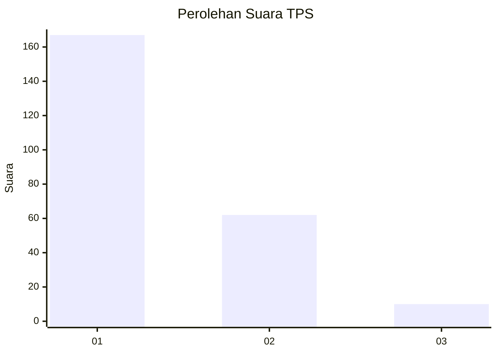
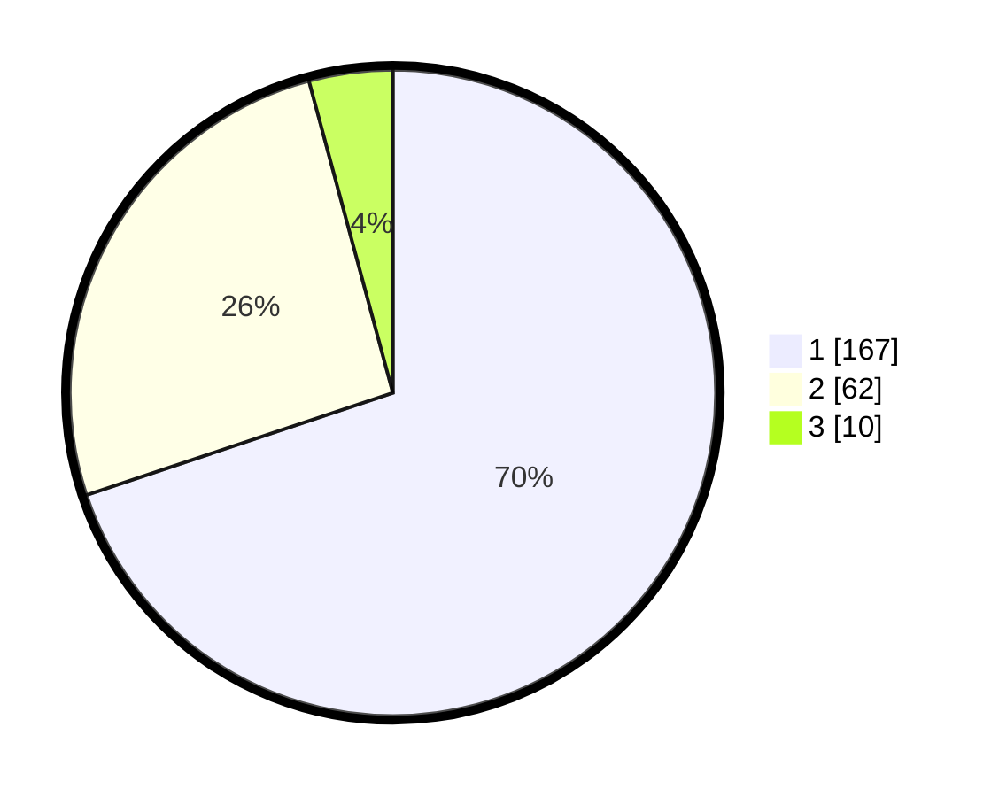

# Hasil

## Grafik

## Tabel

| No. | Nama Paslon    | Suara | Suara (raw) | Persentase |
|:--- |:-------------- | -----:| -----------:| ----------:|
| 1   | ANIES MUHAIMIN | 167   | [167][p-1]  | 69,87      |
| 2   | PRABOWO GIBRAN | 62    | [62][p-2]   | 25,94      |
| 3   | GANJAR MAHFUD  | 10    | [10][p-3]   | 4,18       |

[p-1]: https://github.com/gigit-pemilu/pemilu-2024/blob/main/pilpres/hitung-suara/sub/35-jawa-timur/sub/28-pamekasan/sub/07-pegantenan/sub/2012-pasanggar/sub/014-tps/sub/paslon-1.txt
[p-2]: https://github.com/gigit-pemilu/pemilu-2024/blob/main/pilpres/hitung-suara/sub/35-jawa-timur/sub/28-pamekasan/sub/07-pegantenan/sub/2012-pasanggar/sub/014-tps/sub/paslon-2.txt
[p-3]: https://github.com/gigit-pemilu/pemilu-2024/blob/main/pilpres/hitung-suara/sub/35-jawa-timur/sub/28-pamekasan/sub/07-pegantenan/sub/2012-pasanggar/sub/014-tps/sub/paslon-3.txt

## Foto C Plano

https://sirekap-obj-formc.kpu.go.id/13de/pemilu/ppwp/35/28/07/20/12/3528072012014-20240214-230348--2924f8c6-ff03-4c18-8d7f-0cce0c882a45.jpg

https://sirekap-obj-formc.kpu.go.id/13de/pemilu/ppwp/35/28/07/20/12/3528072012014-20240214-231107--3fc59a79-d441-48ca-a5ce-3769bee5ccba.jpg

https://sirekap-obj-formc.kpu.go.id/13de/pemilu/ppwp/35/28/07/20/12/3528072012014-20240214-231221--340d921a-de79-49be-a250-36937b3904ad.jpg

## Metadata

| Key        | Value               |
| ---------- | ------------------- |
| Time Stamp | 2024-02-24 22:31:28 |

