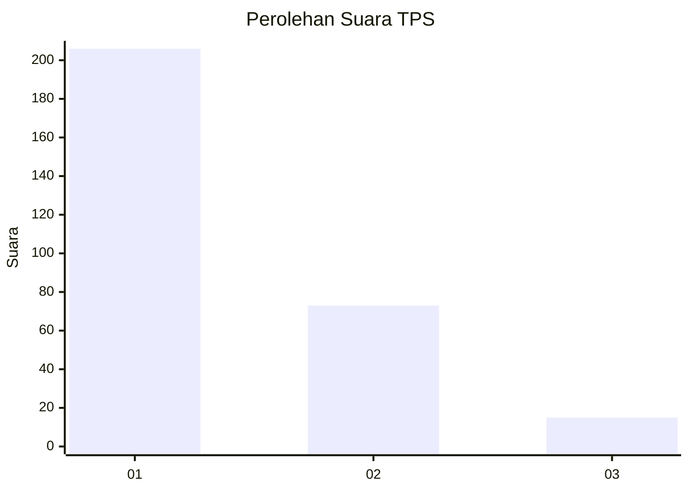
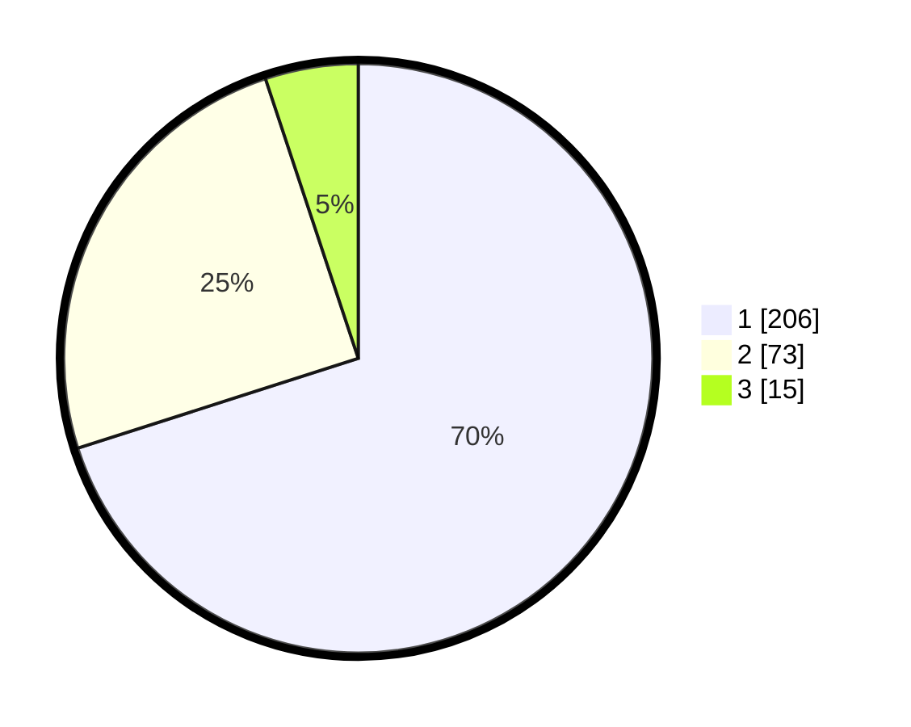

# Hasil

## Grafik

## Tabel

| No. | Nama Paslon    | Suara | Suara (raw) | Persentase |
|:--- |:-------------- | -----:| -----------:| ----------:|
| 1   | ANIES MUHAIMIN | 206   | [206][p-1]  | 70,07      |
| 2   | PRABOWO GIBRAN | 73    | [73][p-2]   | 24,83      |
| 3   | GANJAR MAHFUD  | 15    | [15][p-3]   | 5,10       |

[p-1]: https://github.com/gigit-pemilu/pemilu-2024/blob/main/pilpres/hitung-suara/sub/35-jawa-timur/sub/28-pamekasan/sub/07-pegantenan/sub/2012-pasanggar/sub/016-tps/sub/paslon-1.txt
[p-2]: https://github.com/gigit-pemilu/pemilu-2024/blob/main/pilpres/hitung-suara/sub/35-jawa-timur/sub/28-pamekasan/sub/07-pegantenan/sub/2012-pasanggar/sub/016-tps/sub/paslon-2.txt
[p-3]: https://github.com/gigit-pemilu/pemilu-2024/blob/main/pilpres/hitung-suara/sub/35-jawa-timur/sub/28-pamekasan/sub/07-pegantenan/sub/2012-pasanggar/sub/016-tps/sub/paslon-3.txt

## Foto C Plano

https://sirekap-obj-formc.kpu.go.id/421c/pemilu/ppwp/35/28/07/20/12/3528072012016-20240215-101622--01691dc1-e050-4203-8d08-4ff566fea780.jpg

https://sirekap-obj-formc.kpu.go.id/421c/pemilu/ppwp/35/28/07/20/12/3528072012016-20240215-102025--b02aa668-9e8f-4a46-b107-4ce56db1174b.jpg

https://sirekap-obj-formc.kpu.go.id/421c/pemilu/ppwp/35/28/07/20/12/3528072012016-20240215-102115--7c1da344-9342-4f94-89b5-a0a855c0fb30.jpg

## Metadata

| Key        | Value               |
| ---------- | ------------------- |
| Time Stamp | 2024-02-25 15:00:00 |

