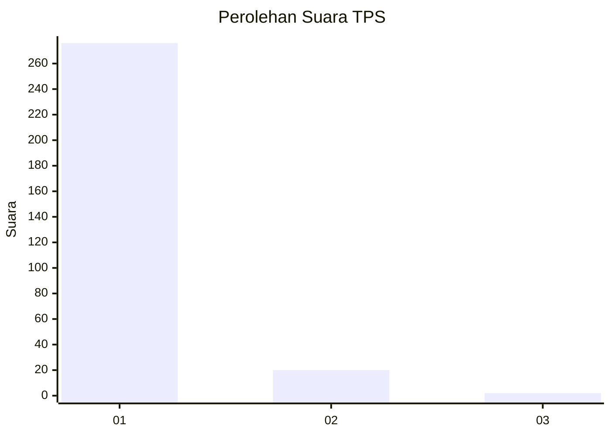
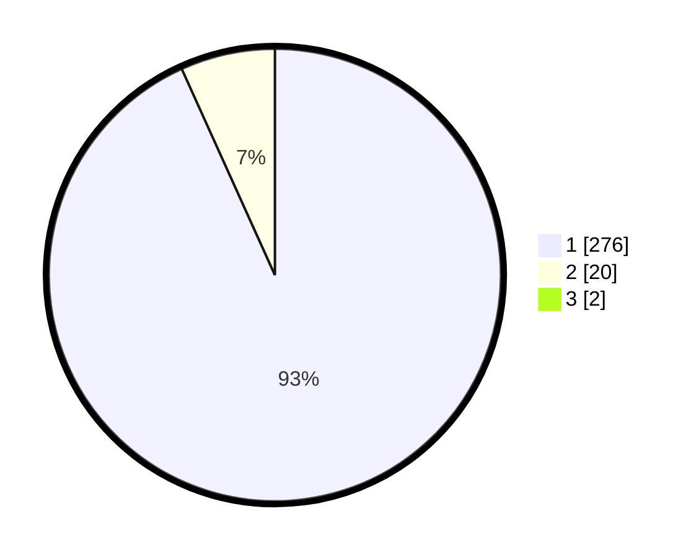

# Hasil

## Grafik

## Tabel

| No. | Nama Paslon    | Suara | Suara (raw) | Persentase |
|:--- |:-------------- | -----:| -----------:| ----------:|
| 1   | ANIES MUHAIMIN | 276   | [276][p-1]  | 92,62      |
| 2   | PRABOWO GIBRAN | 20    | [20][p-2]   | 6,71       |
| 3   | GANJAR MAHFUD  | 2     | [2][p-3]    | 0,67       |

[p-1]: https://github.com/gigit-pemilu/pemilu-2024-35-jawa-timur/blob/main/pilpres/hitung-suara/sub/35-jawa-timur/sub/28-pamekasan/sub/07-pegantenan/sub/2012-pasanggar/sub/018-tps/sub/paslon-1.txt
[p-2]: https://github.com/gigit-pemilu/pemilu-2024-35-jawa-timur/blob/main/pilpres/hitung-suara/sub/35-jawa-timur/sub/28-pamekasan/sub/07-pegantenan/sub/2012-pasanggar/sub/018-tps/sub/paslon-2.txt
[p-3]: https://github.com/gigit-pemilu/pemilu-2024-35-jawa-timur/blob/main/pilpres/hitung-suara/sub/35-jawa-timur/sub/28-pamekasan/sub/07-pegantenan/sub/2012-pasanggar/sub/018-tps/sub/paslon-3.txt

## Foto C Plano

https://sirekap-obj-formc.kpu.go.id/24a9/pemilu/ppwp/35/28/07/20/12/3528072012018-20240215-073724--0d2176a6-1298-43dd-9e33-85ea19e67f39.jpg

https://sirekap-obj-formc.kpu.go.id/24a9/pemilu/ppwp/35/28/07/20/12/3528072012018-20240215-074045--00cee638-1e5a-4913-bff7-eb8a1ba37dfb.jpg

https://sirekap-obj-formc.kpu.go.id/24a9/pemilu/ppwp/35/28/07/20/12/3528072012018-20240215-074138--353d5d7e-0cd9-45c2-8a6e-0ff4eed06f5e.jpg

## Metadata

| Key        | Value               |
| ---------- | ------------------- |
| Time Stamp | 2024-02-15 21:30:27 |

