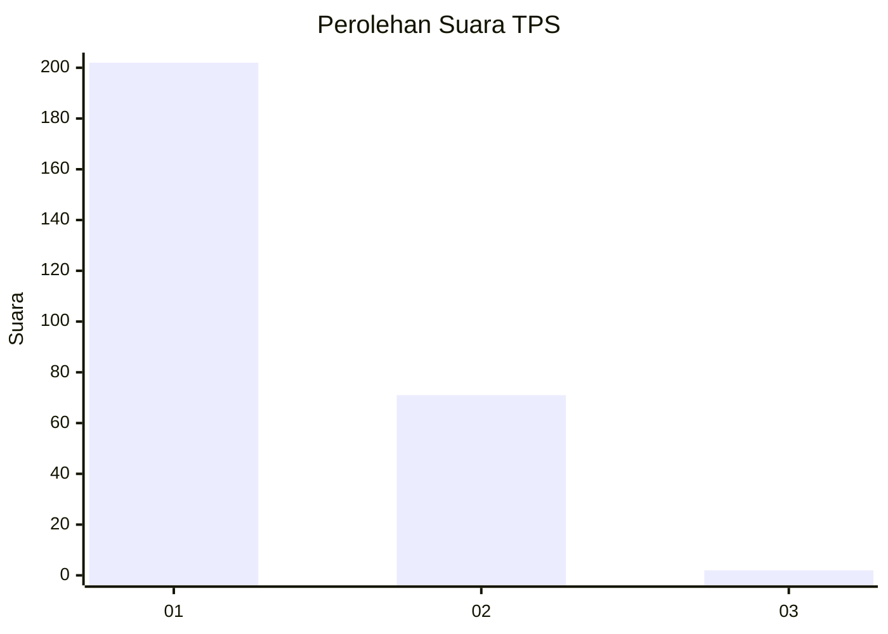
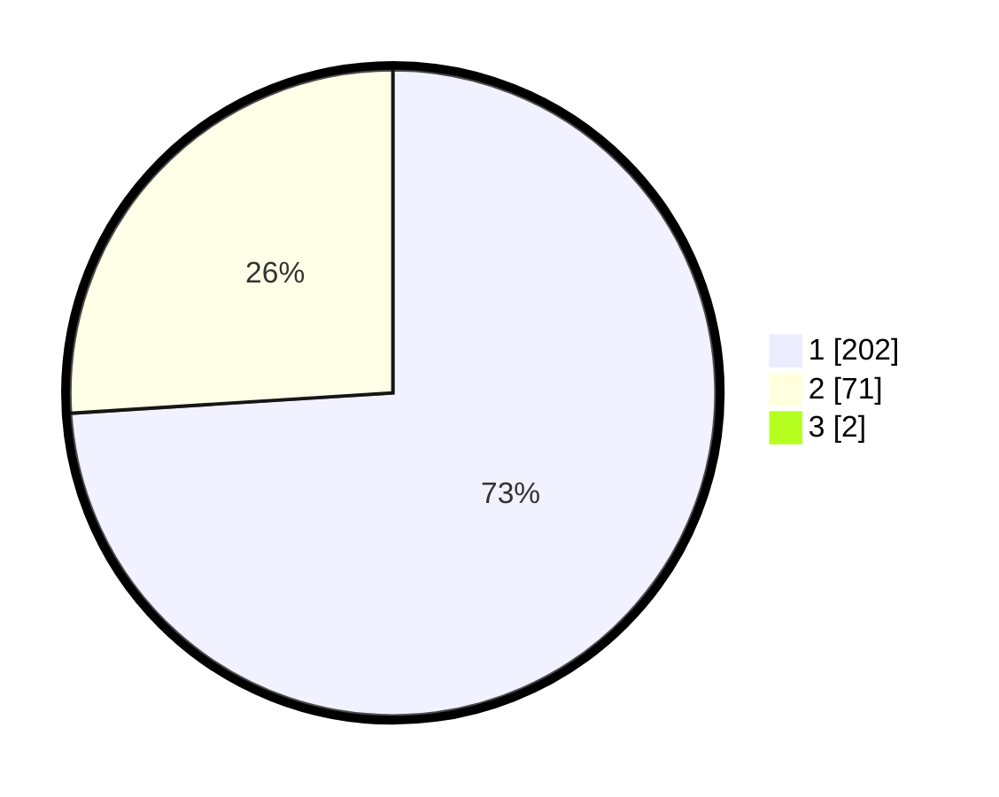

# Hasil

## Grafik

## Tabel

| No. | Nama Paslon    | Suara | Suara (raw) | Persentase |
|:--- |:-------------- | -----:| -----------:| ----------:|
| 1   | ANIES MUHAIMIN | 202   | [202][p-1]  | 73,45      |
| 2   | PRABOWO GIBRAN | 71    | [71][p-2]   | 25,82      |
| 3   | GANJAR MAHFUD  | 2     | [2][p-3]    | 0,73       |

[p-1]: https://github.com/gigit-pemilu/pemilu-2024-35-jawa-timur/blob/main/pilpres/hitung-suara/sub/35-jawa-timur/sub/28-pamekasan/sub/07-pegantenan/sub/2012-pasanggar/sub/024-tps/sub/paslon-1.txt
[p-2]: https://github.com/gigit-pemilu/pemilu-2024-35-jawa-timur/blob/main/pilpres/hitung-suara/sub/35-jawa-timur/sub/28-pamekasan/sub/07-pegantenan/sub/2012-pasanggar/sub/024-tps/sub/paslon-2.txt
[p-3]: https://github.com/gigit-pemilu/pemilu-2024-35-jawa-timur/blob/main/pilpres/hitung-suara/sub/35-jawa-timur/sub/28-pamekasan/sub/07-pegantenan/sub/2012-pasanggar/sub/024-tps/sub/paslon-3.txt

## Foto C Plano

https://sirekap-obj-formc.kpu.go.id/4594/pemilu/ppwp/35/28/07/20/12/3528072012024-20240214-201348--d9d93ab1-bda6-4499-8b49-10e44329a958.jpg

https://sirekap-obj-formc.kpu.go.id/4594/pemilu/ppwp/35/28/07/20/12/3528072012024-20240214-202039--bb620868-9129-4f5c-9522-7b9b09c9cef4.jpg

https://sirekap-obj-formc.kpu.go.id/4594/pemilu/ppwp/35/28/07/20/12/3528072012024-20240214-202146--c26ebeae-d073-4ccb-8fd6-506e951fa57a.jpg

## Metadata

| Key        | Value               |
| ---------- | ------------------- |
| Time Stamp | 2024-02-15 21:30:27 |

