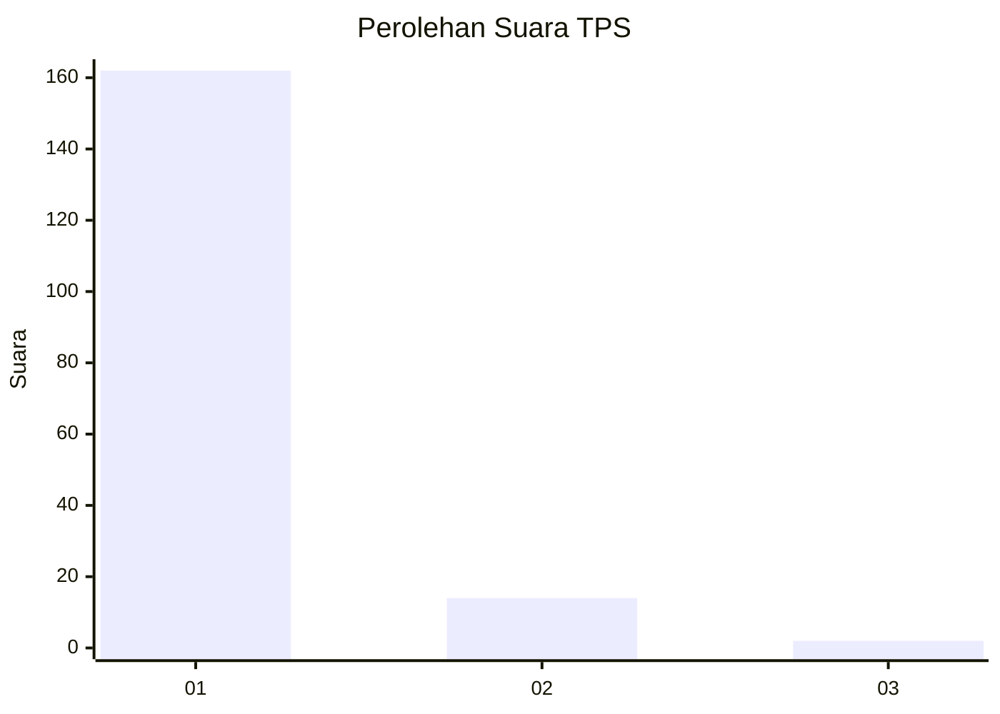
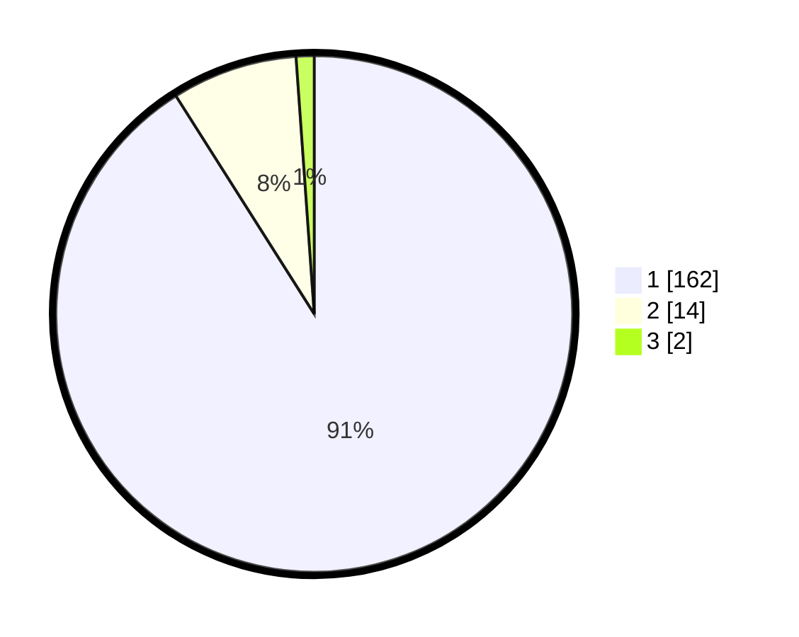

# Hasil

## Grafik

## Tabel

| No. | Nama Paslon    | Suara | Suara (raw) | Persentase |
|:--- |:-------------- | -----:| -----------:| ----------:|
| 1   | ANIES MUHAIMIN | 162   | [162][p-1]  | 91,01      |
| 2   | PRABOWO GIBRAN | 14    | [14][p-2]   | 7,87       |
| 3   | GANJAR MAHFUD  | 2     | [2][p-3]    | 1,12       |

[p-1]: https://github.com/gigit-pemilu/pemilu-2024/blob/main/pilpres/hitung-suara/sub/35-jawa-timur/sub/28-pamekasan/sub/07-pegantenan/sub/2012-pasanggar/sub/028-tps/sub/paslon-1.txt
[p-2]: https://github.com/gigit-pemilu/pemilu-2024/blob/main/pilpres/hitung-suara/sub/35-jawa-timur/sub/28-pamekasan/sub/07-pegantenan/sub/2012-pasanggar/sub/028-tps/sub/paslon-2.txt
[p-3]: https://github.com/gigit-pemilu/pemilu-2024/blob/main/pilpres/hitung-suara/sub/35-jawa-timur/sub/28-pamekasan/sub/07-pegantenan/sub/2012-pasanggar/sub/028-tps/sub/paslon-3.txt

## Foto C Plano

https://sirekap-obj-formc.kpu.go.id/8446/pemilu/ppwp/35/28/07/20/12/3528072012028-20240215-054526--988a46d7-59f7-4ed9-891c-3496474012a4.jpg

https://sirekap-obj-formc.kpu.go.id/8446/pemilu/ppwp/35/28/07/20/12/3528072012028-20240215-054651--7c948c0e-38ac-42bb-9869-839e8b3044bf.jpg

https://sirekap-obj-formc.kpu.go.id/8446/pemilu/ppwp/35/28/07/20/12/3528072012028-20240215-055016--3c6039f2-7af7-47d8-bd65-11b52844990d.jpg

## Metadata

| Key        | Value               |
| ---------- | ------------------- |
| Time Stamp | 2024-02-15 21:30:27 |

