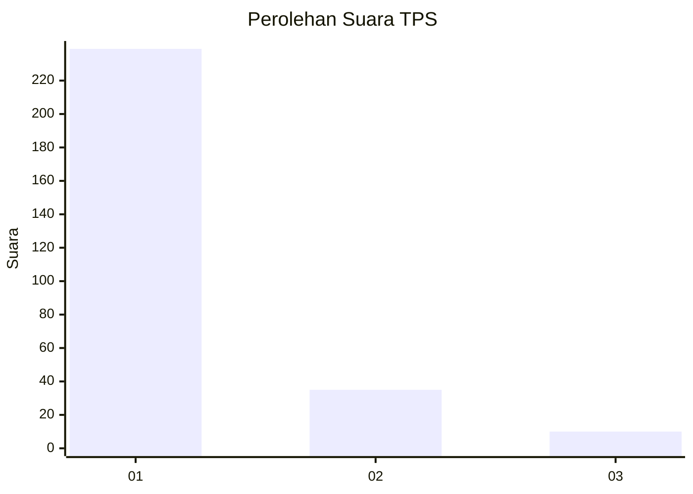
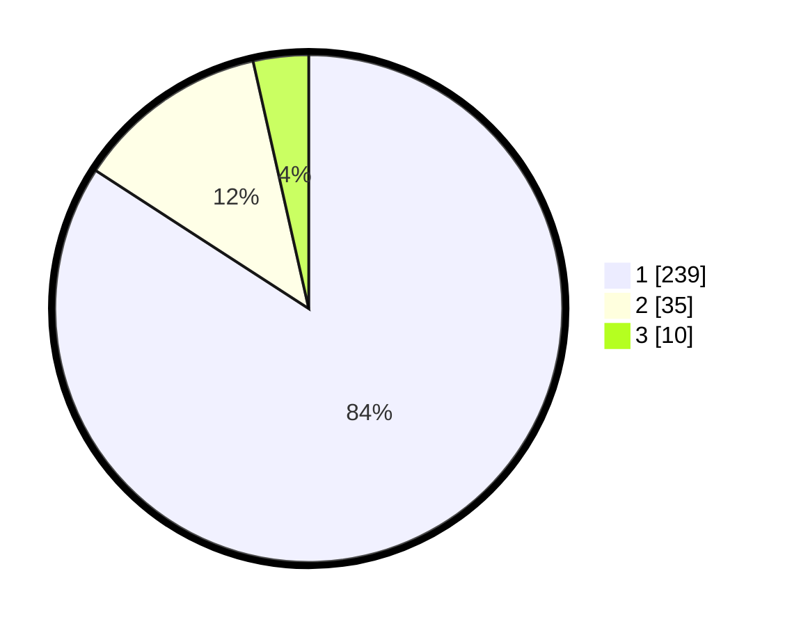

# Hasil

## Grafik

## Tabel

| No. | Nama Paslon    | Suara | Suara (raw) | Persentase |
|:--- |:-------------- | -----:| -----------:| ----------:|
| 1   | ANIES MUHAIMIN | 239   | [239][p-1]  | 84,15      |
| 2   | PRABOWO GIBRAN | 35    | [35][p-2]   | 12,32      |
| 3   | GANJAR MAHFUD  | 10    | [10][p-3]   | 3,52       |

[p-1]: https://github.com/gigit-pemilu/pemilu-2024/blob/main/pilpres/hitung-suara/sub/35-jawa-timur/sub/28-pamekasan/sub/07-pegantenan/sub/2012-pasanggar/sub/032-tps/sub/paslon-1.txt
[p-2]: https://github.com/gigit-pemilu/pemilu-2024/blob/main/pilpres/hitung-suara/sub/35-jawa-timur/sub/28-pamekasan/sub/07-pegantenan/sub/2012-pasanggar/sub/032-tps/sub/paslon-2.txt
[p-3]: https://github.com/gigit-pemilu/pemilu-2024/blob/main/pilpres/hitung-suara/sub/35-jawa-timur/sub/28-pamekasan/sub/07-pegantenan/sub/2012-pasanggar/sub/032-tps/sub/paslon-3.txt

## Foto C Plano

https://sirekap-obj-formc.kpu.go.id/2c87/pemilu/ppwp/35/28/07/20/12/3528072012032-20240215-065124--1577caa2-3b03-4861-a89d-0f27bc7cd37b.jpg

https://sirekap-obj-formc.kpu.go.id/2c87/pemilu/ppwp/35/28/07/20/12/3528072012032-20240215-064616--8b4b794e-42b1-4bc3-9926-53625be58985.jpg

https://sirekap-obj-formc.kpu.go.id/2c87/pemilu/ppwp/35/28/07/20/12/3528072012032-20240215-065641--4ad9f793-82c4-4801-a1db-14318ab6f897.jpg

## Metadata

| Key        | Value               |
| ---------- | ------------------- |
| Time Stamp | 2024-02-15 21:30:27 |

