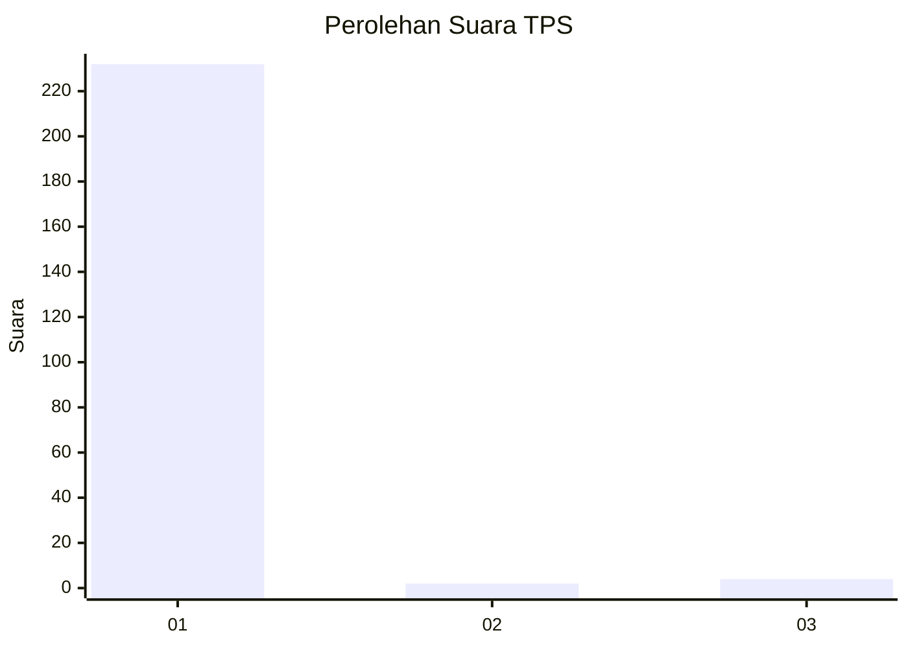
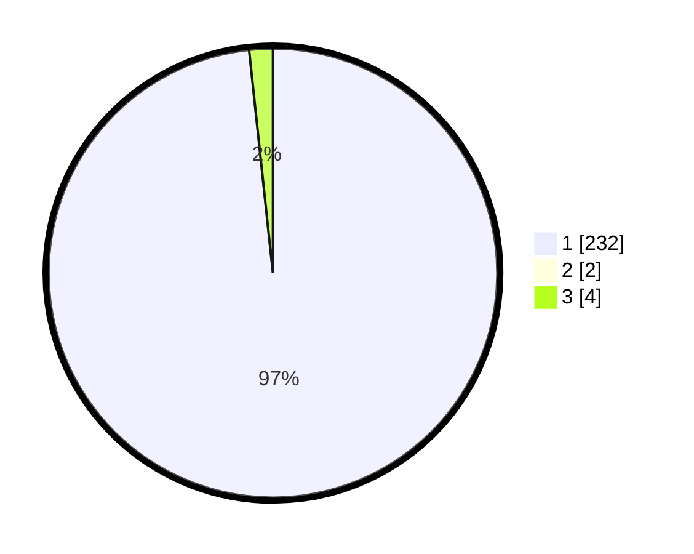

# Hasil

## Grafik

## Tabel

| No. | Nama Paslon    | Suara | Suara (raw) | Persentase |
|:--- |:-------------- | -----:| -----------:| ----------:|
| 1   | ANIES MUHAIMIN | 232   | [232][p-1]  | 97,48      |
| 2   | PRABOWO GIBRAN | 2     | [2][p-2]    | 0,84       |
| 3   | GANJAR MAHFUD  | 4     | [4][p-3]    | 1,68       |

[p-1]: https://github.com/gigit-pemilu/pemilu-2024/blob/main/pilpres/hitung-suara/sub/35-jawa-timur/sub/28-pamekasan/sub/07-pegantenan/sub/2012-pasanggar/sub/038-tps/sub/paslon-1.txt
[p-2]: https://github.com/gigit-pemilu/pemilu-2024/blob/main/pilpres/hitung-suara/sub/35-jawa-timur/sub/28-pamekasan/sub/07-pegantenan/sub/2012-pasanggar/sub/038-tps/sub/paslon-2.txt
[p-3]: https://github.com/gigit-pemilu/pemilu-2024/blob/main/pilpres/hitung-suara/sub/35-jawa-timur/sub/28-pamekasan/sub/07-pegantenan/sub/2012-pasanggar/sub/038-tps/sub/paslon-3.txt

## Foto C Plano

https://sirekap-obj-formc.kpu.go.id/3bf3/pemilu/ppwp/35/28/07/20/12/3528072012038-20240214-204009--eb3237f8-a187-4d73-a325-ce57b75a35f7.jpg

https://sirekap-obj-formc.kpu.go.id/3bf3/pemilu/ppwp/35/28/07/20/12/3528072012038-20240214-205016--1045165c-f918-4b0f-a258-5a64b1aed628.jpg

https://sirekap-obj-formc.kpu.go.id/3bf3/pemilu/ppwp/35/28/07/20/12/3528072012038-20240214-204404--c14637be-0c0a-4065-a5f3-ba4a57283f42.jpg

## Metadata

| Key        | Value               |
| ---------- | ------------------- |
| Time Stamp | 2024-02-25 14:00:00 |

