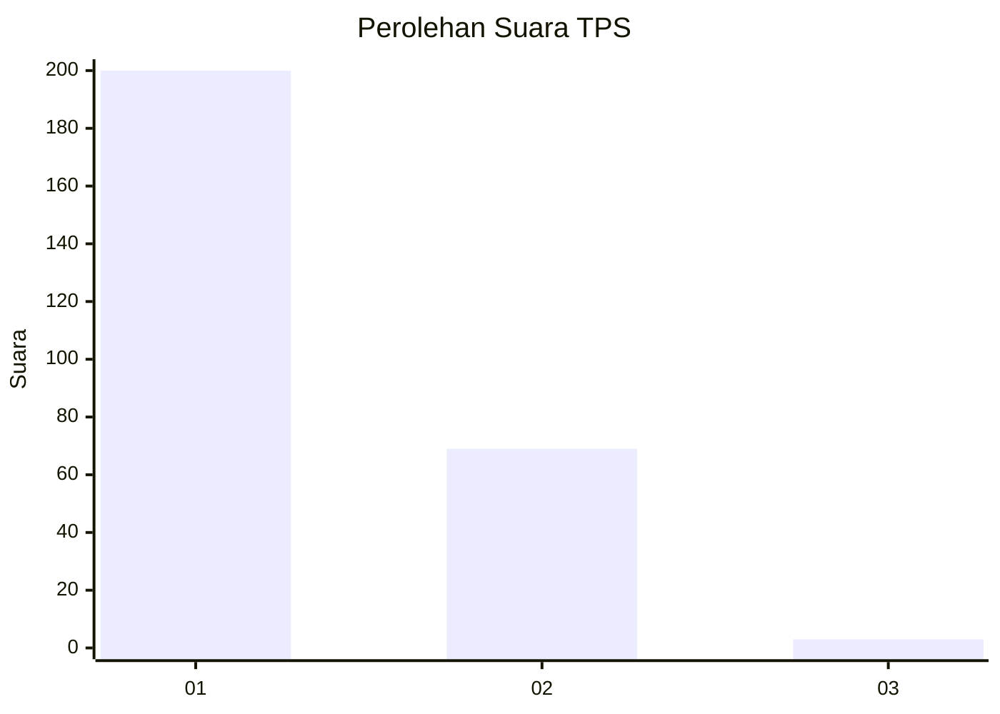
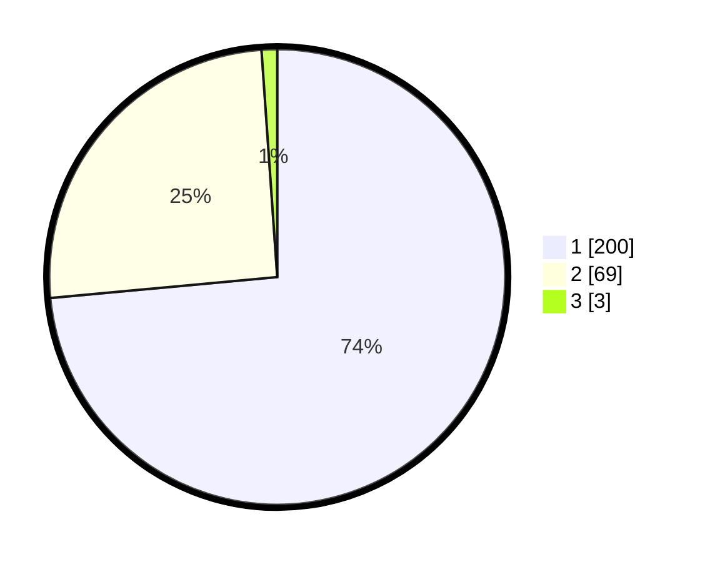

# Hasil

## Grafik

## Tabel

| No. | Nama Paslon    | Suara | Suara (raw) | Persentase |
|:--- |:-------------- | -----:| -----------:| ----------:|
| 1   | ANIES MUHAIMIN | 200   | [200][p-1]  | 73,53      |
| 2   | PRABOWO GIBRAN | 69    | [69][p-2]   | 25,37      |
| 3   | GANJAR MAHFUD  | 3     | [3][p-3]    | 1,10       |

[p-1]: https://github.com/gigit-pemilu/pemilu-2024/blob/main/pilpres/hitung-suara/sub/35-jawa-timur/sub/28-pamekasan/sub/07-pegantenan/sub/2012-pasanggar/sub/039-tps/sub/paslon-1.txt
[p-2]: https://github.com/gigit-pemilu/pemilu-2024/blob/main/pilpres/hitung-suara/sub/35-jawa-timur/sub/28-pamekasan/sub/07-pegantenan/sub/2012-pasanggar/sub/039-tps/sub/paslon-2.txt
[p-3]: https://github.com/gigit-pemilu/pemilu-2024/blob/main/pilpres/hitung-suara/sub/35-jawa-timur/sub/28-pamekasan/sub/07-pegantenan/sub/2012-pasanggar/sub/039-tps/sub/paslon-3.txt

## Foto C Plano

https://sirekap-obj-formc.kpu.go.id/cf76/pemilu/ppwp/35/28/07/20/12/3528072012039-20240214-220303--9993257e-44a8-481d-971e-6f743a2bbe2c.jpg

https://sirekap-obj-formc.kpu.go.id/cf76/pemilu/ppwp/35/28/07/20/12/3528072012039-20240214-220418--3602d7d8-dae6-4685-8a37-6de0817b8ada.jpg

https://sirekap-obj-formc.kpu.go.id/cf76/pemilu/ppwp/35/28/07/20/12/3528072012039-20240214-220517--9ed31058-066a-44f4-9861-b098f207df1f.jpg

## Metadata

| Key        | Value               |
| ---------- | ------------------- |
| Time Stamp | 2024-03-01 22:00:00 |

