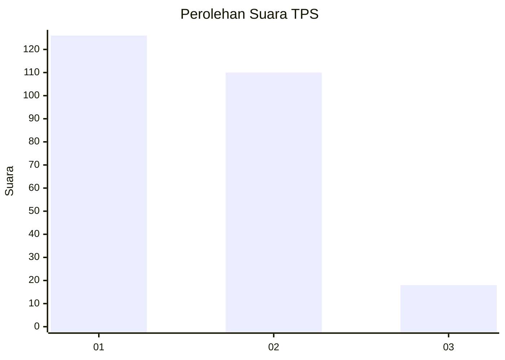
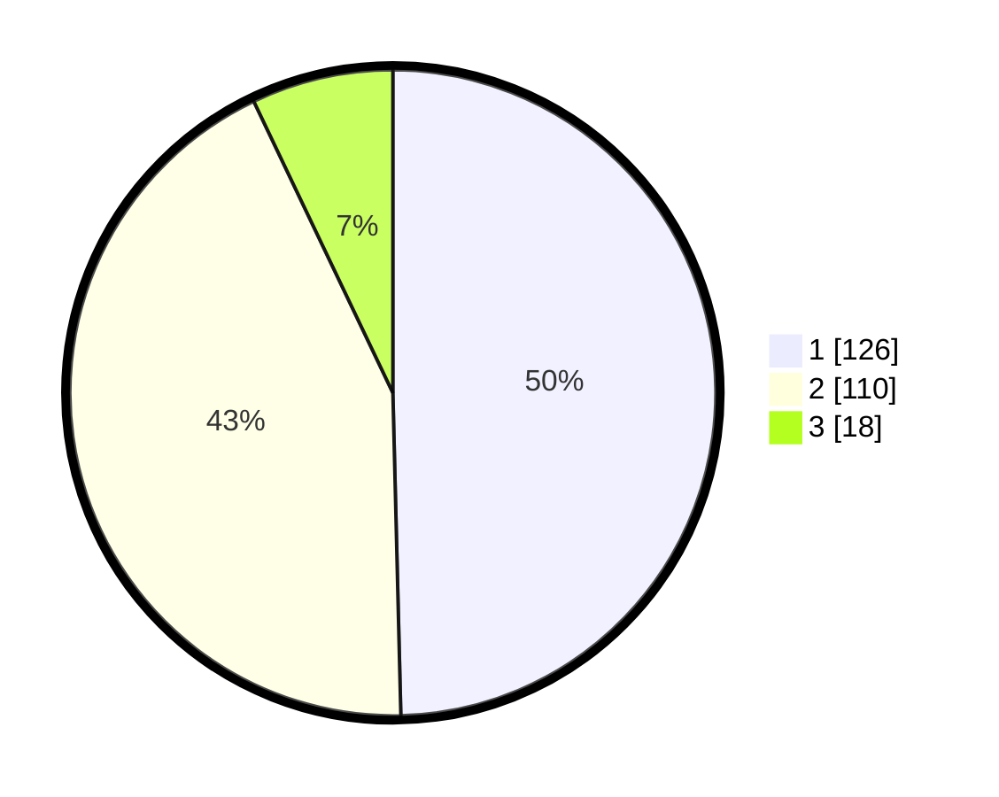

# Hasil

## Grafik

## Tabel

| No. | Nama Paslon    | Suara | Suara (raw) | Persentase |
|:--- |:-------------- | -----:| -----------:| ----------:|
| 1   | ANIES MUHAIMIN | 126   | [126][p-1]  | 49,61      |
| 2   | PRABOWO GIBRAN | 110   | [110][p-2]  | 43,31      |
| 3   | GANJAR MAHFUD  | 18    | [18][p-3]   | 7,09       |

[p-1]: https://github.com/gigit-pemilu/pemilu-2024/blob/main/pilpres/hitung-suara/sub/35-jawa-timur/sub/28-pamekasan/sub/07-pegantenan/sub/2013-tanjung/sub/002-tps/sub/paslon-1.txt
[p-2]: https://github.com/gigit-pemilu/pemilu-2024/blob/main/pilpres/hitung-suara/sub/35-jawa-timur/sub/28-pamekasan/sub/07-pegantenan/sub/2013-tanjung/sub/002-tps/sub/paslon-2.txt
[p-3]: https://github.com/gigit-pemilu/pemilu-2024/blob/main/pilpres/hitung-suara/sub/35-jawa-timur/sub/28-pamekasan/sub/07-pegantenan/sub/2013-tanjung/sub/002-tps/sub/paslon-3.txt

## Foto C Plano

https://sirekap-obj-formc.kpu.go.id/9e6f/pemilu/ppwp/35/28/07/20/13/3528072013002-20240214-222445--8e199c6a-ec80-4e70-a2ed-3e04b4b4522d.jpg

https://sirekap-obj-formc.kpu.go.id/9e6f/pemilu/ppwp/35/28/07/20/13/3528072013002-20240214-222505--e1dda001-2779-4eae-9fd5-f655fa7bc54f.jpg

https://sirekap-obj-formc.kpu.go.id/9e6f/pemilu/ppwp/35/28/07/20/13/3528072013002-20240214-222514--63670db4-b20f-4ff6-bac4-57ee8c0155d4.jpg

## Metadata

| Key        | Value               |
| ---------- | ------------------- |
| Time Stamp | 2024-02-24 22:31:28 |

